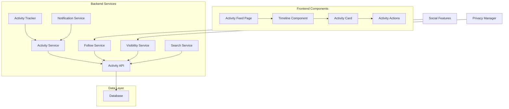

# Activity Feed & Timeline Feature

## Feature Overview

The Activity Feed & Timeline system provides users with a comprehensive view of their viewing activities and social interactions within the platform. It tracks user actions, displays personalized timelines, and enables social discovery through activity sharing and following other users' viewing habits.

## Product Requirements

### User Stories

- **As a user**, I want to see a timeline of my recent viewing activities so I can track my progress and remember what I've watched
- **As a social viewer**, I want to follow friends and see their viewing activities to discover new content
- **As a content discoverer**, I want to see trending activities and popular content based on community viewing patterns
- **As a list collaborator**, I want to see activities related to shared lists and collaborative actions
- **As a privacy-conscious user**, I want to control which activities are visible to others
- **As an engaged user**, I want to interact with activities through likes, comments, and sharing
- **As a returning user**, I want to see a summary of activities that happened while I was away

### Activity Types

#### Personal Activities

- **Watch Status Updates**: Started watching, completed, dropped, or paused content
- **Rating & Reviews**: Rated content or wrote reviews
- **List Management**: Created, updated, or shared lists
- **Content Discovery**: Added content to watchlists or marked as interested
- **Social Actions**: Followed users, joined groups, or accepted collaborations

#### Social Activities

- **Friend Activities**: Activities from followed users
- **Collaboration Activities**: Actions on shared lists and group activities
- **Community Activities**: Popular content, trending discussions, and featured reviews
- **Recommendation Activities**: Content recommended by friends or the system

#### System Activities

- **Achievement Unlocks**: Viewing milestones, streak achievements, or special badges
- **Content Updates**: New episodes, seasons, or related content availability
- **Platform Updates**: New features, announcements, or system notifications

### Privacy & Visibility Settings

| Activity Type          | Default Visibility | User Control                      |
| ---------------------- | ------------------ | --------------------------------- |
| **Watch Status**       | Friends Only       | Public / Friends / Private        |
| **Ratings**            | Public             | Public / Friends / Private        |
| **List Creation**      | Friends Only       | Public / Friends / Private        |
| **List Collaboration** | Collaborators Only | Collaborators / Friends / Private |
| **Social Actions**     | Friends Only       | Friends / Private                 |
| **Achievements**       | Friends Only       | Public / Friends / Private        |

### Acceptance Criteria

#### Activity Generation

- All user actions automatically generate appropriate activity entries
- Activities include relevant metadata (timestamps, content details, context)
- Bulk actions generate summarized activities to avoid spam
- Activities respect user privacy settings before being visible to others
- System activities are generated for significant events and milestones

#### Timeline Display

- Personal timeline shows user's own activities in chronological order
- Social timeline shows activities from followed users and collaborations
- Activities are grouped by date with clear time indicators
- Rich media previews for content-related activities
- Infinite scroll with efficient pagination

#### Social Features

- Users can like, comment on, and share activities
- Activity comments support threaded discussions
- Users can follow/unfollow other users for activity updates
- Activity notifications for interactions and mentions
- Trending activities and popular content discovery

#### Filtering & Search

- Filter activities by type, date range, and content category
- Search activities by content title, user, or activity type
- Saved filter presets for quick access
- Export personal activity data for external use

### User Experience Flow

1. **Viewing Personal Timeline**:
   - User navigates to Activity or Profile page
   - System displays chronological list of user's activities
   - Activities show content previews, timestamps, and interaction counts
   - User can filter by activity type or date range

2. **Following Social Activities**:
   - User discovers and follows other users
   - Social timeline shows combined activities from followed users
   - Activities display user attribution and social context
   - User can interact with activities through likes and comments

3. **Managing Privacy**:
   - User accesses privacy settings from profile or settings page
   - Configures visibility for each activity type
   - Can retroactively change visibility of past activities
   - Preview shows how profile appears to different user types

4. **Activity Interactions**:
   - User clicks on activity to view details and comments
   - Can like activity with single click
   - Comments support mentions and basic formatting
   - Share activity to own timeline or external platforms

## Technical Implementation

### Architecture Components



### Database Schema

```sql
-- Core activities table
CREATE TABLE activities (
    id UUID PRIMARY KEY DEFAULT gen_random_uuid(),
    user_id UUID NOT NULL REFERENCES users(id) ON DELETE CASCADE,
    activity_type VARCHAR(50) NOT NULL,
    visibility VARCHAR(20) DEFAULT 'friends' CHECK (visibility IN ('public', 'friends', 'private')),

    -- Content references (nullable for non-content activities)
    tmdb_id INTEGER,
    content_type VARCHAR(10) CHECK (content_type IN ('movie', 'tv')),
    content_title VARCHAR(255),

    -- List references (nullable for non-list activities)
    list_id UUID REFERENCES lists(id) ON DELETE SET NULL,

    -- Activity metadata as JSONB for flexibility
    metadata JSONB DEFAULT '{}',

    -- Social interaction counters
    like_count INTEGER DEFAULT 0,
    comment_count INTEGER DEFAULT 0,
    share_count INTEGER DEFAULT 0,

    created_at TIMESTAMP WITH TIME ZONE DEFAULT NOW(),
    updated_at TIMESTAMP WITH TIME ZONE DEFAULT NOW()
);

-- Activity interactions (likes, shares)
CREATE TABLE activity_interactions (
    id UUID PRIMARY KEY DEFAULT gen_random_uuid(),
    activity_id UUID NOT NULL REFERENCES activities(id) ON DELETE CASCADE,
    user_id UUID NOT NULL REFERENCES users(id) ON DELETE CASCADE,
    interaction_type VARCHAR(20) NOT NULL CHECK (interaction_type IN ('like', 'share')),
    created_at TIMESTAMP WITH TIME ZONE DEFAULT NOW(),
    UNIQUE(activity_id, user_id, interaction_type)
);

-- Activity comments
CREATE TABLE activity_comments (
    id UUID PRIMARY KEY DEFAULT gen_random_uuid(),
    activity_id UUID NOT NULL REFERENCES activities(id) ON DELETE CASCADE,
    user_id UUID NOT NULL REFERENCES users(id) ON DELETE CASCADE,
    parent_comment_id UUID REFERENCES activity_comments(id) ON DELETE CASCADE,
    content TEXT NOT NULL,
    like_count INTEGER DEFAULT 0,
    created_at TIMESTAMP WITH TIME ZONE DEFAULT NOW(),
    updated_at TIMESTAMP WITH TIME ZONE DEFAULT NOW()
);

-- User following relationships
CREATE TABLE user_follows (
    id UUID PRIMARY KEY DEFAULT gen_random_uuid(),
    follower_id UUID NOT NULL REFERENCES users(id) ON DELETE CASCADE,
    following_id UUID NOT NULL REFERENCES users(id) ON DELETE CASCADE,
    created_at TIMESTAMP WITH TIME ZONE DEFAULT NOW(),
    UNIQUE(follower_id, following_id),
    CHECK(follower_id != following_id)
);

-- Activity feed cache for performance
CREATE TABLE activity_feed_cache (
    id UUID PRIMARY KEY DEFAULT gen_random_uuid(),
    user_id UUID NOT NULL REFERENCES users(id) ON DELETE CASCADE,
    activity_id UUID NOT NULL REFERENCES activities(id) ON DELETE CASCADE,
    feed_type VARCHAR(20) NOT NULL CHECK (feed_type IN ('personal', 'social', 'trending')),
    score DECIMAL(10,6) DEFAULT 0, -- For ranking/sorting
    created_at TIMESTAMP WITH TIME ZONE DEFAULT NOW(),
    UNIQUE(user_id, activity_id, feed_type)
);

-- Performance indexes
CREATE INDEX idx_activities_user_id ON activities(user_id);
CREATE INDEX idx_activities_created_at ON activities(created_at DESC);
CREATE INDEX idx_activities_type ON activities(activity_type);
CREATE INDEX idx_activities_visibility ON activities(visibility);
CREATE INDEX idx_activities_tmdb_id ON activities(tmdb_id) WHERE tmdb_id IS NOT NULL;
CREATE INDEX idx_activities_list_id ON activities(list_id) WHERE list_id IS NOT NULL;
CREATE INDEX idx_activities_metadata ON activities USING GIN(metadata);

CREATE INDEX idx_activity_interactions_activity_id ON activity_interactions(activity_id);
CREATE INDEX idx_activity_interactions_user_id ON activity_interactions(user_id);
CREATE INDEX idx_activity_interactions_type ON activity_interactions(interaction_type);

CREATE INDEX idx_activity_comments_activity_id ON activity_comments(activity_id);
CREATE INDEX idx_activity_comments_user_id ON activity_comments(user_id);
CREATE INDEX idx_activity_comments_parent ON activity_comments(parent_comment_id);
CREATE INDEX idx_activity_comments_created_at ON activity_comments(created_at DESC);

CREATE INDEX idx_user_follows_follower ON user_follows(follower_id);
CREATE INDEX idx_user_follows_following ON user_follows(following_id);
CREATE INDEX idx_user_follows_created_at ON user_follows(created_at DESC);

CREATE INDEX idx_activity_feed_cache_user_id ON activity_feed_cache(user_id);
CREATE INDEX idx_activity_feed_cache_feed_type ON activity_feed_cache(feed_type);
CREATE INDEX idx_activity_feed_cache_score ON activity_feed_cache(score DESC);
```

### API Endpoints

#### Activity Feed

```typescript
// GET /api/activities/feed
interface ActivityFeedRequest {
  feed_type?: "personal" | "social" | "trending";
  limit?: number;
  cursor?: string;
  activity_types?: string[];
  date_from?: string;
  date_to?: string;
}

interface ActivityFeedResponse {
  activities: Activity[];
  next_cursor?: string;
  has_more: boolean;
  total_count?: number;
}

// GET /api/activities/[id]
interface ActivityDetailsResponse {
  activity: Activity & {
    user: User;
    content?: ContentDetails;
    list?: ListDetails;
    interactions: {
      user_liked: boolean;
      user_shared: boolean;
      recent_likes: User[];
    };
    comments: ActivityComment[];
  };
}

// POST /api/activities
interface CreateActivityRequest {
  activity_type: string;
  visibility?: "public" | "friends" | "private";
  tmdb_id?: number;
  content_type?: "movie" | "tv";
  content_title?: string;
  list_id?: string;
  metadata?: Record<string, any>;
}

interface CreateActivityResponse {
  success: boolean;
  activity: Activity;
}
```

#### Social Interactions

```typescript
// POST /api/activities/[id]/like
interface LikeActivityResponse {
  success: boolean;
  liked: boolean;
  like_count: number;
}

// POST /api/activities/[id]/comments
interface CreateCommentRequest {
  content: string;
  parent_comment_id?: string;
}

interface CreateCommentResponse {
  success: boolean;
  comment: ActivityComment;
}

// GET /api/activities/[id]/comments
interface CommentsResponse {
  comments: ActivityComment[];
  total_count: number;
}

// POST /api/activities/[id]/share
interface ShareActivityRequest {
  share_type: "timeline" | "external";
  message?: string;
}

interface ShareActivityResponse {
  success: boolean;
  share_url?: string;
}
```

#### User Following

```typescript
// POST /api/users/[id]/follow
interface FollowUserResponse {
  success: boolean;
  following: boolean;
  follower_count: number;
}

// GET /api/users/[id]/followers
interface FollowersResponse {
  followers: User[];
  total_count: number;
}

// GET /api/users/[id]/following
interface FollowingResponse {
  following: User[];
  total_count: number;
}

// GET /api/users/me/feed-settings
interface FeedSettingsResponse {
  activity_visibility: Record<string, "public" | "friends" | "private">;
  notification_preferences: Record<string, boolean>;
  blocked_users: string[];
}

// PUT /api/users/me/feed-settings
interface UpdateFeedSettingsRequest {
  activity_visibility?: Record<string, "public" | "friends" | "private">;
  notification_preferences?: Record<string, boolean>;
}
```

### Frontend Components

#### Activity Feed Page

```typescript
// app/(authenticated)/activity/page.tsx
export default async function ActivityPage() {
  const initialFeed = await getActivityFeed({ feed_type: 'social', limit: 20 });

  return (
    <div className="min-h-screen bg-gray-950">
      <Header title="Activity Feed" />
      <main className="max-w-4xl mx-auto px-4 sm:px-6 lg:px-8 py-8">
        <div className="mb-8">
          <h1 className="text-3xl font-bold text-white mb-4">Activity Feed</h1>
          <Suspense fallback={<FeedFiltersSkeleton />}>
            <FeedFilters />
          </Suspense>
        </div>

        <div className="space-y-6">
          <Suspense fallback={<ActivityFeedSkeleton />}>
            <ActivityFeed initialData={initialFeed} />
          </Suspense>
        </div>
      </main>
    </div>
  );
}

// components/activity/ActivityFeed.tsx
'use client';
export function ActivityFeed({ initialData }: { initialData: ActivityFeedResponse }) {
  const [activities, setActivities] = useState(initialData.activities);
  const [cursor, setCursor] = useState(initialData.next_cursor);
  const [loading, setLoading] = useState(false);
  const [filters, setFilters] = useState<ActivityFilters>({});

  const loadMore = useCallback(async () => {
    if (!cursor || loading) return;

    setLoading(true);
    try {
      const response = await fetch(`/api/activities/feed?${new URLSearchParams({
        cursor,
        ...filters,
      })}`);
      const data = await response.json();

      setActivities(prev => [...prev, ...data.activities]);
      setCursor(data.next_cursor);
    } catch (error) {
      console.error('Failed to load more activities:', error);
    } finally {
      setLoading(false);
    }
  }, [cursor, loading, filters]);

  return (
    <div className="space-y-6">
      {activities.map((activity) => (
        <ActivityCard key={activity.id} activity={activity} />
      ))}

      {cursor && (
        <div className="flex justify-center">
          <Button
            onClick={loadMore}
            disabled={loading}
            variant="outline"
          >
            {loading ? 'Loading...' : 'Load More'}
          </Button>
        </div>
      )}
    </div>
  );
}
```

#### Activity Card Component

```typescript
// components/activity/ActivityCard.tsx
'use client';
export function ActivityCard({ activity }: { activity: Activity }) {
  const [liked, setLiked] = useState(activity.user_liked);
  const [likeCount, setLikeCount] = useState(activity.like_count);
  const [showComments, setShowComments] = useState(false);

  const handleLike = async () => {
    try {
      const response = await fetch(`/api/activities/${activity.id}/like`, {
        method: 'POST',
      });
      const data = await response.json();

      setLiked(data.liked);
      setLikeCount(data.like_count);
    } catch (error) {
      console.error('Failed to like activity:', error);
    }
  };

  return (
    <div className="bg-gray-900 rounded-lg p-6 border border-gray-800">
      <div className="flex items-start space-x-4">
        <UserAvatar user={activity.user} size="md" />

        <div className="flex-1 min-w-0">
          <div className="flex items-center space-x-2 mb-2">
            <span className="font-medium text-white">{activity.user.username}</span>
            <span className="text-gray-400 text-sm">
              {formatActivityType(activity.activity_type)}
            </span>
            <span className="text-gray-500 text-sm">
              {formatRelativeTime(activity.created_at)}
            </span>
          </div>

          <div className="mb-4">
            <ActivityContent activity={activity} />
          </div>

          <div className="flex items-center space-x-6 text-sm text-gray-400">
            <button
              onClick={handleLike}
              className={`flex items-center space-x-1 hover:text-red-400 transition-colors ${
                liked ? 'text-red-500' : ''
              }`}
            >
              <HeartIcon className={`w-4 h-4 ${liked ? 'fill-current' : ''}`} />
              <span>{likeCount}</span>
            </button>

            <button
              onClick={() => setShowComments(!showComments)}
              className="flex items-center space-x-1 hover:text-blue-400 transition-colors"
            >
              <ChatBubbleLeftIcon className="w-4 h-4" />
              <span>{activity.comment_count}</span>
            </button>

            <ShareActivityButton activity={activity} />
          </div>

          {showComments && (
            <div className="mt-4 pt-4 border-t border-gray-800">
              <Suspense fallback={<CommentsSkeleton />}>
                <ActivityComments activityId={activity.id} />
              </Suspense>
            </div>
          )}
        </div>
      </div>
    </div>
  );
}

// components/activity/ActivityContent.tsx
export function ActivityContent({ activity }: { activity: Activity }) {
  switch (activity.activity_type) {
    case 'watch_status_update':
      return (
        <div className="flex items-center space-x-3">
          {activity.content && (
            
          )}
          <div>
            <p className="text-white">
              {activity.metadata.status === 'completed' ? 'Finished watching' :
               activity.metadata.status === 'started' ? 'Started watching' :
               activity.metadata.status === 'dropped' ? 'Dropped' : 'Updated'}
              <span className="font-medium ml-1">{activity.content_title}</span>
            </p>
            {activity.metadata.rating && (
              <div className="flex items-center space-x-1 mt-1">
                <StarIcon className="w-4 h-4 text-yellow-500 fill-current" />
                <span className="text-sm text-gray-400">{activity.metadata.rating}/10</span>
              </div>
            )}
          </div>
        </div>
      );

    case 'list_created':
      return (
        <div>
          <p className="text-white">
            Created a new list: <span className="font-medium">{activity.metadata.list_name}</span>
          </p>
          {activity.metadata.description && (
            <p className="text-gray-400 text-sm mt-1">{activity.metadata.description}</p>
          )}
        </div>
      );

    case 'list_collaboration':
      return (
        <div>
          <p className="text-white">
            {activity.metadata.action === 'added' ? 'Added' : 'Removed'}
            <span className="font-medium mx-1">{activity.metadata.content_title}</span>
            {activity.metadata.action === 'added' ? 'to' : 'from'}
            <span className="font-medium ml-1">{activity.metadata.list_name}</span>
          </p>
        </div>
      );

    default:
      return (
        <p className="text-white">{activity.metadata.description || 'Activity update'}</p>
      );
  }
}
```

### Backend Services

#### Activity Service

```typescript
// lib/services/activity-service.ts
export class ActivityService {
  async createActivity(data: {
    userId: string;
    activityType: string;
    visibility?: "public" | "friends" | "private";
    tmdbId?: number;
    contentType?: "movie" | "tv";
    contentTitle?: string;
    listId?: string;
    metadata?: Record<string, any>;
    collaborators?: string[]; // Additional users to notify
  }) {
    return await db.transaction(async (tx) => {
      // Create the activity
      const [activity] = await tx
        .insert(activities)
        .values({
          userId: data.userId,
          activityType: data.activityType,
          visibility: data.visibility ?? "friends",
          tmdbId: data.tmdbId,
          contentType: data.contentType,
          contentTitle: data.contentTitle,
          listId: data.listId,
          metadata: data.metadata ?? {},
        })
        .returning();

      // Update feed cache for relevant users
      await this.updateFeedCache(activity, data.collaborators);

      // Send notifications for social activities
      if (data.collaborators?.length) {
        await this.notificationService.sendActivityNotifications({
          activityId: activity.id,
          actorId: data.userId,
          recipientIds: data.collaborators,
          activityType: data.activityType,
        });
      }

      return activity;
    });
  }

  async getActivityFeed(
    userId: string,
    options: {
      feedType: "personal" | "social" | "trending";
      limit: number;
      cursor?: string;
      activityTypes?: string[];
      dateFrom?: Date;
      dateTo?: Date;
    },
  ) {
    const { feedType, limit, cursor, activityTypes, dateFrom, dateTo } =
      options;

    let query = db
      .select({
        activity: activities,
        user: {
          id: users.id,
          username: users.username,
          avatarUrl: users.avatarUrl,
        },
      })
      .from(activities)
      .innerJoin(users, eq(activities.userId, users.id))
      .limit(limit + 1); // +1 to check if there are more results

    // Apply feed type filtering
    if (feedType === "personal") {
      query = query.where(eq(activities.userId, userId));
    } else if (feedType === "social") {
      // Get activities from followed users and collaborations
      const followedUsers = db
        .select({ userId: userFollows.followingId })
        .from(userFollows)
        .where(eq(userFollows.followerId, userId));

      query = query.where(
        or(
          inArray(activities.userId, followedUsers),
          and(
            eq(activities.activityType, "list_collaboration"),
            sql`${activities.metadata}->>'collaborators' LIKE '%${userId}%'`,
          ),
        ),
      );
    } else if (feedType === "trending") {
      // Use cached trending activities
      query = query
        .innerJoin(
          activityFeedCache,
          and(
            eq(activityFeedCache.activityId, activities.id),
            eq(activityFeedCache.feedType, "trending"),
          ),
        )
        .orderBy(desc(activityFeedCache.score));
    }

    // Apply additional filters
    if (activityTypes?.length) {
      query = query.where(inArray(activities.activityType, activityTypes));
    }

    if (dateFrom) {
      query = query.where(gte(activities.createdAt, dateFrom));
    }

    if (dateTo) {
      query = query.where(lte(activities.createdAt, dateTo));
    }

    // Apply cursor pagination
    if (cursor) {
      const cursorDate = new Date(cursor);
      query = query.where(lt(activities.createdAt, cursorDate));
    }

    // Default ordering by creation time
    if (feedType !== "trending") {
      query = query.orderBy(desc(activities.createdAt));
    }

    const results = await query;
    const hasMore = results.length > limit;
    const activities = hasMore ? results.slice(0, -1) : results;

    // Get interaction data for each activity
    const activitiesWithInteractions = await Promise.all(
      activities.map(async (result) => {
        const interactions = await this.getActivityInteractions(
          result.activity.id,
          userId,
        );

        return {
          ...result.activity,
          user: result.user,
          ...interactions,
        };
      }),
    );

    return {
      activities: activitiesWithInteractions,
      nextCursor: hasMore
        ? activities[activities.length - 1].activity.createdAt.toISOString()
        : undefined,
      hasMore,
    };
  }

  async likeActivity(activityId: string, userId: string) {
    return await db.transaction(async (tx) => {
      // Check if already liked
      const existing = await tx
        .select()
        .from(activityInteractions)
        .where(
          and(
            eq(activityInteractions.activityId, activityId),
            eq(activityInteractions.userId, userId),
            eq(activityInteractions.interactionType, "like"),
          ),
        )
        .limit(1);

      let liked: boolean;

      if (existing.length > 0) {
        // Unlike
        await tx
          .delete(activityInteractions)
          .where(
            and(
              eq(activityInteractions.activityId, activityId),
              eq(activityInteractions.userId, userId),
              eq(activityInteractions.interactionType, "like"),
            ),
          );

        await tx
          .update(activities)
          .set({ likeCount: sql`${activities.likeCount} - 1` })
          .where(eq(activities.id, activityId));

        liked = false;
      } else {
        // Like
        await tx.insert(activityInteractions).values({
          activityId,
          userId,
          interactionType: "like",
        });

        await tx
          .update(activities)
          .set({ likeCount: sql`${activities.likeCount} + 1` })
          .where(eq(activities.id, activityId));

        liked = true;

        // Send notification to activity owner
        const activity = await tx
          .select({ userId: activities.userId })
          .from(activities)
          .where(eq(activities.id, activityId))
          .limit(1);

        if (activity[0] && activity[0].userId !== userId) {
          await this.notificationService.sendActivityLikeNotification({
            activityId,
            likedBy: userId,
            activityOwner: activity[0].userId,
          });
        }
      }

      // Get updated like count
      const [updatedActivity] = await tx
        .select({ likeCount: activities.likeCount })
        .from(activities)
        .where(eq(activities.id, activityId));

      return {
        liked,
        likeCount: updatedActivity.likeCount,
      };
    });
  }

  private async updateFeedCache(activity: Activity, collaborators?: string[]) {
    // Update personal feed cache
    await db
      .insert(activityFeedCache)
      .values({
        userId: activity.userId,
        activityId: activity.id,
        feedType: "personal",
        score: Date.now(), // Use timestamp as score for chronological ordering
      })
      .onConflictDoNothing();

    // Update social feed cache for followers
    const followers = await db
      .select({ followerId: userFollows.followerId })
      .from(userFollows)
      .where(eq(userFollows.followingId, activity.userId));

    const socialCacheEntries = followers.map((follower) => ({
      userId: follower.followerId,
      activityId: activity.id,
      feedType: "social" as const,
      score: Date.now(),
    }));

    if (socialCacheEntries.length > 0) {
      await db
        .insert(activityFeedCache)
        .values(socialCacheEntries)
        .onConflictDoNothing();
    }

    // Update cache for collaborators if applicable
    if (collaborators?.length) {
      const collaboratorCacheEntries = collaborators.map((collaboratorId) => ({
        userId: collaboratorId,
        activityId: activity.id,
        feedType: "social" as const,
        score: Date.now(),
      }));

      await db
        .insert(activityFeedCache)
        .values(collaboratorCacheEntries)
        .onConflictDoNothing();
    }
  }
}
```

### Performance Optimizations

1. **Feed Caching**: Pre-compute and cache activity feeds for faster loading
2. **Pagination**: Use cursor-based pagination for efficient scrolling
3. **Batch Loading**: Load activity metadata and interactions in batches
4. **Image Optimization**: Lazy load content images and use appropriate sizes
5. **Real-time Updates**: Use WebSocket connections for live activity updates

### Privacy & Security

1. **Visibility Controls**: Respect user privacy settings for all activity displays
2. **Content Filtering**: Filter inappropriate content and spam activities
3. **Rate Limiting**: Prevent spam through activity creation rate limits
4. **Data Retention**: Implement activity data retention policies
5. **User Blocking**: Allow users to block others and hide their activities

### Analytics & Insights

1. **Engagement Metrics**: Track likes, comments, and shares per activity type
2. **Content Discovery**: Analyze which activities drive content discovery
3. **Social Graph**: Monitor follow relationships and community formation
4. **Trending Detection**: Identify trending content and popular activities
5. **User Behavior**: Track activity patterns and engagement trends

---

_This feature document should be updated as the activity feed and social features evolve and new engagement patterns are identified._
