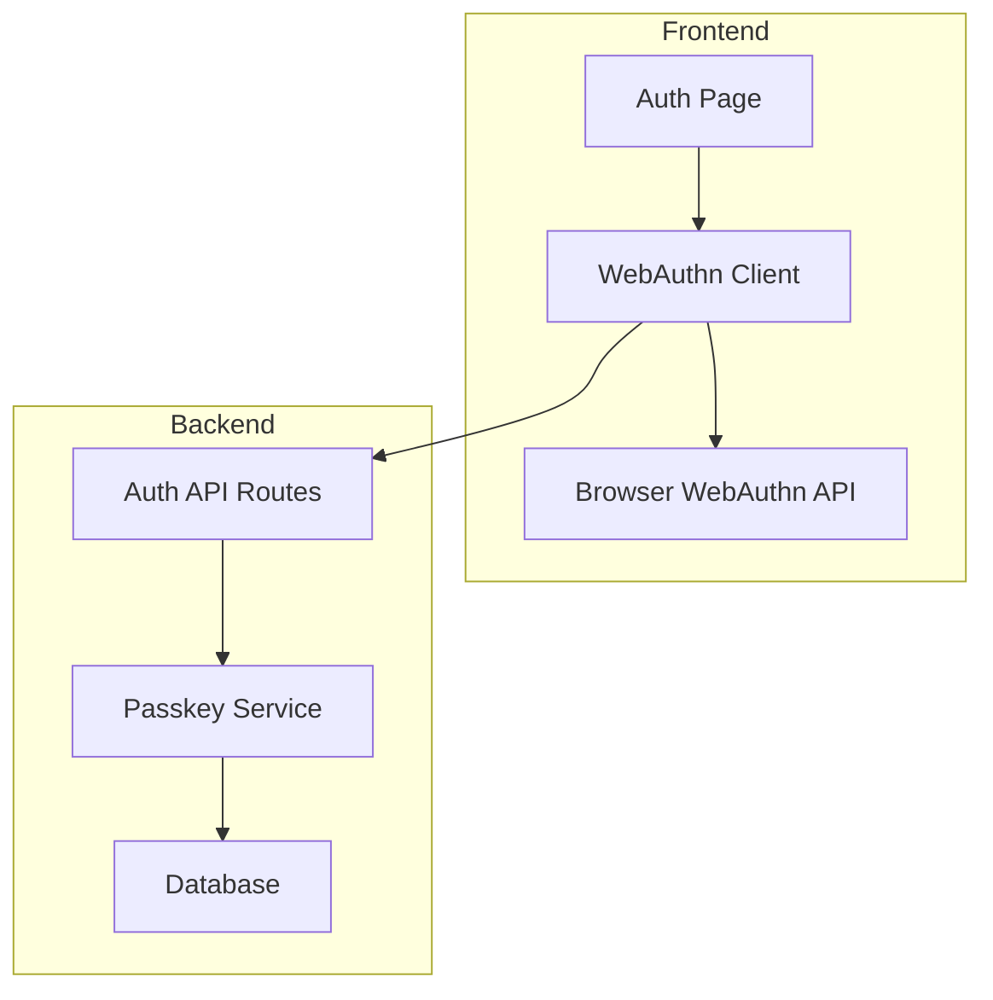

# Authentication & Passkeys Feature

## Feature Overview

WatchThis uses WebAuthn/Passkeys for passwordless authentication, providing a secure, user-friendly login experience without traditional passwords. This feature enables users to authenticate using biometrics, security keys, or device-based credentials.

## Product Requirements

### User Stories

- **As a new user**, I want to register using my device's biometric authentication so I can securely access my account without remembering passwords
- **As a returning user**, I want to sign in quickly using my fingerprint or face recognition
- **As a security-conscious user**, I want to manage multiple devices and see which devices have access to my account
- **As a user with multiple devices**, I want to register additional passkeys so I can access my account from any device

### Acceptance Criteria

- Users can register new accounts using WebAuthn passkeys
- Users can sign in using any registered passkey
- Users can view and manage their registered devices
- Users can add new passkeys from different devices
- Users can remove old or compromised passkeys
- System gracefully handles unsupported browsers with clear messaging

### User Experience Flow

1. **Registration Flow**:
   - User visits `/auth` page
   - Enters desired username
   - System checks WebAuthn support
   - User prompted for biometric/device authentication
   - Passkey credential created and stored
   - User redirected to dashboard

2. **Sign-in Flow**:
   - User visits `/auth` page
   - Enters username
   - System prompts for passkey authentication
   - User authenticates with biometric/device
   - User redirected to dashboard

3. **Device Management**:
   - User accesses profile settings
   - Views list of registered devices with names and last used dates
   - Can add new devices or remove existing ones

## Technical Implementation

### Architecture Components



### Database Schema

```sql
-- Users table (core user information)
CREATE TABLE users (
    id UUID PRIMARY KEY DEFAULT gen_random_uuid(),
    username VARCHAR(50) UNIQUE NOT NULL,
    profile_picture_url VARCHAR(500),
    created_at TIMESTAMP WITH TIME ZONE DEFAULT NOW(),
    updated_at TIMESTAMP WITH TIME ZONE DEFAULT NOW()
);

-- Passkey credentials table
CREATE TABLE passkey_credentials (
    id UUID PRIMARY KEY DEFAULT gen_random_uuid(),
    user_id UUID NOT NULL REFERENCES users(id) ON DELETE CASCADE,
    credential_id VARCHAR(255) UNIQUE NOT NULL,
    public_key TEXT NOT NULL,
    counter BIGINT DEFAULT 0,
    device_name VARCHAR(100),
    created_at TIMESTAMP WITH TIME ZONE DEFAULT NOW(),
    last_used TIMESTAMP WITH TIME ZONE DEFAULT NOW()
);

-- Indexes for performance
CREATE INDEX idx_passkey_credentials_user_id ON passkey_credentials(user_id);
CREATE INDEX idx_passkey_credentials_credential_id ON passkey_credentials(credential_id);
```

### API Endpoints

#### Registration

```typescript
// POST /api/auth/register/begin
interface RegisterBeginRequest {
  username: string;
}

interface RegisterBeginResponse {
  options: PublicKeyCredentialCreationOptions;
  challenge: string;
}

// POST /api/auth/register/complete
interface RegisterCompleteRequest {
  username: string;
  credential: AuthenticatorAttestationResponse;
  challenge: string;
}

interface RegisterCompleteResponse {
  success: boolean;
  user: {
    id: string;
    username: string;
  };
}
```

#### Authentication

```typescript
// POST /api/auth/login/begin
interface LoginBeginRequest {
  username: string;
}

interface LoginBeginResponse {
  options: PublicKeyCredentialRequestOptions;
  challenge: string;
}

// POST /api/auth/login/complete
interface LoginCompleteRequest {
  username: string;
  credential: AuthenticatorAssertionResponse;
  challenge: string;
}

interface LoginCompleteResponse {
  success: boolean;
  user: {
    id: string;
    username: string;
    profile_picture_url?: string;
  };
}
```

#### Device Management

```typescript
// GET /api/profile/devices
interface DevicesResponse {
  devices: Array<{
    id: string;
    device_name: string;
    created_at: string;
    last_used: string;
  }>;
}

// DELETE /api/profile/devices/[id]
interface DeleteDeviceResponse {
  success: boolean;
}

// PUT /api/profile/devices/[id]
interface UpdateDeviceRequest {
  device_name: string;
}
```

### Frontend Components

#### Auth Page Structure

```typescript
// app/(public)/auth/page.tsx
export default function AuthPage() {
  return (
    <div className="min-h-screen bg-gray-950 flex items-center justify-center">
      <div className="max-w-md w-full space-y-8">
        <Suspense fallback={<AuthSkeleton />}>
          <AuthForm />
        </Suspense>
      </div>
    </div>
  );
}

// components/auth/AuthForm.tsx (Client Component)
'use client';
export function AuthForm() {
  const [mode, setMode] = useState<'login' | 'register'>('login');
  const [username, setUsername] = useState('');
  const [isLoading, setIsLoading] = useState(false);

  // WebAuthn registration/authentication logic
}
```

#### WebAuthn Service

```typescript
// lib/auth/webauthn-client.ts
export class WebAuthnClient {
  async register(username: string): Promise<User> {
    // 1. Get registration options from server
    const beginResponse = await fetch("/api/auth/register/begin", {
      method: "POST",
      body: JSON.stringify({ username }),
    });

    const { options, challenge } = await beginResponse.json();

    // 2. Create credential using WebAuthn API
    const credential = (await navigator.credentials.create({
      publicKey: options,
    })) as PublicKeyCredential;

    // 3. Complete registration on server
    const completeResponse = await fetch("/api/auth/register/complete", {
      method: "POST",
      body: JSON.stringify({
        username,
        credential: credential.response,
        challenge,
      }),
    });

    return completeResponse.json();
  }

  async authenticate(username: string): Promise<User> {
    // Similar flow for authentication
  }
}
```

### Security Considerations

1. **Challenge Management**: Use cryptographically secure random challenges with short expiration times
2. **Credential Validation**: Verify attestation and assertion responses according to WebAuthn specification
3. **Counter Tracking**: Monitor authenticator counter values to detect cloned credentials
4. **Origin Validation**: Ensure requests originate from the correct domain
5. **User Verification**: Require user verification (biometrics/PIN) for sensitive operations

### Error Handling

```typescript
// lib/auth/webauthn-errors.ts
export class WebAuthnError extends Error {
  constructor(
    message: string,
    public code: string,
    public userMessage: string,
  ) {
    super(message);
  }
}

export const WebAuthnErrorCodes = {
  NOT_SUPPORTED: "webauthn_not_supported",
  USER_CANCELLED: "user_cancelled",
  INVALID_CREDENTIAL: "invalid_credential",
  NETWORK_ERROR: "network_error",
} as const;

// Error handling in components
function handleWebAuthnError(error: unknown) {
  if (error instanceof WebAuthnError) {
    toast.error(error.userMessage);
  } else {
    toast.error("An unexpected error occurred");
  }
}
```

### Browser Compatibility

- **Supported**: Chrome 67+, Firefox 60+, Safari 14+, Edge 18+
- **Fallback**: Display clear messaging for unsupported browsers
- **Progressive Enhancement**: Detect WebAuthn support before showing registration options

```typescript
// lib/auth/webauthn-support.ts
export function isWebAuthnSupported(): boolean {
  return (
    typeof window !== "undefined" &&
    "credentials" in navigator &&
    "create" in navigator.credentials &&
    "get" in navigator.credentials
  );
}
```

### Testing Strategy

1. **Unit Tests**: Test WebAuthn service methods with mocked browser APIs
2. **Integration Tests**: Test complete registration/authentication flows
3. **E2E Tests**: Use browser automation with WebAuthn simulation
4. **Security Tests**: Validate challenge handling and credential verification

### Performance Considerations

- **Lazy Loading**: Load WebAuthn polyfills only when needed
- **Caching**: Cache user credentials list for device management
- **Debouncing**: Debounce username availability checks
- **Error Recovery**: Implement retry logic for network failures

### Deployment Notes

- **HTTPS Required**: WebAuthn only works over HTTPS in production
- **Domain Configuration**: Configure allowed origins for WebAuthn
- **Environment Variables**: Store WebAuthn configuration securely
- **Monitoring**: Track authentication success/failure rates

---

_This feature document should be updated as the authentication system evolves and new requirements are identified._
