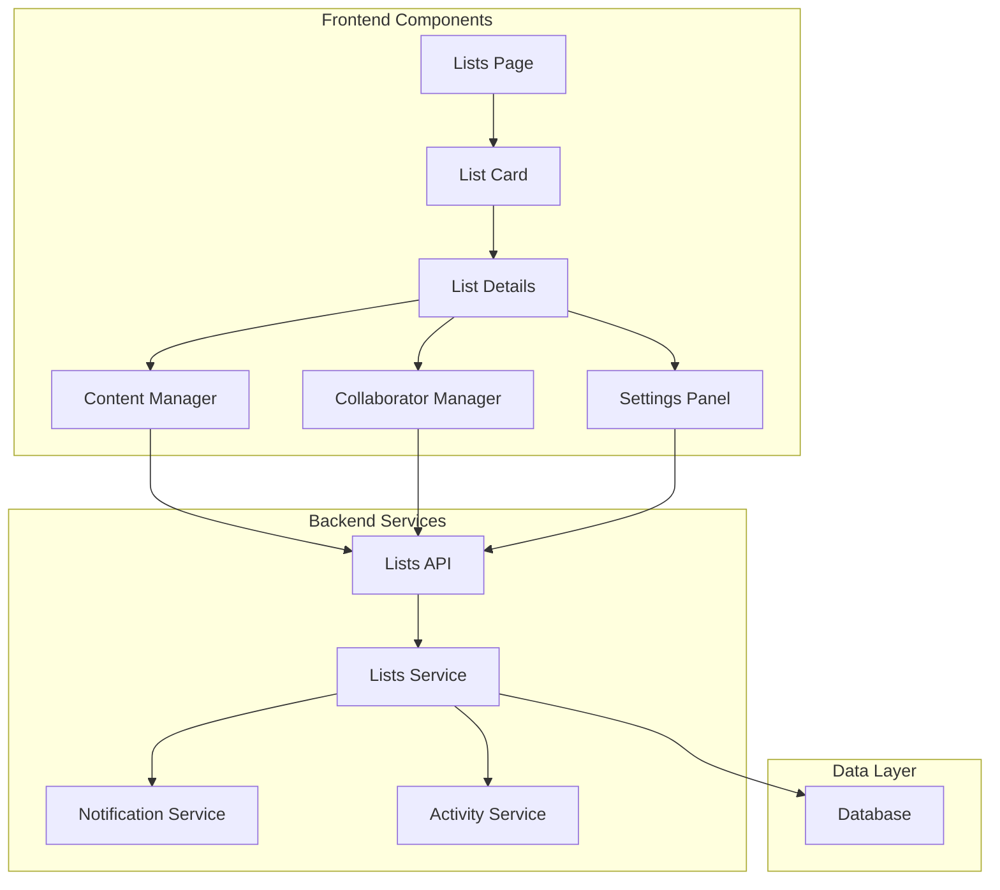

# Lists & Collaboration Feature

## Feature Overview

The Lists & Collaboration system enables users to create, organize, and share watchlists with others. Users can create multiple lists for different purposes, invite collaborators with different permission levels, and optionally enable watch status synchronization for coordinated viewing experiences.

## Product Requirements

### User Stories
- **As a user**, I want to create multiple lists to organize my content by genre, mood, or viewing plans
- **As a list creator**, I want to invite friends to collaborate on shared lists so we can plan what to watch together
- **As a collaborator**, I want different permission levels so I can view or edit lists based on the owner's preferences
- **As a group viewer**, I want to enable "Watch Together" mode so our viewing progress stays synchronized
- **As a list manager**, I want to control who can see and edit my lists
- **As a content organizer**, I want to add notes and custom ordering to list items
- **As a social viewer**, I want to discover and follow public lists from other users

### List Types & Features

#### List Categories
- **Personal Lists**: Private lists for individual use
- **Shared Lists**: Lists with invited collaborators
- **Public Lists**: Discoverable lists visible to all users
- **Watch Together Lists**: Shared lists with status synchronization enabled

#### Permission Levels
| Permission | View List | Add/Remove Content | Edit List Details | Manage Collaborators |
|------------|-----------|-------------------|-------------------|---------------------|
| **Owner** | ✅ | ✅ | ✅ | ✅ |
| **Collaborator** | ✅ | ✅ | ❌ | ❌ |
| **Viewer** | ✅ | ❌ | ❌ | ❌ |
| **Public** | ✅ | ❌ | ❌ | ❌ |

### Acceptance Criteria

#### List Management
- Users can create unlimited lists with custom names and descriptions
- Lists support mixed content types (movies and TV shows) or type-specific filtering
- Users can reorder list items with drag-and-drop or manual sorting
- List items can include personal notes and custom metadata
- Users can duplicate existing lists as templates

#### Collaboration Features
- List owners can invite collaborators via username or shareable links
- Collaborators receive notifications for list invitations
- Permission levels can be changed by list owners
- Collaborators can be removed by list owners
- Activity feed shows collaborative actions for transparency

#### Watch Together Synchronization
- Lists can enable "Watch Together" mode for status sync
- When enabled, watch status changes sync to all collaborators automatically
- Users can opt-out of receiving synced status updates per list
- Sync conflicts are resolved using "last update wins" strategy
- Sync activities are logged for audit trail

#### Content Management
- Users can add content from search results or TMDB links
- Duplicate content is prevented within the same list
- Content can be moved between lists
- Bulk operations support adding/removing multiple items
- List items retain metadata like date added and added-by user

### User Experience Flow

1. **Creating a List**:
   - User clicks "Create List" from dashboard or lists page
   - Enters list name, description, and privacy settings
   - Optionally sets content type filter (movies, TV, or mixed)
   - List created and user redirected to list details

2. **Adding Collaborators**:
   - List owner clicks "Share" or "Manage Collaborators"
   - Enters collaborator usernames or generates shareable link
   - Sets permission level for each collaborator
   - Invitations sent and collaborators notified

3. **Enabling Watch Together**:
   - List owner toggles "Watch Together" mode in list settings
   - System prompts to confirm sync behavior
   - All collaborators notified of sync enablement
   - Future status changes automatically sync

4. **Managing List Content**:
   - Users browse to list details page
   - Can add content via search integration
   - Reorder items with drag-and-drop
   - Add personal notes to list items
   - Remove items with confirmation

## Technical Implementation

### Architecture Components



### Database Schema

```sql
-- Core lists table
CREATE TABLE lists (
    id UUID PRIMARY KEY DEFAULT gen_random_uuid(),
    owner_id UUID NOT NULL REFERENCES users(id) ON DELETE CASCADE,
    name VARCHAR(100) NOT NULL,
    description TEXT,
    list_type VARCHAR(20) DEFAULT 'mixed' CHECK (list_type IN ('movie', 'tv', 'mixed')),
    is_public BOOLEAN DEFAULT false,
    sync_watch_status BOOLEAN DEFAULT false,
    created_at TIMESTAMP WITH TIME ZONE DEFAULT NOW(),
    updated_at TIMESTAMP WITH TIME ZONE DEFAULT NOW()
);

-- List collaborators and permissions
CREATE TABLE list_collaborators (
    id UUID PRIMARY KEY DEFAULT gen_random_uuid(),
    list_id UUID NOT NULL REFERENCES lists(id) ON DELETE CASCADE,
    user_id UUID NOT NULL REFERENCES users(id) ON DELETE CASCADE,
    permission_level VARCHAR(20) DEFAULT 'collaborator' CHECK (permission_level IN ('collaborator', 'viewer')),
    invited_at TIMESTAMP WITH TIME ZONE DEFAULT NOW(),
    joined_at TIMESTAMP WITH TIME ZONE,
    invited_by UUID REFERENCES users(id),
    UNIQUE(list_id, user_id)
);

-- List content items
CREATE TABLE list_items (
    id UUID PRIMARY KEY DEFAULT gen_random_uuid(),
    list_id UUID NOT NULL REFERENCES lists(id) ON DELETE CASCADE,
    tmdb_id INTEGER NOT NULL,
    content_type VARCHAR(10) NOT NULL CHECK (content_type IN ('movie', 'tv')),
    title VARCHAR(255) NOT NULL,
    poster_path VARCHAR(255),
    notes TEXT,
    added_at TIMESTAMP WITH TIME ZONE DEFAULT NOW(),
    added_by UUID REFERENCES users(id),
    sort_order INTEGER DEFAULT 0,
    UNIQUE(list_id, tmdb_id, content_type)
);

-- List invitation tokens for shareable links
CREATE TABLE list_invitations (
    id UUID PRIMARY KEY DEFAULT gen_random_uuid(),
    list_id UUID NOT NULL REFERENCES lists(id) ON DELETE CASCADE,
    token VARCHAR(255) UNIQUE NOT NULL,
    permission_level VARCHAR(20) NOT NULL,
    expires_at TIMESTAMP WITH TIME ZONE,
    max_uses INTEGER,
    current_uses INTEGER DEFAULT 0,
    created_by UUID NOT NULL REFERENCES users(id),
    created_at TIMESTAMP WITH TIME ZONE DEFAULT NOW()
);

-- Performance indexes
CREATE INDEX idx_lists_owner_id ON lists(owner_id);
CREATE INDEX idx_lists_created_at ON lists(created_at DESC);
CREATE INDEX idx_lists_public ON lists(is_public, created_at DESC);

CREATE INDEX idx_list_collaborators_list_id ON list_collaborators(list_id);
CREATE INDEX idx_list_collaborators_user_id ON list_collaborators(user_id);

CREATE INDEX idx_list_items_list_id ON list_items(list_id);
CREATE INDEX idx_list_items_tmdb_id ON list_items(tmdb_id);
CREATE INDEX idx_list_items_sort_order ON list_items(list_id, sort_order);
CREATE INDEX idx_list_items_added_at ON list_items(added_at DESC);

CREATE INDEX idx_list_invitations_token ON list_invitations(token);
CREATE INDEX idx_list_invitations_list_id ON list_invitations(list_id);
```

### API Endpoints

#### List Management
```typescript
// GET /api/lists
interface ListsResponse {
  owned_lists: List[];
  collaborated_lists: List[];
  public_lists?: List[]; // If requesting public lists
}

// POST /api/lists
interface CreateListRequest {
  name: string;
  description?: string;
  list_type?: 'movie' | 'tv' | 'mixed';
  is_public?: boolean;
  sync_watch_status?: boolean;
}

interface CreateListResponse {
  success: boolean;
  list: List;
}

// GET /api/lists/[id]
interface ListDetailsResponse {
  list: List & {
    items: ListItem[];
    collaborators: Collaborator[];
    user_permission: 'owner' | 'collaborator' | 'viewer';
    can_edit: boolean;
    can_manage_collaborators: boolean;
  };
}

// PUT /api/lists/[id]
interface UpdateListRequest {
  name?: string;
  description?: string;
  is_public?: boolean;
  sync_watch_status?: boolean;
}

// DELETE /api/lists/[id]
interface DeleteListResponse {
  success: boolean;
}
```

#### List Content Management
```typescript
// POST /api/lists/[id]/items
interface AddListItemRequest {
  tmdb_id: number;
  content_type: 'movie' | 'tv';
  title: string;
  poster_path?: string;
  notes?: string;
}

interface AddListItemResponse {
  success: boolean;
  item: ListItem;
  duplicate?: boolean;
}

// PUT /api/lists/[id]/items/[itemId]
interface UpdateListItemRequest {
  notes?: string;
  sort_order?: number;
}

// DELETE /api/lists/[id]/items/[itemId]
interface RemoveListItemResponse {
  success: boolean;
}

// PUT /api/lists/[id]/items/reorder
interface ReorderItemsRequest {
  item_orders: Array<{
    item_id: string;
    sort_order: number;
  }>;
}
```

#### Collaboration Management
```typescript
// POST /api/lists/[id]/collaborators
interface AddCollaboratorRequest {
  username?: string;
  user_id?: string;
  permission_level: 'collaborator' | 'viewer';
}

interface AddCollaboratorResponse {
  success: boolean;
  collaborator: Collaborator;
  notification_sent: boolean;
}

// PUT /api/lists/[id]/collaborators/[userId]
interface UpdateCollaboratorRequest {
  permission_level: 'collaborator' | 'viewer';
}

// DELETE /api/lists/[id]/collaborators/[userId]
interface RemoveCollaboratorResponse {
  success: boolean;
}

// POST /api/lists/[id]/invitations
interface CreateInvitationRequest {
  permission_level: 'collaborator' | 'viewer';
  expires_in_hours?: number;
  max_uses?: number;
}

interface CreateInvitationResponse {
  success: boolean;
  invitation_url: string;
  token: string;
  expires_at: string;
}

// POST /api/lists/invitations/[token]/accept
interface AcceptInvitationResponse {
  success: boolean;
  list: List;
  permission_level: string;
}
```

### Frontend Components

#### Lists Overview Page
```typescript
// app/(authenticated)/lists/page.tsx
export default async function ListsPage() {
  const lists = await getUserLists();
  
  return (
    <div className="min-h-screen bg-gray-950">
      <Header title="My Lists" />
      <main className="max-w-7xl mx-auto px-4 sm:px-6 lg:px-8 py-8">
        <div className="flex justify-between items-center mb-8">
          <h1 className="text-3xl font-bold text-white">My Lists</h1>
          <Suspense fallback={<ButtonSkeleton />}>
            <CreateListButton />
          </Suspense>
        </div>
        
        <div className="grid grid-cols-1 md:grid-cols-2 lg:grid-cols-3 gap-6">
          <Suspense fallback={<ListCardsSkeleton />}>
            <ListCards lists={lists} />
          </Suspense>
        </div>
      </main>
    </div>
  );
}

// components/lists/ListCard.tsx
'use client';
export function ListCard({ list }: { list: List }) {
  return (
    <div className="bg-gray-900 rounded-lg p-6 border border-gray-800 hover:border-gray-700 transition-colors">
      <div className="flex items-start justify-between mb-4">
        <div>
          <h3 className="text-lg font-semibold text-white mb-2">{list.name}</h3>
          {list.description && (
            <p className="text-gray-400 text-sm">{list.description}</p>
          )}
        </div>
        <ListOptionsMenu list={list} />
      </div>
      
      <div className="flex items-center justify-between text-sm text-gray-400">
        <span>{list.item_count} items</span>
        <div className="flex items-center space-x-2">
          {list.is_public && <Badge variant="outline">Public</Badge>}
          {list.sync_watch_status && <Badge variant="accent">Watch Together</Badge>}
          {list.collaborator_count > 0 && (
            <span>{list.collaborator_count} collaborators</span>
          )}
        </div>
      </div>
      
      <Link
        href={`/lists/${list.id}`}
        className="mt-4 block w-full text-center py-2 px-4 bg-red-600 hover:bg-red-700 text-white rounded-md transition-colors"
      >
        View List
      </Link>
    </div>
  );
}
```

#### List Details Page
```typescript
// app/(authenticated)/lists/[id]/page.tsx
export default async function ListDetailsPage({ params }: { params: { id: string } }) {
  const listDetails = await getListDetails(params.id);
  
  return (
    <div className="min-h-screen bg-gray-950">
      <Header title={listDetails.list.name} />
      <main className="max-w-7xl mx-auto px-4 sm:px-6 lg:px-8 py-8">
        <div className="mb-8">
          <div className="flex items-center justify-between mb-4">
            <div>
              <h1 className="text-3xl font-bold text-white mb-2">{listDetails.list.name}</h1>
              {listDetails.list.description && (
                <p className="text-gray-400">{listDetails.list.description}</p>
              )}
            </div>
            <div className="flex items-center space-x-4">
              {listDetails.can_edit && (
                <Suspense fallback={<ButtonSkeleton />}>
                  <AddContentButton listId={listDetails.list.id} />
                </Suspense>
              )}
              <ListSettingsButton list={listDetails.list} canEdit={listDetails.can_edit} />
            </div>
          </div>
          
          <div className="flex items-center space-x-4 text-sm text-gray-400">
            <span>{listDetails.list.items.length} items</span>
            {listDetails.list.collaborators.length > 0 && (
              <span>{listDetails.list.collaborators.length} collaborators</span>
            )}
            {listDetails.list.sync_watch_status && (
              <Badge variant="accent">Watch Together Enabled</Badge>
            )}
          </div>
        </div>
        
        <div className="grid grid-cols-1 lg:grid-cols-4 gap-8">
          <div className="lg:col-span-3">
            <Suspense fallback={<ListItemsSkeleton />}>
              <ListItems
                items={listDetails.list.items}
                canEdit={listDetails.can_edit}
                listId={listDetails.list.id}
              />
            </Suspense>
          </div>
          
          <div className="lg:col-span-1">
            <Suspense fallback={<CollaboratorsSkeleton />}>
              <CollaboratorsPanel
                collaborators={listDetails.list.collaborators}
                canManage={listDetails.can_manage_collaborators}
                listId={listDetails.list.id}
              />
            </Suspense>
          </div>
        </div>
      </main>
    </div>
  );
}
```

#### Collaboration Components
```typescript
// components/lists/CollaboratorsPanel.tsx
'use client';
export function CollaboratorsPanel({
  collaborators,
  canManage,
  listId,
}: {
  collaborators: Collaborator[];
  canManage: boolean;
  listId: string;
}) {
  const [showInviteModal, setShowInviteModal] = useState(false);
  
  return (
    <div className="bg-gray-900 rounded-lg p-6 border border-gray-800">
      <div className="flex items-center justify-between mb-4">
        <h3 className="text-lg font-semibold text-white">Collaborators</h3>
        {canManage && (
          <Button
            size="sm"
            onClick={() => setShowInviteModal(true)}
          >
            Invite
          </Button>
        )}
      </div>
      
      <div className="space-y-3">
        {collaborators.map((collaborator) => (
          <div key={collaborator.user_id} className="flex items-center justify-between">
            <div className="flex items-center space-x-3">
              <UserAvatar user={collaborator.user} size="sm" />
              <div>
                <p className="text-white text-sm font-medium">{collaborator.user.username}</p>
                <p className="text-gray-400 text-xs">{collaborator.permission_level}</p>
              </div>
            </div>
            
            {canManage && (
              <CollaboratorOptionsMenu
                collaborator={collaborator}
                listId={listId}
              />
            )}
          </div>
        ))}
      </div>
      
      {showInviteModal && (
        <InviteCollaboratorModal
          listId={listId}
          onClose={() => setShowInviteModal(false)}
        />
      )}
    </div>
  );
}
```

### Backend Services

#### Lists Service
```typescript
// lib/services/lists-service.ts
export class ListsService {
  async createList(
    ownerId: string,
    data: {
      name: string;
      description?: string;
      listType?: 'movie' | 'tv' | 'mixed';
      isPublic?: boolean;
      syncWatchStatus?: boolean;
    }
  ) {
    const [list] = await db
      .insert(lists)
      .values({
        ownerId,
        name: data.name,
        description: data.description,
        listType: data.listType ?? 'mixed',
        isPublic: data.isPublic ?? false,
        syncWatchStatus: data.syncWatchStatus ?? false,
      })
      .returning();
    
    // Create activity entry
    await this.activityService.createActivity({
      userId: ownerId,
      activityType: 'list_management',
      listId: list.id,
      metadata: { action: 'created', list_name: list.name },
    });
    
    return list;
  }
  
  async addCollaborator(
    listId: string,
    userId: string,
    invitedBy: string,
    permissionLevel: 'collaborator' | 'viewer'
  ) {
    return await db.transaction(async (tx) => {
      // Check if user is already a collaborator
      const existing = await tx
        .select()
        .from(listCollaborators)
        .where(
          and(
            eq(listCollaborators.listId, listId),
            eq(listCollaborators.userId, userId)
          )
        )
        .limit(1);
      
      if (existing.length > 0) {
        throw new Error('User is already a collaborator');
      }
      
      // Add collaborator
      const [collaborator] = await tx
        .insert(listCollaborators)
        .values({
          listId,
          userId,
          permissionLevel,
          invitedBy,
          joinedAt: new Date(),
        })
        .returning();
      
      // Send notification
      await this.notificationService.sendCollaboratorInvitation({
        listId,
        invitedUserId: userId,
        invitedBy,
        permissionLevel,
      });
      
      // Create activity entry
      await this.activityService.createActivity({
        userId: invitedBy,
        activityType: 'list_management',
        listId,
        metadata: {
          action: 'collaborator_added',
          collaborator_username: collaborator.user?.username,
          permission_level: permissionLevel,
        },
        collaborators: [userId],
      });
      
      return collaborator;
    });
  }
  
  async addListItem(
    listId: string,
    userId: string,
    item: {
      tmdbId: number;
      contentType: 'movie' | 'tv';
      title: string;
      posterPath?: string;
      notes?: string;
    }
  ) {
    return await db.transaction(async (tx) => {
      // Check for duplicates
      const existing = await tx
        .select()
        .from(listItems)
        .where(
          and(
            eq(listItems.listId, listId),
            eq(listItems.tmdbId, item.tmdbId),
            eq(listItems.contentType, item.contentType)
          )
        )
        .limit(1);
      
      if (existing.length > 0) {
        return { item: existing[0], duplicate: true };
      }
      
      // Get next sort order
      const maxOrder = await tx
        .select({ max: max(listItems.sortOrder) })
        .from(listItems)
        .where(eq(listItems.listId, listId));
      
      const sortOrder = (maxOrder[0]?.max ?? 0) + 1;
      
      // Add item
      const [newItem] = await tx
        .insert(listItems)
        .values({
          listId,
          tmdbId: item.tmdbId,
          contentType: item.contentType,
          title: item.title,
          posterPath: item.posterPath,
          notes: item.notes,
          addedBy: userId,
          sortOrder,
        })
        .returning();
      
      // Create activity entry
      await this.activityService.createActivity({
        userId,
        activityType: 'list_content',
        listId,
        tmdbId: item.tmdbId,
        contentType: item.contentType,
        metadata: {
          action: 'added',
          content_title: item.title,
        },
      });
      
      return { item: newItem, duplicate: false };
    });
  }
}
```

### Performance Optimizations

1. **Pagination**: Implement cursor-based pagination for large lists
2. **Caching**: Cache frequently accessed list metadata
3. **Lazy Loading**: Load collaborator details and item metadata on demand
4. **Optimistic Updates**: Update UI immediately with rollback on error
5. **Batch Operations**: Support bulk item operations for efficiency

### Security Considerations

1. **Permission Validation**: Verify user permissions on every operation
2. **Input Sanitization**: Validate and sanitize all user inputs
3. **Rate Limiting**: Prevent abuse of invitation and collaboration features
4. **Audit Trail**: Log all collaborative actions for transparency
5. **Token Security**: Use secure, time-limited tokens for invitations

---

*This feature document should be updated as the lists and collaboration system evolves and new sharing requirements are identified.*