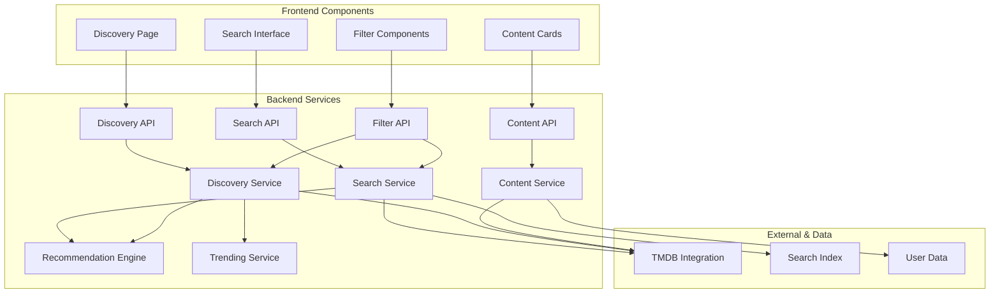

# Search & Content Discovery Feature

## Feature Overview

The Search & Content Discovery system enables users to find movies and TV shows through multiple discovery methods including text search, advanced filtering, personalized recommendations, trending content, and social discovery. The system integrates with TMDB for comprehensive content data and provides intelligent suggestions based on user preferences and viewing history.

## Product Requirements

### User Stories
- **As a content seeker**, I want to search for movies and TV shows by title, genre, cast, or director to find specific content
- **As a discovery user**, I want personalized recommendations based on my viewing history and preferences
- **As a social viewer**, I want to discover content through friends' activities and popular community choices
- **As a browser**, I want to explore trending content, new releases, and curated collections
- **As a filter user**, I want advanced filtering options to narrow down content by multiple criteria
- **As a mobile user**, I want fast, responsive search with autocomplete and voice search capabilities
- **As a list builder**, I want to easily add discovered content to my watchlists
- **As a detailed researcher**, I want comprehensive content information including ratings, reviews, and where to watch

### Search Types & Methods

#### Text Search
- **Quick Search**: Fast autocomplete search in header/navigation
- **Full Search**: Comprehensive search page with filters and sorting
- **Voice Search**: Speech-to-text search input (mobile/desktop)
- **Barcode Scan**: Search by scanning movie/TV show barcodes (mobile)

#### Discovery Methods
- **Personalized Recommendations**: AI-driven suggestions based on user data
- **Trending Content**: Popular content across different time periods
- **New Releases**: Recently released movies and TV shows
- **Genre Exploration**: Browse by genre with subcategory filtering
- **Social Discovery**: Content from friends and followed users
- **Curated Collections**: Editorial and algorithmic content collections

#### Advanced Filtering
| Filter Category | Options |
|----------------|----------|
| **Content Type** | Movies, TV Shows, Both |
| **Genre** | Action, Comedy, Drama, Horror, Sci-Fi, etc. |
| **Release Year** | Range slider, decade selection |
| **Rating** | TMDB rating, user community rating |
| **Runtime** | Short (<90min), Medium (90-150min), Long (>150min) |
| **Language** | Original language, available subtitles |
| **Streaming** | Available platforms, free vs paid |
| **Status** | Released, In Production, Announced |

### Acceptance Criteria

#### Search Functionality
- Search returns results within 500ms for optimal user experience
- Autocomplete suggestions appear after 2+ characters with debouncing
- Search handles typos and partial matches with fuzzy matching
- Results include movies, TV shows, people, and collections
- Search history is saved and accessible for quick re-search
- Voice search supports multiple languages and accents

#### Content Discovery
- Personalized recommendations update based on user interactions
- Trending content refreshes hourly with different time period options
- New releases are updated daily from TMDB data feeds
- Genre browsing supports nested categories and cross-genre filtering
- Social discovery respects user privacy settings
- Collections are curated by algorithms and editorial teams

#### Results & Display
- Search results show relevant content metadata (poster, title, year, rating)
- Infinite scroll pagination with smooth loading states
- Results can be sorted by relevance, rating, release date, or popularity
- Content cards include quick actions (add to list, mark status, like)
- Detailed view shows comprehensive information and related content
- "Where to Watch" integration shows streaming availability

#### Performance & Accessibility
- Search works offline with cached recent results
- Keyboard navigation support for all search interfaces
- Screen reader compatibility with proper ARIA labels
- Mobile-optimized touch interfaces with gesture support
- Progressive loading for images and metadata

### User Experience Flow

1. **Quick Search**:
   - User types in header search bar
   - Autocomplete suggestions appear with content previews
   - User selects suggestion or presses enter for full results
   - Results page shows filtered content with quick actions

2. **Advanced Discovery**:
   - User navigates to Discover page
   - Browses personalized recommendations or trending content
   - Applies filters to narrow down results
   - Explores content details and adds to watchlists

3. **Social Discovery**:
   - User views activity feed or friends' profiles
   - Discovers content through social activities
   - Clicks on content to view details and availability
   - Adds interesting content to personal lists

4. **Genre Exploration**:
   - User selects genre from browse menu
   - Views genre-specific trending and recommended content
   - Applies additional filters for refined browsing
   - Discovers new content within preferred genres

## Technical Implementation

### Architecture Components



### Database Schema

```sql
-- Search index for fast content lookup
CREATE TABLE content_search_index (
    id UUID PRIMARY KEY DEFAULT gen_random_uuid(),
    tmdb_id INTEGER NOT NULL,
    content_type VARCHAR(10) NOT NULL CHECK (content_type IN ('movie', 'tv')),
    title VARCHAR(255) NOT NULL,
    original_title VARCHAR(255),
    overview TEXT,
    release_date DATE,
    genres TEXT[], -- Array of genre names for filtering
    cast_names TEXT[], -- Array of cast member names
    crew_names TEXT[], -- Array of crew member names
    keywords TEXT[], -- Array of keywords for matching
    popularity DECIMAL(10,2) DEFAULT 0,
    vote_average DECIMAL(3,1) DEFAULT 0,
    vote_count INTEGER DEFAULT 0,
    runtime INTEGER, -- In minutes
    original_language VARCHAR(10),
    poster_path VARCHAR(255),
    backdrop_path VARCHAR(255),
    
    -- Search optimization fields
    search_vector TSVECTOR, -- Full-text search vector
    last_updated TIMESTAMP WITH TIME ZONE DEFAULT NOW(),
    
    UNIQUE(tmdb_id, content_type)
);

-- User search history
CREATE TABLE user_search_history (
    id UUID PRIMARY KEY DEFAULT gen_random_uuid(),
    user_id UUID NOT NULL REFERENCES users(id) ON DELETE CASCADE,
    query TEXT NOT NULL,
    filters JSONB DEFAULT '{}',
    result_count INTEGER DEFAULT 0,
    clicked_content JSONB DEFAULT '[]', -- Array of clicked content IDs
    created_at TIMESTAMP WITH TIME ZONE DEFAULT NOW()
);

-- User content interactions for recommendations
CREATE TABLE user_content_interactions (
    id UUID PRIMARY KEY DEFAULT gen_random_uuid(),
    user_id UUID NOT NULL REFERENCES users(id) ON DELETE CASCADE,
    tmdb_id INTEGER NOT NULL,
    content_type VARCHAR(10) NOT NULL CHECK (content_type IN ('movie', 'tv')),
    interaction_type VARCHAR(20) NOT NULL CHECK (interaction_type IN (
        'view', 'search_click', 'list_add', 'status_update', 'rating', 'like'
    )),
    interaction_weight DECIMAL(3,2) DEFAULT 1.0, -- Weight for recommendation scoring
    metadata JSONB DEFAULT '{}',
    created_at TIMESTAMP WITH TIME ZONE DEFAULT NOW(),
    
    INDEX(user_id, created_at DESC),
    INDEX(tmdb_id, content_type),
    INDEX(interaction_type)
);

-- Trending content cache
CREATE TABLE trending_content (
    id UUID PRIMARY KEY DEFAULT gen_random_uuid(),
    tmdb_id INTEGER NOT NULL,
    content_type VARCHAR(10) NOT NULL CHECK (content_type IN ('movie', 'tv')),
    time_period VARCHAR(20) NOT NULL CHECK (time_period IN ('day', 'week', 'month')),
    trend_score DECIMAL(10,2) NOT NULL,
    rank_position INTEGER NOT NULL,
    metadata JSONB DEFAULT '{}',
    updated_at TIMESTAMP WITH TIME ZONE DEFAULT NOW(),
    
    UNIQUE(tmdb_id, content_type, time_period)
);

-- Content recommendations cache
CREATE TABLE user_recommendations (
    id UUID PRIMARY KEY DEFAULT gen_random_uuid(),
    user_id UUID NOT NULL REFERENCES users(id) ON DELETE CASCADE,
    tmdb_id INTEGER NOT NULL,
    content_type VARCHAR(10) NOT NULL CHECK (content_type IN ('movie', 'tv')),
    recommendation_type VARCHAR(30) NOT NULL CHECK (recommendation_type IN (
        'collaborative_filtering', 'content_based', 'trending', 'social', 'editorial'
    )),
    score DECIMAL(5,3) NOT NULL, -- 0.000 to 1.000
    reasoning TEXT, -- Human-readable explanation
    metadata JSONB DEFAULT '{}',
    created_at TIMESTAMP WITH TIME ZONE DEFAULT NOW(),
    expires_at TIMESTAMP WITH TIME ZONE,
    
    INDEX(user_id, score DESC),
    INDEX(recommendation_type),
    INDEX(expires_at)
);

-- Performance indexes
CREATE INDEX idx_content_search_vector ON content_search_index USING GIN(search_vector);
CREATE INDEX idx_content_search_title ON content_search_index USING GIN(title gin_trgm_ops);
CREATE INDEX idx_content_search_genres ON content_search_index USING GIN(genres);
CREATE INDEX idx_content_search_popularity ON content_search_index(popularity DESC);
CREATE INDEX idx_content_search_rating ON content_search_index(vote_average DESC);
CREATE INDEX idx_content_search_release_date ON content_search_index(release_date DESC);
CREATE INDEX idx_content_search_type ON content_search_index(content_type);

CREATE INDEX idx_user_search_history_user_id ON user_search_history(user_id);
CREATE INDEX idx_user_search_history_created_at ON user_search_history(created_at DESC);
CREATE INDEX idx_user_search_history_query ON user_search_history USING GIN(query gin_trgm_ops);

CREATE INDEX idx_trending_content_period ON trending_content(time_period, rank_position);
CREATE INDEX idx_trending_content_score ON trending_content(trend_score DESC);
CREATE INDEX idx_trending_content_updated ON trending_content(updated_at DESC);
```

### API Endpoints

#### Search API
```typescript
// GET /api/search
interface SearchRequest {
  q: string; // Search query
  type?: 'movie' | 'tv' | 'person' | 'all';
  page?: number;
  limit?: number;
  
  // Filters
  genres?: string[];
  year_from?: number;
  year_to?: number;
  rating_min?: number;
  rating_max?: number;
  runtime_min?: number;
  runtime_max?: number;
  language?: string;
  
  // Sorting
  sort_by?: 'relevance' | 'popularity' | 'rating' | 'release_date' | 'title';
  sort_order?: 'asc' | 'desc';
}

interface SearchResponse {
  results: SearchResult[];
  total_results: number;
  total_pages: number;
  current_page: number;
  query: string;
  filters_applied: Record<string, any>;
  search_time_ms: number;
}

interface SearchResult {
  tmdb_id: number;
  content_type: 'movie' | 'tv';
  title: string;
  original_title?: string;
  overview: string;
  release_date: string;
  poster_path?: string;
  backdrop_path?: string;
  vote_average: number;
  vote_count: number;
  popularity: number;
  genres: string[];
  runtime?: number;
  
  // User-specific data
  user_status?: 'watching' | 'completed' | 'planned' | 'dropped';
  user_rating?: number;
  in_user_lists: string[]; // List IDs
  recommendation_score?: number;
}

// GET /api/search/autocomplete
interface AutocompleteRequest {
  q: string;
  limit?: number;
  types?: ('movie' | 'tv' | 'person')[];
}

interface AutocompleteResponse {
  suggestions: AutocompleteSuggestion[];
  query: string;
}

interface AutocompleteSuggestion {
  type: 'movie' | 'tv' | 'person';
  tmdb_id: number;
  title: string;
  subtitle?: string; // Year, role, etc.
  poster_path?: string;
  match_type: 'title' | 'cast' | 'crew' | 'keyword';
}
```

#### Discovery API
```typescript
// GET /api/discover/recommendations
interface RecommendationsRequest {
  type?: 'movie' | 'tv' | 'all';
  recommendation_types?: ('collaborative' | 'content_based' | 'trending' | 'social')[];
  limit?: number;
  exclude_seen?: boolean;
}

interface RecommendationsResponse {
  recommendations: RecommendationResult[];
  recommendation_types: string[];
  generated_at: string;
}

interface RecommendationResult {
  content: SearchResult;
  recommendation_type: string;
  score: number;
  reasoning: string;
  similar_to?: {
    tmdb_id: number;
    title: string;
    content_type: 'movie' | 'tv';
  }[];
}

// GET /api/discover/trending
interface TrendingRequest {
  time_period: 'day' | 'week' | 'month';
  type?: 'movie' | 'tv' | 'all';
  limit?: number;
}

interface TrendingResponse {
  trending: TrendingResult[];
  time_period: string;
  last_updated: string;
}

interface TrendingResult {
  content: SearchResult;
  trend_score: number;
  rank_position: number;
  trend_change?: 'up' | 'down' | 'new' | 'stable';
  previous_rank?: number;
}

// GET /api/discover/genres/[genre]
interface GenreDiscoveryRequest {
  genre: string;
  type?: 'movie' | 'tv' | 'all';
  sort_by?: 'popularity' | 'rating' | 'release_date';
  limit?: number;
  page?: number;
}

interface GenreDiscoveryResponse {
  content: SearchResult[];
  genre: string;
  total_results: number;
  current_page: number;
  sort_by: string;
}
```

#### Content Details API
```typescript
// GET /api/content/[type]/[id]
interface ContentDetailsResponse {
  content: {
    tmdb_id: number;
    content_type: 'movie' | 'tv';
    title: string;
    original_title: string;
    overview: string;
    tagline?: string;
    release_date: string;
    runtime?: number;
    genres: Genre[];
    production_companies: Company[];
    production_countries: Country[];
    spoken_languages: Language[];
    
    // Ratings & Popularity
    vote_average: number;
    vote_count: number;
    popularity: number;
    
    // Media
    poster_path?: string;
    backdrop_path?: string;
    images: {
      backdrops: Image[];
      posters: Image[];
    };
    videos: Video[];
    
    // Cast & Crew
    credits: {
      cast: CastMember[];
      crew: CrewMember[];
    };
    
    // Related Content
    similar: SearchResult[];
    recommendations: SearchResult[];
    
    // External Data
    external_ids: {
      imdb_id?: string;
      facebook_id?: string;
      twitter_id?: string;
      instagram_id?: string;
    };
    
    // Streaming Availability
    watch_providers?: {
      [country: string]: {
        flatrate?: Provider[];
        rent?: Provider[];
        buy?: Provider[];
      };
    };
  };
  
  // User-specific data
  user_data: {
    status?: 'watching' | 'completed' | 'planned' | 'dropped';
    rating?: number;
    review?: string;
    lists: UserList[];
    watched_episodes?: number; // For TV shows
    last_watched?: string;
  };
  
  // Community data
  community_stats: {
    total_users: number;
    status_distribution: Record<string, number>;
    average_rating: number;
    rating_distribution: Record<string, number>;
    popular_lists: UserList[];
  };
}
```

### Frontend Components

#### Search Interface
```typescript
// components/search/SearchHeader.tsx
'use client';
export function SearchHeader() {
  const [query, setQuery] = useState('');
  const [suggestions, setSuggestions] = useState<AutocompleteSuggestion[]>([]);
  const [showSuggestions, setShowSuggestions] = useState(false);
  const [loading, setLoading] = useState(false);
  const router = useRouter();
  
  const debouncedQuery = useDebounce(query, 300);
  
  useEffect(() => {
    if (debouncedQuery.length >= 2) {
      fetchSuggestions(debouncedQuery);
    } else {
      setSuggestions([]);
      setShowSuggestions(false);
    }
  }, [debouncedQuery]);
  
  const fetchSuggestions = async (searchQuery: string) => {
    setLoading(true);
    try {
      const response = await fetch(`/api/search/autocomplete?q=${encodeURIComponent(searchQuery)}`);
      const data = await response.json();
      setSuggestions(data.suggestions);
      setShowSuggestions(true);
    } catch (error) {
      console.error('Failed to fetch suggestions:', error);
    } finally {
      setLoading(false);
    }
  };
  
  const handleSearch = (searchQuery?: string) => {
    const finalQuery = searchQuery || query;
    if (finalQuery.trim()) {
      router.push(`/search?q=${encodeURIComponent(finalQuery)}`);
      setShowSuggestions(false);
    }
  };
  
  const handleSuggestionClick = (suggestion: AutocompleteSuggestion) => {
    if (suggestion.type === 'person') {
      router.push(`/person/${suggestion.tmdb_id}`);
    } else {
      router.push(`/content/${suggestion.type}/${suggestion.tmdb_id}`);
    }
    setShowSuggestions(false);
  };
  
  return (
    <div className="relative flex-1 max-w-lg">
      <div className="relative">
        <MagnifyingGlassIcon className="absolute left-3 top-1/2 transform -translate-y-1/2 w-5 h-5 text-gray-400" />
        <input
          type="text"
          value={query}
          onChange={(e) => setQuery(e.target.value)}
          onKeyDown={(e) => e.key === 'Enter' && handleSearch()}
          onFocus={() => suggestions.length > 0 && setShowSuggestions(true)}
          placeholder="Search movies, TV shows, people..."
          className="w-full pl-10 pr-4 py-2 bg-gray-800 border border-gray-700 rounded-lg text-white placeholder-gray-400 focus:outline-none focus:ring-2 focus:ring-red-500 focus:border-transparent"
        />
        {loading && (
          <div className="absolute right-3 top-1/2 transform -translate-y-1/2">
            <LoadingSpinner size="sm" />
          </div>
        )}
      </div>
      
      {showSuggestions && suggestions.length > 0 && (
        <div className="absolute top-full left-0 right-0 mt-1 bg-gray-800 border border-gray-700 rounded-lg shadow-lg z-50 max-h-96 overflow-y-auto">
          {suggestions.map((suggestion, index) => (
            <button
              key={`${suggestion.type}-${suggestion.tmdb_id}`}
              onClick={() => handleSuggestionClick(suggestion)}
              className="w-full px-4 py-3 text-left hover:bg-gray-700 transition-colors flex items-center space-x-3"
            >
              {suggestion.poster_path && (
                
              )}
              <div className="flex-1 min-w-0">
                <p className="text-white font-medium truncate">{suggestion.title}</p>
                {suggestion.subtitle && (
                  <p className="text-gray-400 text-sm truncate">{suggestion.subtitle}</p>
                )}
              </div>
              <Badge variant="outline" size="sm">
                {suggestion.type}
              </Badge>
            </button>
          ))}
          
          <button
            onClick={() => handleSearch()}
            className="w-full px-4 py-3 text-left border-t border-gray-700 text-red-400 hover:bg-gray-700 transition-colors"
          >
            Search for "{query}"
          </button>
        </div>
      )}
    </div>
  );
}
```

#### Search Results Page
```typescript
// app/(authenticated)/search/page.tsx
export default async function SearchPage({ searchParams }: {
  searchParams: { q?: string; type?: string; page?: string; [key: string]: string | undefined }
}) {
  const query = searchParams.q || '';
  const contentType = searchParams.type as 'movie' | 'tv' | 'all' || 'all';
  const page = parseInt(searchParams.page || '1');
  
  if (!query) {
    redirect('/discover');
  }
  
  const searchResults = await searchContent({
    q: query,
    type: contentType,
    page,
    ...searchParams,
  });
  
  return (
    <div className="min-h-screen bg-gray-950">
      <Header title={`Search: ${query}`} />
      <main className="max-w-7xl mx-auto px-4 sm:px-6 lg:px-8 py-8">
        <div className="mb-8">
          <h1 className="text-3xl font-bold text-white mb-2">
            Search Results for "{query}"
          </h1>
          <p className="text-gray-400">
            {searchResults.total_results.toLocaleString()} results found in {searchResults.search_time_ms}ms
          </p>
        </div>
        
        <div className="grid grid-cols-1 lg:grid-cols-4 gap-8">
          <div className="lg:col-span-1">
            <Suspense fallback={<SearchFiltersSkeleton />}>
              <SearchFilters
                currentFilters={searchParams}
                totalResults={searchResults.total_results}
              />
            </Suspense>
          </div>
          
          <div className="lg:col-span-3">
            <div className="mb-6">
              <SearchSorting
                currentSort={searchParams.sort_by || 'relevance'}
                currentOrder={searchParams.sort_order || 'desc'}
              />
            </div>
            
            <div className="grid grid-cols-2 md:grid-cols-3 lg:grid-cols-4 xl:grid-cols-5 gap-6">
              {searchResults.results.map((result) => (
                <ContentCard key={`${result.content_type}-${result.tmdb_id}`} content={result} />
              ))}
            </div>
            
            {searchResults.total_pages > 1 && (
              <div className="mt-8">
                <Pagination
                  currentPage={searchResults.current_page}
                  totalPages={searchResults.total_pages}
                  baseUrl={`/search?q=${encodeURIComponent(query)}`}
                  params={searchParams}
                />
              </div>
            )}
          </div>
        </div>
      </main>
    </div>
  );
}
```

#### Discovery Page
```typescript
// app/(authenticated)/discover/page.tsx
export default async function DiscoverPage() {
  const [recommendations, trending, genres] = await Promise.all([
    getPersonalizedRecommendations({ limit: 20 }),
    getTrendingContent({ time_period: 'week', limit: 20 }),
    getGenres(),
  ]);
  
  return (
    <div className="min-h-screen bg-gray-950">
      <Header title="Discover" />
      <main className="max-w-7xl mx-auto px-4 sm:px-6 lg:px-8 py-8">
        <div className="mb-8">
          <h1 className="text-3xl font-bold text-white mb-4">Discover Content</h1>
          <p className="text-gray-400">
            Find your next favorite movie or TV show through personalized recommendations and trending content.
          </p>
        </div>
        
        <div className="space-y-12">
          {/* Personalized Recommendations */}
          <section>
            <div className="flex items-center justify-between mb-6">
              <h2 className="text-2xl font-bold text-white">Recommended for You</h2>
              <Link
                href="/discover/recommendations"
                className="text-red-400 hover:text-red-300 transition-colors"
              >
                View All
              </Link>
            </div>
            <div className="grid grid-cols-2 md:grid-cols-3 lg:grid-cols-4 xl:grid-cols-6 gap-6">
              {recommendations.recommendations.slice(0, 12).map((rec) => (
                <ContentCard
                  key={`${rec.content.content_type}-${rec.content.tmdb_id}`}
                  content={rec.content}
                  showRecommendationReason={true}
                  recommendationReason={rec.reasoning}
                />
              ))}
            </div>
          </section>
          
          {/* Trending Content */}
          <section>
            <div className="flex items-center justify-between mb-6">
              <h2 className="text-2xl font-bold text-white">Trending This Week</h2>
              <div className="flex items-center space-x-4">
                <TrendingPeriodSelector />
                <Link
                  href="/discover/trending"
                  className="text-red-400 hover:text-red-300 transition-colors"
                >
                  View All
                </Link>
              </div>
            </div>
            <div className="grid grid-cols-2 md:grid-cols-3 lg:grid-cols-4 xl:grid-cols-6 gap-6">
              {trending.trending.slice(0, 12).map((trend, index) => (
                <ContentCard
                  key={`${trend.content.content_type}-${trend.content.tmdb_id}`}
                  content={trend.content}
                  showTrendingRank={true}
                  trendingRank={index + 1}
                  trendingChange={trend.trend_change}
                />
              ))}
            </div>
          </section>
          
          {/* Genre Exploration */}
          <section>
            <div className="flex items-center justify-between mb-6">
              <h2 className="text-2xl font-bold text-white">Explore by Genre</h2>
            </div>
            <div className="grid grid-cols-2 md:grid-cols-3 lg:grid-cols-4 gap-4">
              {genres.map((genre) => (
                <Link
                  key={genre.id}
                  href={`/discover/genre/${genre.name.toLowerCase()}`}
                  className="group relative overflow-hidden rounded-lg bg-gradient-to-br from-gray-800 to-gray-900 p-6 hover:from-gray-700 hover:to-gray-800 transition-all duration-300"
                >
                  <div className="relative z-10">
                    <h3 className="text-lg font-semibold text-white mb-2">{genre.name}</h3>
                    <p className="text-gray-400 text-sm">
                      {genre.content_count?.toLocaleString()} titles
                    </p>
                  </div>
                  <div className="absolute inset-0 bg-gradient-to-br from-red-500/10 to-transparent opacity-0 group-hover:opacity-100 transition-opacity duration-300" />
                </Link>
              ))}
            </div>
          </section>
        </div>
      </main>
    </div>
  );
}
```

### Backend Services

#### Search Service
```typescript
// lib/services/search-service.ts
export class SearchService {
  async searchContent(params: {
    query: string;
    type?: 'movie' | 'tv' | 'all';
    page?: number;
    limit?: number;
    filters?: SearchFilters;
    sortBy?: string;
    sortOrder?: 'asc' | 'desc';
    userId?: string;
  }) {
    const {
      query,
      type = 'all',
      page = 1,
      limit = 20,
      filters = {},
      sortBy = 'relevance',
      sortOrder = 'desc',
      userId,
    } = params;
    
    const startTime = Date.now();
    
    // Build search query
    let searchQuery = db
      .select({
        content: contentSearchIndex,
        relevanceScore: sql<number>`ts_rank(${contentSearchIndex.searchVector}, plainto_tsquery(${query}))`,
      })
      .from(contentSearchIndex)
      .where(
        sql`${contentSearchIndex.searchVector} @@ plainto_tsquery(${query})`
      );
    
    // Apply content type filter
    if (type !== 'all') {
      searchQuery = searchQuery.where(eq(contentSearchIndex.contentType, type));
    }
    
    // Apply additional filters
    if (filters.genres?.length) {
      searchQuery = searchQuery.where(
        sql`${contentSearchIndex.genres} && ${filters.genres}`
      );
    }
    
    if (filters.yearFrom) {
      searchQuery = searchQuery.where(
        gte(contentSearchIndex.releaseDate, new Date(`${filters.yearFrom}-01-01`))
      );
    }
    
    if (filters.yearTo) {
      searchQuery = searchQuery.where(
        lte(contentSearchIndex.releaseDate, new Date(`${filters.yearTo}-12-31`))
      );
    }
    
    if (filters.ratingMin) {
      searchQuery = searchQuery.where(
        gte(contentSearchIndex.voteAverage, filters.ratingMin)
      );
    }
    
    if (filters.ratingMax) {
      searchQuery = searchQuery.where(
        lte(contentSearchIndex.voteAverage, filters.ratingMax)
      );
    }
    
    if (filters.runtimeMin) {
      searchQuery = searchQuery.where(
        gte(contentSearchIndex.runtime, filters.runtimeMin)
      );
    }
    
    if (filters.runtimeMax) {
      searchQuery = searchQuery.where(
        lte(contentSearchIndex.runtime, filters.runtimeMax)
      );
    }
    
    if (filters.language) {
      searchQuery = searchQuery.where(
        eq(contentSearchIndex.originalLanguage, filters.language)
      );
    }
    
    // Apply sorting
    switch (sortBy) {
      case 'relevance':
        searchQuery = searchQuery.orderBy(
          sortOrder === 'desc' ? desc(sql`relevance_score`) : asc(sql`relevance_score`)
        );
        break;
      case 'popularity':
        searchQuery = searchQuery.orderBy(
          sortOrder === 'desc' ? desc(contentSearchIndex.popularity) : asc(contentSearchIndex.popularity)
        );
        break;
      case 'rating':
        searchQuery = searchQuery.orderBy(
          sortOrder === 'desc' ? desc(contentSearchIndex.voteAverage) : asc(contentSearchIndex.voteAverage)
        );
        break;
      case 'release_date':
        searchQuery = searchQuery.orderBy(
          sortOrder === 'desc' ? desc(contentSearchIndex.releaseDate) : asc(contentSearchIndex.releaseDate)
        );
        break;
      case 'title':
        searchQuery = searchQuery.orderBy(
          sortOrder === 'desc' ? desc(contentSearchIndex.title) : asc(contentSearchIndex.title)
        );
        break;
    }
    
    // Get total count for pagination
    const totalQuery = db
      .select({ count: count() })
      .from(contentSearchIndex)
      .where(
        sql`${contentSearchIndex.searchVector} @@ plainto_tsquery(${query})`
      );
    
    // Apply same filters to count query
    // ... (apply same filters as above)
    
    const [results, totalResult] = await Promise.all([
      searchQuery.limit(limit).offset((page - 1) * limit),
      totalQuery,
    ]);
    
    const totalResults = totalResult[0]?.count || 0;
    const searchTime = Date.now() - startTime;
    
    // Get user-specific data if userId provided
    let enrichedResults = results.map(r => r.content);
    if (userId) {
      enrichedResults = await this.enrichWithUserData(enrichedResults, userId);
    }
    
    // Log search for analytics and recommendations
    if (userId) {
      await this.logSearch(userId, query, filters, enrichedResults.length);
    }
    
    return {
      results: enrichedResults,
      totalResults,
      totalPages: Math.ceil(totalResults / limit),
      currentPage: page,
      query,
      filtersApplied: filters,
      searchTimeMs: searchTime,
    };
  }
  
  async getAutocompleteResults(query: string, limit = 10) {
    // Search for exact title matches first
    const titleMatches = await db
      .select({
        tmdbId: contentSearchIndex.tmdbId,
        contentType: contentSearchIndex.contentType,
        title: contentSearchIndex.title,
        posterPath: contentSearchIndex.posterPath,
        releaseDate: contentSearchIndex.releaseDate,
        similarity: sql<number>`similarity(${contentSearchIndex.title}, ${query})`,
      })
      .from(contentSearchIndex)
      .where(
        sql`${contentSearchIndex.title} % ${query}`
      )
      .orderBy(desc(sql`similarity`))
      .limit(limit);
    
    // Search for cast/crew matches
    const castMatches = await db
      .select({
        tmdbId: contentSearchIndex.tmdbId,
        contentType: contentSearchIndex.contentType,
        title: contentSearchIndex.title,
        posterPath: contentSearchIndex.posterPath,
        releaseDate: contentSearchIndex.releaseDate,
        matchedName: sql<string>`unnest(${contentSearchIndex.castNames})`,
      })
      .from(contentSearchIndex)
      .where(
        sql`EXISTS (
          SELECT 1 FROM unnest(${contentSearchIndex.castNames}) AS cast_name
          WHERE cast_name % ${query}
        )`
      )
      .limit(limit / 2);
    
    // Format results
    const suggestions: AutocompleteSuggestion[] = [
      ...titleMatches.map(match => ({
        type: match.contentType as 'movie' | 'tv',
        tmdbId: match.tmdbId,
        title: match.title,
        subtitle: new Date(match.releaseDate).getFullYear().toString(),
        posterPath: match.posterPath,
        matchType: 'title' as const,
      })),
      ...castMatches.map(match => ({
        type: match.contentType as 'movie' | 'tv',
        tmdbId: match.tmdbId,
        title: match.title,
        subtitle: `${new Date(match.releaseDate).getFullYear()} • ${match.matchedName}`,
        posterPath: match.posterPath,
        matchType: 'cast' as const,
      })),
    ];
    
    // Remove duplicates and limit results
    const uniqueSuggestions = suggestions
      .filter((suggestion, index, self) => 
        index === self.findIndex(s => 
          s.tmdbId === suggestion.tmdbId && s.type === suggestion.type
        )
      )
      .slice(0, limit);
    
    return {
      suggestions: uniqueSuggestions,
      query,
    };
  }
  
  private async enrichWithUserData(content: ContentSearchResult[], userId: string) {
    // Get user watch status, ratings, and list memberships
    const userStatuses = await db
      .select()
      .from(userWatchStatus)
      .where(
        and(
          eq(userWatchStatus.userId, userId),
          inArray(
            sql`(${userWatchStatus.tmdbId}, ${userWatchStatus.contentType})`,
            content.map(c => sql`(${c.tmdbId}, ${c.contentType})`)
          )
        )
      );
    
    const userListItems = await db
      .select({
        tmdbId: listItems.tmdbId,
        contentType: listItems.contentType,
        listId: listItems.listId,
        listName: lists.name,
      })
      .from(listItems)
      .innerJoin(lists, eq(listItems.listId, lists.id))
      .where(
        and(
          eq(lists.ownerId, userId),
          inArray(
            sql`(${listItems.tmdbId}, ${listItems.contentType})`,
            content.map(c => sql`(${c.tmdbId}, ${c.contentType})`)
          )
        )
      );
    
    // Enrich content with user data
    return content.map(item => {
      const userStatus = userStatuses.find(
        s => s.tmdbId === item.tmdbId && s.contentType === item.contentType
      );
      
      const userLists = userListItems
        .filter(l => l.tmdbId === item.tmdbId && l.contentType === item.contentType)
        .map(l => l.listId);
      
      return {
        ...item,
        userStatus: userStatus?.status,
        userRating: userStatus?.rating,
        inUserLists: userLists,
      };
    });
  }
  
  private async logSearch(
    userId: string,
    query: string,
    filters: SearchFilters,
    resultCount: number
  ) {
    await db
      .insert(userSearchHistory)
      .values({
        userId,
        query,
        filters,
        resultCount,
      })
      .onConflictDoNothing();
  }
}
```

### Performance Optimizations

1. **Search Index**: Full-text search with PostgreSQL's tsvector for fast text matching
2. **Autocomplete**: Trigram similarity for fuzzy matching and typo tolerance
3. **Caching**: Redis cache for trending content and popular searches
4. **Pagination**: Cursor-based pagination for large result sets
5. **Image Loading**: Lazy loading with progressive enhancement
6. **Debouncing**: Debounced autocomplete to reduce API calls

### Analytics & Insights

1. **Search Analytics**: Track popular queries, zero-result searches, and click-through rates
2. **Discovery Patterns**: Analyze how users discover and interact with content
3. **Recommendation Performance**: Measure recommendation accuracy and user engagement
4. **Content Popularity**: Track trending content and genre preferences
5. **User Behavior**: Monitor search patterns and discovery preferences

---

*This feature document should be updated as search capabilities expand and new discovery methods are implemented.*