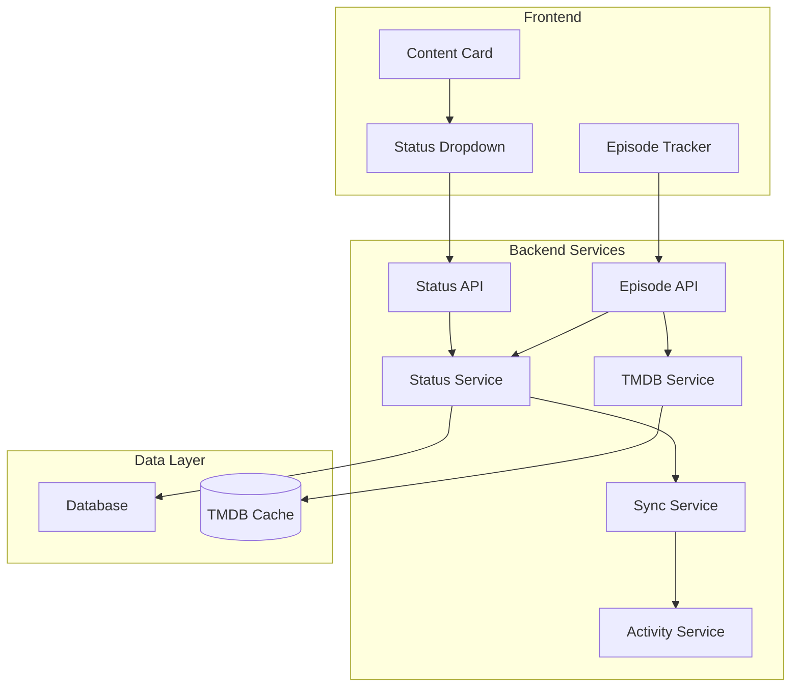

# Watch Status & Episode Tracking Feature

## Feature Overview

The Watch Status & Episode Tracking system allows users to track their viewing progress for movies and TV shows. It provides granular episode-level tracking for TV series and automatic status updates based on viewing progress, with support for collaborative synchronization across shared lists.

## Product Requirements

### User Stories
- **As a viewer**, I want to mark movies as "Planning to Watch", "Watching", "Completed", "Paused", or "Dropped" so I can organize my viewing
- **As a TV show watcher**, I want to track which episodes I've watched so I know where I left off
- **As a binge watcher**, I want the system to automatically update my show status when I complete all episodes
- **As a collaborative viewer**, I want my watch progress to sync with friends on shared lists so we stay coordinated
- **As a returning user**, I want to see my overall progress and recently watched content
- **As a data-conscious user**, I want to control whether my watch status is shared with collaborators

### Status Definitions

| Status | Description | Applies To |
|--------|-------------|------------|
| **Planning** | Content added to watch later | Movies, TV Shows |
| **Watching** | Currently in progress | Movies, TV Shows |
| **Paused** | Temporarily stopped watching | Movies, TV Shows |
| **Completed** | Finished watching entirely | Movies, TV Shows |
| **Dropped** | Decided not to continue | Movies, TV Shows |

### Acceptance Criteria

#### Content Status Management
- Users can set and update watch status for any movie or TV show
- Status changes are reflected immediately in the UI with optimistic updates
- Users can add personal notes to their watch status
- Status changes generate activity feed entries (if enabled)

#### Episode Tracking
- Users can mark individual episodes as watched/unwatched
- Episode progress is displayed with season/episode breakdowns
- System automatically updates show status based on episode progress:
  - First episode watched → Status becomes "Watching"
  - All episodes watched → Status becomes "Completed"
  - New episodes added to completed show → Status reverts to "Watching"
- Episode data is fetched from TMDB API and cached locally

#### Collaborative Synchronization
- Lists can enable "Watch Together" mode for status synchronization
- When enabled, status changes sync to all collaborators automatically
- Users can opt-out of sharing specific status updates
- Sync conflicts are resolved using "last update wins" strategy
- Collaborators receive notifications of sync updates

### User Experience Flow

1. **Setting Initial Status**:
   - User finds content via search or list
   - Clicks status dropdown/button
   - Selects desired status
   - Optional: Adds personal notes
   - Status saved and synced (if applicable)

2. **Episode Tracking**:
   - User views TV show details
   - Sees episode list with checkboxes
   - Clicks episodes to mark watched/unwatched
   - Progress bar updates automatically
   - Show status updates based on completion

3. **Collaborative Sync**:
   - User updates status in sync-enabled list
   - System identifies collaborators
   - Status change applied to all collaborators
   - Activity feed entry created for transparency

## Technical Implementation

### Architecture Components



### Database Schema

```sql
-- User content status tracking
CREATE TABLE user_content_status (
    id UUID PRIMARY KEY DEFAULT gen_random_uuid(),
    user_id UUID NOT NULL REFERENCES users(id) ON DELETE CASCADE,
    tmdb_id INTEGER NOT NULL,
    content_type VARCHAR(10) NOT NULL CHECK (content_type IN ('movie', 'tv')),
    status VARCHAR(20) NOT NULL CHECK (status IN ('planning', 'watching', 'paused', 'completed', 'dropped')),
    notes TEXT,
    share_status_updates BOOLEAN DEFAULT true,
    updated_at TIMESTAMP WITH TIME ZONE DEFAULT NOW(),
    created_at TIMESTAMP WITH TIME ZONE DEFAULT NOW(),
    UNIQUE(user_id, tmdb_id, content_type)
);

-- Episode-level tracking for TV shows
CREATE TABLE episode_watch_status (
    id UUID PRIMARY KEY DEFAULT gen_random_uuid(),
    user_id UUID NOT NULL REFERENCES users(id) ON DELETE CASCADE,
    tmdb_id INTEGER NOT NULL,
    season_number INTEGER NOT NULL,
    episode_number INTEGER NOT NULL,
    watched BOOLEAN DEFAULT false,
    watched_at TIMESTAMP WITH TIME ZONE,
    created_at TIMESTAMP WITH TIME ZONE DEFAULT NOW(),
    updated_at TIMESTAMP WITH TIME ZONE DEFAULT NOW(),
    UNIQUE(user_id, tmdb_id, season_number, episode_number)
);

-- TMDB episode data cache
CREATE TABLE tmdb_episode_cache (
    id UUID PRIMARY KEY DEFAULT gen_random_uuid(),
    tmdb_id INTEGER NOT NULL,
    season_number INTEGER NOT NULL,
    episode_number INTEGER NOT NULL,
    name VARCHAR(255),
    overview TEXT,
    air_date DATE,
    still_path VARCHAR(255),
    cached_at TIMESTAMP WITH TIME ZONE DEFAULT NOW(),
    UNIQUE(tmdb_id, season_number, episode_number)
);

-- Performance indexes
CREATE INDEX idx_user_content_status_user_id ON user_content_status(user_id);
CREATE INDEX idx_user_content_status_tmdb_id ON user_content_status(tmdb_id);
CREATE INDEX idx_user_content_status_updated_at ON user_content_status(updated_at DESC);

CREATE INDEX idx_episode_watch_status_user_id ON episode_watch_status(user_id);
CREATE INDEX idx_episode_watch_status_tmdb_id ON episode_watch_status(tmdb_id);
CREATE INDEX idx_episode_watch_status_season_episode ON episode_watch_status(tmdb_id, season_number, episode_number);
CREATE INDEX idx_episode_watch_status_watched_at ON episode_watch_status(watched_at DESC);

CREATE INDEX idx_tmdb_episode_cache_show ON tmdb_episode_cache(tmdb_id, season_number);
CREATE INDEX idx_tmdb_episode_cache_cached_at ON tmdb_episode_cache(cached_at);
```

### API Endpoints

#### Content Status Management
```typescript
// GET /api/status/content?tmdb_id={id}&content_type={type}
interface ContentStatusResponse {
  status?: string;
  notes?: string;
  updated_at: string;
  share_status_updates: boolean;
}

// PUT /api/status/content
interface UpdateContentStatusRequest {
  tmdb_id: number;
  content_type: 'movie' | 'tv';
  status: 'planning' | 'watching' | 'paused' | 'completed' | 'dropped';
  notes?: string;
  share_status_updates?: boolean;
}

interface UpdateContentStatusResponse {
  success: boolean;
  status: ContentStatusResponse;
  synced_to: string[]; // User IDs who received sync
  affected_lists: string[]; // List IDs where sync was applied
}

// DELETE /api/status/content
interface DeleteContentStatusRequest {
  tmdb_id: number;
  content_type: 'movie' | 'tv';
}
```

#### Episode Tracking
```typescript
// GET /api/status/episodes?tmdb_id={id}
interface EpisodeStatusResponse {
  episodes: Array<{
    season_number: number;
    episode_number: number;
    watched: boolean;
    watched_at?: string;
    episode_info?: {
      name: string;
      overview: string;
      air_date: string;
      still_path?: string;
    };
  }>;
  total_episodes: number;
  watched_count: number;
  progress_percentage: number;
}

// PUT /api/status/episodes
interface UpdateEpisodeStatusRequest {
  tmdb_id: number;
  season_number: number;
  episode_number: number;
  watched: boolean;
}

interface UpdateEpisodeStatusResponse {
  success: boolean;
  show_status?: string; // Updated show status if changed
  episode_count: {
    total: number;
    watched: number;
    percentage: number;
  };
  synced_to: string[];
  affected_lists: string[];
}

// POST /api/status/episodes/bulk
interface BulkUpdateEpisodesRequest {
  tmdb_id: number;
  episodes: Array<{
    season_number: number;
    episode_number: number;
    watched: boolean;
  }>;
}
```

### Frontend Components

#### Status Dropdown Component
```typescript
// components/status/StatusDropdown.tsx
'use client';
import { Badge } from '@/components/ui/Badge';
import { DropdownMenu } from '@/components/ui/DropdownMenu';

interface StatusDropdownProps {
  tmdbId: number;
  contentType: 'movie' | 'tv';
  currentStatus?: string;
  onStatusChange?: (status: string) => void;
}

export function StatusDropdown({ tmdbId, contentType, currentStatus, onStatusChange }: StatusDropdownProps) {
  const [status, setStatus] = useState(currentStatus);
  const [isLoading, setIsLoading] = useState(false);
  
  const updateStatus = async (newStatus: string) => {
    setIsLoading(true);
    setStatus(newStatus); // Optimistic update
    
    try {
      const response = await fetch('/api/status/content', {
        method: 'PUT',
        headers: { 'Content-Type': 'application/json' },
        body: JSON.stringify({
          tmdb_id: tmdbId,
          content_type: contentType,
          status: newStatus,
        }),
      });
      
      if (!response.ok) throw new Error('Failed to update status');
      
      const result = await response.json();
      onStatusChange?.(newStatus);
      
      // Show sync notification if applicable
      if (result.synced_to.length > 0) {
        toast.success(`Status synced with ${result.synced_to.length} collaborators`);
      }
    } catch (error) {
      setStatus(currentStatus); // Rollback on error
      toast.error('Failed to update status');
    } finally {
      setIsLoading(false);
    }
  };
  
  return (
    <DropdownMenu>
      <DropdownMenu.Trigger asChild>
        <button disabled={isLoading}>
          {status ? (
            <Badge variant={status}>{status}</Badge>
          ) : (
            <Badge variant="outline">Set Status</Badge>
          )}
        </button>
      </DropdownMenu.Trigger>
      <DropdownMenu.Content>
        {STATUS_OPTIONS.map((option) => (
          <DropdownMenu.Item
            key={option.value}
            onClick={() => updateStatus(option.value)}
          >
            <Badge variant={option.value} size="sm" />
            {option.label}
          </DropdownMenu.Item>
        ))}
      </DropdownMenu.Content>
    </DropdownMenu>
  );
}
```

#### Episode Tracker Component
```typescript
// components/status/EpisodeTracker.tsx
'use client';
import { useQuery, useMutation, useQueryClient } from '@tanstack/react-query';
import { Checkbox } from '@/components/ui/Checkbox';
import { Progress } from '@/components/ui/Progress';

interface EpisodeTrackerProps {
  tmdbId: number;
  showTitle: string;
}

export function EpisodeTracker({ tmdbId, showTitle }: EpisodeTrackerProps) {
  const queryClient = useQueryClient();
  
  const { data: episodeData, isLoading } = useQuery({
    queryKey: ['episodes', tmdbId],
    queryFn: () => fetchEpisodeStatus(tmdbId),
  });
  
  const updateEpisodeMutation = useMutation({
    mutationFn: ({ season, episode, watched }: { season: number; episode: number; watched: boolean }) =>
      updateEpisodeStatus(tmdbId, season, episode, watched),
    onSuccess: () => {
      queryClient.invalidateQueries({ queryKey: ['episodes', tmdbId] });
    },
  });
  
  const handleEpisodeToggle = useMemo(
    () => debounce((season: number, episode: number, watched: boolean) => {
      updateEpisodeMutation.mutate({ season, episode, watched });
    }, 300),
    [updateEpisodeMutation]
  );
  
  if (isLoading) return <EpisodeTrackerSkeleton />;
  
  return (
    <div className="space-y-6">
      <div className="flex items-center justify-between">
        <h3 className="text-lg font-semibold">Episode Progress</h3>
        <div className="text-sm text-gray-400">
          {episodeData.watched_count} / {episodeData.total_episodes} episodes
        </div>
      </div>
      
      <Progress value={episodeData.progress_percentage} className="w-full" />
      
      <div className="space-y-4">
        {groupEpisodesBySeason(episodeData.episodes).map((season) => (
          <SeasonGroup
            key={season.number}
            season={season}
            onEpisodeToggle={handleEpisodeToggle}
          />
        ))}
      </div>
    </div>
  );
}
```

### Backend Services

#### Status Service
```typescript
// lib/services/status-service.ts
export class StatusService {
  async updateContentStatus(
    userId: string,
    tmdbId: number,
    contentType: 'movie' | 'tv',
    status: string,
    options: {
      notes?: string;
      shareStatusUpdates?: boolean;
    } = {}
  ) {
    return await db.transaction(async (tx) => {
      // Get old status for activity tracking
      const oldStatus = await this.getCurrentStatus(tx, userId, tmdbId, contentType);
      
      // Update or insert status
      const [updatedStatus] = await tx
        .insert(userContentStatus)
        .values({
          userId,
          tmdbId,
          contentType,
          status,
          notes: options.notes,
          shareStatusUpdates: options.shareStatusUpdates ?? true,
        })
        .onConflictDoUpdate({
          target: [userContentStatus.userId, userContentStatus.tmdbId, userContentStatus.contentType],
          set: {
            status,
            notes: options.notes,
            shareStatusUpdates: options.shareStatusUpdates,
            updatedAt: new Date(),
          },
        })
        .returning();
      
      // Handle collaborative sync
      const syncResults = await this.handleCollaborativeSync(
        tx,
        userId,
        tmdbId,
        contentType,
        status,
        options
      );
      
      // Create activity entry
      await this.createStatusActivity(tx, {
        userId,
        tmdbId,
        contentType,
        oldStatus: oldStatus?.status,
        newStatus: status,
        collaborators: syncResults.syncedUsers,
      });
      
      return {
        status: updatedStatus,
        syncedTo: syncResults.syncedUsers,
        affectedLists: syncResults.affectedLists,
      };
    });
  }
  
  async updateEpisodeStatus(
    userId: string,
    tmdbId: number,
    seasonNumber: number,
    episodeNumber: number,
    watched: boolean
  ) {
    return await db.transaction(async (tx) => {
      // Update episode status
      await tx
        .insert(episodeWatchStatus)
        .values({
          userId,
          tmdbId,
          seasonNumber,
          episodeNumber,
          watched,
          watchedAt: watched ? new Date() : null,
        })
        .onConflictDoUpdate({
          target: [
            episodeWatchStatus.userId,
            episodeWatchStatus.tmdbId,
            episodeWatchStatus.seasonNumber,
            episodeWatchStatus.episodeNumber,
          ],
          set: {
            watched,
            watchedAt: watched ? new Date() : null,
            updatedAt: new Date(),
          },
        });
      
      // Check if show status needs automatic update
      const episodeStats = await this.getEpisodeStats(tx, userId, tmdbId);
      const newShowStatus = this.calculateAutoStatus(episodeStats);
      
      let statusUpdate = null;
      if (newShowStatus) {
        statusUpdate = await this.updateContentStatus(
          userId,
          tmdbId,
          'tv',
          newShowStatus,
          { shareStatusUpdates: true }
        );
      }
      
      return {
        episodeStats,
        statusUpdate,
      };
    });
  }
  
  private calculateAutoStatus(stats: EpisodeStats): string | null {
    if (stats.watchedCount === 0) return null;
    if (stats.watchedCount === 1 && stats.totalCount > 1) return 'watching';
    if (stats.watchedCount === stats.totalCount) return 'completed';
    if (stats.watchedCount > 0 && stats.watchedCount < stats.totalCount) return 'watching';
    return null;
  }
}
```

### Performance Optimizations

1. **Optimistic Updates**: UI updates immediately, with rollback on error
2. **Debounced Episode Updates**: Prevent excessive API calls during rapid clicking
3. **TMDB Caching**: Cache episode metadata to reduce external API calls
4. **Database Indexing**: Optimized indexes for common query patterns
5. **Batch Operations**: Support bulk episode updates for efficiency

### Error Handling

```typescript
// lib/errors/status-errors.ts
export class StatusError extends Error {
  constructor(
    message: string,
    public code: string,
    public statusCode: number = 400
  ) {
    super(message);
  }
}

export const StatusErrorCodes = {
  INVALID_STATUS: 'invalid_status',
  CONTENT_NOT_FOUND: 'content_not_found',
  SYNC_FAILED: 'sync_failed',
  EPISODE_NOT_FOUND: 'episode_not_found',
} as const;
```

### Testing Strategy

1. **Unit Tests**: Test status calculation logic and sync algorithms
2. **Integration Tests**: Test API endpoints with database operations
3. **Component Tests**: Test UI components with mocked API responses
4. **E2E Tests**: Test complete user flows including collaborative sync

---

*This feature document should be updated as the watch status system evolves and new tracking requirements are identified.*