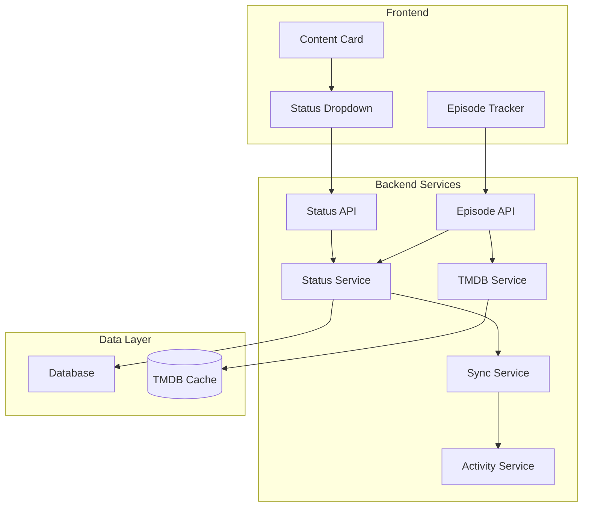

# Watch Status & Episode Tracking Feature

## Feature Overview

The Watch Status & Episode Tracking system allows users to track their viewing progress for movies and TV shows. It provides granular episode-level tracking for TV series and automatic status updates based on viewing progress, with support for collaborative synchronization across shared lists.

## Product Requirements

### User Stories

- **As a viewer**, I want to mark movies as "Planning" or "Completed" so I can organize my viewing
- **As a TV show watcher**, I want to mark shows as "Planning", "Watching", "Paused", "Completed", or "Dropped" and track individual episodes
- **As a TV show watcher**, I want to track which episodes I've watched so I know where I left off
- **As a binge watcher**, I want the system to automatically update my show status when I complete all episodes or start watching
- **As a collaborative viewer**, I want my watch progress to sync with friends on shared lists so we stay coordinated
- **As a returning user**, I want to see my overall progress and recently watched content
- **As a data-conscious user**, I want my status changes to be reflected in activity feeds for transparency

### Status Definitions

| Status        | Description                  | Applies To       |
| ------------- | ---------------------------- | ---------------- |
| **Planning**  | Content added to watch later | Movies, TV Shows |
| **Watching**  | Currently in progress        | TV Shows only    |
| **Paused**    | Temporarily stopped watching | TV Shows only    |
| **Completed** | Finished watching entirely   | Movies, TV Shows |
| **Dropped**   | Decided not to continue      | TV Shows only    |

### Acceptance Criteria

#### Content Status Management

- Users can set and update watch status for any movie or TV show
- Status changes are reflected immediately in the UI with optimistic updates
- Users can add personal notes to their watch status
- Status changes generate activity feed entries (if enabled)

#### Episode Tracking

- Users can mark individual episodes as watched/unwatched
- Episode progress is displayed with season/episode breakdowns
- System automatically updates show status based on episode progress:
  - First episode watched → Status becomes "Watching"
  - All episodes watched → Status becomes "Completed"
  - New episodes added to completed show → Status reverts to "Watching"
- Episode data is fetched from TMDB API and cached locally

#### Collaborative Synchronization

- Lists can enable "Watch Together" mode for status synchronization
- When enabled, status changes sync to all collaborators automatically
- Users can opt-out of sharing specific status updates
- Sync conflicts are resolved using "last update wins" strategy
- Collaborators receive notifications of sync updates

### User Experience Flow

1. **Setting Initial Status**:
   - User finds content via search or list
   - Clicks status dropdown/button
   - Selects desired status
   - Optional: Adds personal notes
   - Status saved and synced (if applicable)

2. **Episode Tracking**:
   - User views TV show details
   - Sees episode list with checkboxes
   - Clicks episodes to mark watched/unwatched
   - Progress bar updates automatically
   - Show status updates based on completion

3. **Collaborative Sync**:
   - User updates status in sync-enabled list
   - System identifies collaborators
   - Status change applied to all collaborators
   - Activity feed entry created for transparency

## Technical Implementation

### Architecture Components



### Database Schema

```sql
-- User content status tracking
CREATE TABLE user_content_status (
    id UUID PRIMARY KEY DEFAULT gen_random_uuid(),
    user_id UUID NOT NULL REFERENCES users(id) ON DELETE CASCADE,
    tmdb_id INTEGER NOT NULL,
    content_type VARCHAR(10) NOT NULL CHECK (content_type IN ('movie', 'tv')),
    status VARCHAR(20) NOT NULL DEFAULT 'planning',
    next_episode_date TIMESTAMP WITH TIME ZONE,
    updated_at TIMESTAMP WITH TIME ZONE DEFAULT NOW(),
    created_at TIMESTAMP WITH TIME ZONE DEFAULT NOW(),
    UNIQUE(user_id, tmdb_id, content_type)
);

-- Episode-level tracking for TV shows
CREATE TABLE episode_watch_status (
    id UUID PRIMARY KEY DEFAULT gen_random_uuid(),
    user_id UUID NOT NULL REFERENCES users(id) ON DELETE CASCADE,
    tmdb_id INTEGER NOT NULL,
    season_number INTEGER NOT NULL,
    episode_number INTEGER NOT NULL,
    watched BOOLEAN DEFAULT false,
    watched_at TIMESTAMP WITH TIME ZONE,
    created_at TIMESTAMP WITH TIME ZONE DEFAULT NOW(),
    updated_at TIMESTAMP WITH TIME ZONE DEFAULT NOW(),
    UNIQUE(user_id, tmdb_id, season_number, episode_number)
);

-- Activity feed for tracking status changes
CREATE TABLE activity_feed (
    id UUID PRIMARY KEY DEFAULT gen_random_uuid(),
    user_id UUID NOT NULL REFERENCES users(id) ON DELETE CASCADE,
    activity_type VARCHAR(50) NOT NULL,
    tmdb_id INTEGER,
    content_type VARCHAR(10),
    list_id UUID REFERENCES lists(id) ON DELETE CASCADE,
    metadata JSONB,
    collaborators UUID[],
    is_collaborative BOOLEAN DEFAULT false,
    created_at TIMESTAMP WITH TIME ZONE DEFAULT NOW()
);

-- Performance indexes
CREATE INDEX idx_user_content_status_user_id ON user_content_status(user_id);
CREATE INDEX idx_user_content_status_tmdb_id ON user_content_status(tmdb_id);
CREATE INDEX idx_user_content_status_updated_at ON user_content_status(updated_at DESC);

CREATE INDEX idx_episode_watch_status_user_id ON episode_watch_status(user_id);
CREATE INDEX idx_episode_watch_status_tmdb_id ON episode_watch_status(tmdb_id);
CREATE INDEX idx_episode_watch_status_season_episode ON episode_watch_status(tmdb_id, season_number, episode_number);
CREATE INDEX idx_episode_watch_status_watched_at ON episode_watch_status(watched_at DESC);

CREATE INDEX idx_activity_feed_user_id ON activity_feed(user_id);
CREATE INDEX idx_activity_feed_created_at ON activity_feed(created_at DESC);
```

### API Endpoints

#### Content Status Management

```typescript
// GET /api/status/content?tmdbId={id}&contentType={type}
interface ContentStatusResponse {
  status: {
    id: string;
    userId: string;
    tmdbId: number;
    contentType: string;
    status: string;
    nextEpisodeDate?: string;
    updatedAt: string;
    createdAt: string;
  } | null;
}

// POST /api/status/content
interface CreateContentStatusRequest {
  tmdbId: number;
  contentType: "movie" | "tv";
  status: "planning" | "watching" | "paused" | "completed" | "dropped";
}

interface CreateContentStatusResponse {
  status: {
    id: string;
    userId: string;
    tmdbId: number;
    contentType: string;
    status: string;
    nextEpisodeDate?: string;
    updatedAt: string;
    createdAt: string;
  };
}

// PUT /api/status/content
interface UpdateContentStatusRequest {
  tmdbId: number;
  contentType: "movie" | "tv";
  status?: string;
}

// DELETE /api/status/content?tmdbId={id}&contentType={type}
```

#### Episode Tracking

```typescript
// GET /api/status/episodes?tmdbId={id}&seasonNumber={season}&episodeNumber={episode}
interface EpisodeStatusResponse {
  episodes: Array<{
    id: string;
    userId: string;
    tmdbId: number;
    seasonNumber: number;
    episodeNumber: number;
    watched: boolean;
    watchedAt: string | null;
    createdAt: string;
    updatedAt: string;
  }>;
}

// POST /api/status/episodes
interface UpdateEpisodeStatusRequest {
  tmdbId: number;
  seasonNumber: number;
  episodeNumber: number;
  watched?: boolean; // defaults to true
}

interface UpdateEpisodeStatusResponse {
  episode: {
    id: string;
    userId: string;
    tmdbId: number;
    seasonNumber: number;
    episodeNumber: number;
    watched: boolean;
    watchedAt: string | null;
  };
  newStatus?: string; // Updated show status if changed
}

// PUT /api/status/episodes/batch
interface BatchUpdateEpisodesRequest {
  tmdbId: number;
  episodes: Array<{
    seasonNumber: number;
    episodeNumber: number;
    watched: boolean;
  }>;
}

interface BatchUpdateEpisodesResponse {
  episodes: Array<EpisodeWatchStatus>;
  newStatus?: string; // Updated show status if changed
}

// DELETE /api/status/episodes?tmdbId={id}&seasonNumber={season}&episodeNumber={episode}
```

### Frontend Components

#### StatusSegmentedSelector Component

```typescript
// components/ui/StatusSegmentedSelector.tsx
'use client';
import { cn } from '@/lib/utils';
import { getAvailableStatuses, getStatusConfig } from './StatusBadge';
import { WatchStatusEnum, ContentTypeEnum } from '@/lib/db/schema';

interface StatusSegmentedSelectorProps {
  value: WatchStatusEnum | null;
  contentType: ContentTypeEnum;
  onValueChange: (status: WatchStatusEnum) => void;
  disabled?: boolean;
  className?: string;
  size?: 'default' | 'sm' | 'lg';
}

export function StatusSegmentedSelector({
  value,
  contentType,
  onValueChange,
  disabled = false,
  className,
  size = 'default'
}: StatusSegmentedSelectorProps) {
  const availableStatuses = getAvailableStatuses(contentType);

  const statusColors = {
    planning: 'bg-yellow-400',
    watching: 'bg-green-400',
    paused: 'bg-orange-400',
    completed: 'bg-blue-400',
    dropped: 'bg-red-400'
  } as const;

  const handleStatusChange = (status: WatchStatusEnum) => {
    if (!disabled) {
      onValueChange(status);
    }
  };

  return (
    <div
      className={cn(
        'inline-flex flex-wrap bg-gray-800 border border-gray-600 rounded-lg',
        'focus-within:ring-2 focus-within:ring-red-500 focus-within:border-transparent',
        disabled && 'opacity-50 cursor-not-allowed',
        className
      )}
      role="radiogroup"
    >
      {availableStatuses.map((status) => {
        const config = getStatusConfig(status);
        const isSelected = value === status;

        return (
          <button
            key={status}
            type="button"
            onClick={() => handleStatusChange(status)}
            disabled={disabled}
            className={cn(
              'relative flex items-center justify-center gap-1.5',
              'rounded-md transition-all duration-200',
              'focus:outline-none focus:ring-2 focus:ring-red-500',
              isSelected
                ? 'bg-red-600 text-white shadow-sm'
                : 'text-gray-300 hover:text-white hover:bg-gray-700'
            )}
            role="radio"
            aria-checked={isSelected}
          >
            <span
              className={cn(
                'w-2 h-2 rounded-full flex-shrink-0',
                isSelected ? 'bg-white' : statusColors[status]
              )}
            />
            <span className="font-medium truncate">
              {config?.label}
            </span>
          </button>
        );
      })}
    </div>
  );
}
```

#### EpisodeTracker Component

```typescript
// components/ui/EpisodeTracker.tsx
'use client';
import { useState, useEffect, useCallback } from 'react';
import { Check, ChevronDown, ChevronRight, Calendar, Clock, Eye } from 'lucide-react';
import { cn } from '@/lib/utils';
import { Button } from './Button';
import { LoadingSpinner } from './LoadingSpinner';
import { WatchStatusEnum } from '@/lib';

interface EpisodeTrackerProps {
  tvShowId: number;
  className?: string;
  onShowStatusChanged?: (status: WatchStatusEnum) => void;
}

export function EpisodeTracker({ tvShowId, className, onShowStatusChanged }: EpisodeTrackerProps) {
  const [seasons, setSeasons] = useState<SeasonData[]>([]);
  const [isLoading, setIsLoading] = useState(true);
  const [error, setError] = useState<string | null>(null);
  const [updatingEpisodes, setUpdatingEpisodes] = useState<Set<string>>(new Set());

  // Fetch TV show details and episode statuses
  const fetchTVShowData = useCallback(async () => {
    try {
      setIsLoading(true);
      setError(null);

      // Get TV show details
      const tvDetailsResponse = await fetch(`/api/tmdb/details?type=tv&id=${tvShowId}`);
      const tvDetails = await tvDetailsResponse.json();

      // Get watch statuses for all episodes
      const statusResponse = await fetch(`/api/status/episodes?tmdbId=${tvShowId}`);
      const { episodes: watchStatuses } = await statusResponse.json();

      // Fetch season details for each season
      const seasonPromises = [];
      for (let seasonNum = 1; seasonNum <= tvDetails.number_of_seasons; seasonNum++) {
        seasonPromises.push(
          fetch(`/api/tmdb/episodes/${tvShowId}?season=${seasonNum}`)
            .then(res => res.json())
            .then(data => ({ seasonNumber: seasonNum, ...data }))
        );
      }

      const seasonResults = await Promise.all(seasonPromises);

      const seasonsData = seasonResults
        .filter(result => result.season)
        .map(result => ({
          season: result.season,
          watchStatuses: watchStatuses.filter(
            status => status.seasonNumber === result.seasonNumber
          ),
          isExpanded: false
        }));

      setSeasons(seasonsData);
    } catch (err) {
      setError(err instanceof Error ? err.message : 'An error occurred');
    } finally {
      setIsLoading(false);
    }
  }, [tvShowId]);

  // Toggle episode watch status
  const toggleEpisodeWatched = async (seasonNumber: number, episodeNumber: number, currentlyWatched: boolean) => {
    const episodeKey = `${seasonNumber}-${episodeNumber}`;
    setUpdatingEpisodes(prev => new Set(prev).add(episodeKey));

    try {
      const response = await fetch('/api/status/episodes', {
        method: "POST",
        headers: { 'Content-Type': 'application/json' },
        body: JSON.stringify({
          tmdbId: tvShowId,
          seasonNumber,
          episodeNumber,
          watched: !currentlyWatched
        }),
      });

      const { newStatus } = await response.json();
      if (newStatus) {
        onShowStatusChanged?.(newStatus);
      }

      // Update local state optimistically
      setSeasons(prevSeasons =>
        prevSeasons.map(seasonData => {
          if (seasonData.season.season_number === seasonNumber) {
            // Update watch statuses for this season
            const updatedStatuses = currentlyWatched
              ? seasonData.watchStatuses.filter(
                  status => !(status.seasonNumber === seasonNumber && status.episodeNumber === episodeNumber)
                )
              : [
                  ...seasonData.watchStatuses.filter(
                    status => !(status.seasonNumber === seasonNumber && status.episodeNumber === episodeNumber)
                  ),
                  {
                    id: `temp-${Date.now()}`,
                    userId: 'current-user',
                    tmdbId: tvShowId,
                    seasonNumber,
                    episodeNumber,
                    watched: true,
                    watchedAt: new Date().toISOString()
                  }
                ];

            return { ...seasonData, watchStatuses: updatedStatuses };
          }
          return seasonData;
        })
      );
    } catch (err) {
      console.error('Error updating episode status:', err);
    } finally {
      setUpdatingEpisodes(prev => {
        const newSet = new Set(prev);
        newSet.delete(episodeKey);
        return newSet;
      });
    }
  };

  // Toggle season expansion and batch operations
  const toggleSeasonExpanded = (seasonNumber: number) => {
    setSeasons(prevSeasons =>
      prevSeasons.map(seasonData =>
        seasonData.season.season_number === seasonNumber
          ? { ...seasonData, isExpanded: !seasonData.isExpanded }
          : seasonData
      )
    );
  };

  const toggleSeasonWatched = async (seasonNumber: number, markAsWatched: boolean) => {
    const seasonData = seasons.find(s => s.season.season_number === seasonNumber);
    if (!seasonData) return;

    try {
      const episodes = seasonData.season.episodes
        .filter(ep => new Date(ep.air_date) < new Date())
        .map(ep => ({
          seasonNumber,
          episodeNumber: ep.episode_number,
          watched: markAsWatched
        }));

      await fetch('/api/status/episodes', {
        method: 'PUT',
        headers: { 'Content-Type': 'application/json' },
        body: JSON.stringify({ tmdbId: tvShowId, episodes }),
      });

      await fetchTVShowData(); // Refresh data
    } catch (err) {
      console.error('Error updating season status:', err);
    }
  };

  if (isLoading) {
    return (
      <div className={cn('flex items-center justify-center p-8', className)}>
        <LoadingSpinner size="lg" text='Loading episodes...' />
      </div>
    );
  }

  if (error) {
    return (
      <div className={cn('p-6 text-center', className)}>
        <p className="text-red-400 mb-4">{error}</p>
        <Button onClick={fetchTVShowData} variant="outline" size="sm">
          Retry
        </Button>
      </div>
    );
  }

  return (
    <div className={cn('space-y-4', className)}>
      <h3 className="text-lg font-semibold text-gray-100">Episode Progress</h3>
      {/* Season list with expandable episodes */}
      {seasons.map((seasonData) => (
        <SeasonComponent
          key={seasonData.season.season_number}
          seasonData={seasonData}
          onToggleExpanded={toggleSeasonExpanded}
          onToggleEpisode={toggleEpisodeWatched}
          onToggleSeasonWatched={toggleSeasonWatched}
          updatingEpisodes={updatingEpisodes}
        />
      ))}
    </div>
  );
}
```

### Backend Services

#### API Route Implementation

The backend uses Next.js API routes with middleware for authentication and error handling:

```typescript
// app/api/status/content/route.ts
import {
  withAuth,
  AuthenticatedRequest,
  handleApiError,
} from "@/lib/auth/api-middleware";
import { syncStatusToCollaborators } from "@/lib/activity/sync-utils";

export const POST = withAuth(async (request: AuthenticatedRequest) => {
  try {
    const userId = request.user.id;
    const { tmdbId, contentType, status } = await request.json();

    // Validation for content type and status
    if (contentType === ContentType.MOVIE) {
      if (!Object.values(MovieWatchStatus).includes(status)) {
        return NextResponse.json(
          { error: "Invalid movie status. Must be 'planning' or 'completed'" },
          { status: 400 },
        );
      }
    } else if (contentType === ContentType.TV) {
      if (!Object.values(TVWatchStatus).includes(status)) {
        return NextResponse.json(
          { error: "Invalid TV status" },
          { status: 400 },
        );
      }
    }

    // Update or create status
    const [result] = await db
      .insert(userContentStatus)
      .values({ userId, tmdbId, contentType, status })
      .onConflictDoUpdate({
        target: [
          userContentStatus.userId,
          userContentStatus.tmdbId,
          userContentStatus.contentType,
        ],
        set: { status, updatedAt: new Date() },
      })
      .returning();

    // Sync to collaborators and create activity
    const syncedCollaboratorIds = await syncStatusToCollaborators(
      userId,
      tmdbId,
      contentType,
      status,
    );

    await db.insert(activityFeed).values({
      userId,
      activityType: ActivityType.STATUS_CHANGED,
      tmdbId,
      contentType,
      metadata: { status, title: contentDetails.title || contentDetails.name },
      collaborators: syncedCollaboratorIds,
      isCollaborative: syncedCollaboratorIds.length > 0,
    });

    return NextResponse.json({ status: result }, { status: 201 });
  } catch (error) {
    return handleApiError(error, "Create/update content status");
  }
});
```

#### Episode Status Management

```typescript
// app/api/status/episodes/route.ts
export const POST = withAuth(async (request: AuthenticatedRequest) => {
  try {
    const userId = request.user.id;
    const {
      tmdbId,
      seasonNumber,
      episodeNumber,
      watched = true,
    } = await request.json();

    // Update episode status
    const [result] = await db
      .insert(episodeWatchStatus)
      .values({
        userId,
        tmdbId,
        seasonNumber,
        episodeNumber,
        watched,
        watchedAt: watched ? new Date() : null,
      })
      .onConflictDoUpdate({
        target: [
          episodeWatchStatus.userId,
          episodeWatchStatus.tmdbId,
          episodeWatchStatus.seasonNumber,
          episodeWatchStatus.episodeNumber,
        ],
        set: {
          watched,
          watchedAt: watched ? new Date() : null,
          updatedAt: new Date(),
        },
      })
      .returning();

    // Sync episode status to collaborators
    const syncedCollaboratorIds = await syncEpisodeStatusToCollaborators(
      userId,
      tmdbId,
      seasonNumber,
      episodeNumber,
      watched,
    );

    // Auto-update show status based on episode progress
    let newStatus: WatchStatusEnum | null = null;
    if (watched) {
      const contentStatus = await db
        .select()
        .from(userContentStatus)
        .where(
          and(
            eq(userContentStatus.userId, userId),
            eq(userContentStatus.tmdbId, tmdbId),
            eq(userContentStatus.contentType, ContentType.TV),
          ),
        )
        .limit(1);

      if (contentStatus.length === 0) {
        await db.insert(userContentStatus).values({
          userId,
          tmdbId,
          contentType: ContentType.TV,
          status: WatchStatus.WATCHING,
        });
        newStatus = WatchStatus.WATCHING;
      } else if (contentStatus[0].status !== WatchStatus.WATCHING) {
        // Check if this is the last episode to mark as completed
        const showDetails = await tmdbClient.getTVShowDetails(tmdbId);
        if (
          showDetails.last_episode_to_air &&
          showDetails.last_episode_to_air.season_number === seasonNumber &&
          showDetails.last_episode_to_air.episode_number === episodeNumber
        ) {
          newStatus = WatchStatus.COMPLETED;
        } else {
          newStatus = WatchStatus.WATCHING;
        }

        await db
          .update(userContentStatus)
          .set({ status: newStatus, updatedAt: new Date() })
          .where(
            and(
              eq(userContentStatus.userId, userId),
              eq(userContentStatus.tmdbId, tmdbId),
              eq(userContentStatus.contentType, ContentType.TV),
            ),
          );
      }
    }

    return NextResponse.json({ episode: result, newStatus }, { status: 201 });
  } catch (error) {
    return handleApiError(error, "Update episode status");
  }
});
```

#### Collaborative Sync Utilities

```typescript
// lib/activity/sync-utils.ts
export async function syncStatusToCollaborators(
  userId: string,
  tmdbId: number,
  contentType: string,
  status: string,
): Promise<string[]> {
  // Find all lists that contain this content and have sync enabled
  const syncEnabledLists = await db
    .select({ listId: lists.id, ownerId: lists.ownerId })
    .from(lists)
    .innerJoin(listItems, eq(listItems.listId, lists.id))
    .leftJoin(listCollaborators, eq(listCollaborators.listId, lists.id))
    .where(
      and(
        eq(lists.syncWatchStatus, true),
        eq(listItems.tmdbId, tmdbId),
        eq(listItems.contentType, contentType),
        or(eq(lists.ownerId, userId), eq(listCollaborators.userId, userId)),
      ),
    );

  const syncedCollaboratorIds: string[] = [];

  for (const list of syncEnabledLists) {
    const collaborators = await db
      .select({ userId: listCollaborators.userId })
      .from(listCollaborators)
      .where(eq(listCollaborators.listId, list.listId));

    const allUsers = [
      ...collaborators.map((c) => c.userId),
      list.ownerId,
    ].filter((id) => id !== userId);

    for (const collaboratorId of allUsers) {
      await db
        .insert(userContentStatus)
        .values({ userId: collaboratorId, tmdbId, contentType, status })
        .onConflictDoUpdate({
          target: [
            userContentStatus.userId,
            userContentStatus.tmdbId,
            userContentStatus.contentType,
          ],
          set: { status, updatedAt: new Date() },
        });

      syncedCollaboratorIds.push(collaboratorId);
    }
  }

  return Array.from(new Set(syncedCollaboratorIds));
}
```

### Performance Optimizations

1. **Optimistic Updates**: UI updates immediately in EpisodeTracker, with rollback on error
2. **Loading States**: Individual episode loading indicators prevent UI blocking
3. **Database Indexing**: Optimized indexes for user queries and episode lookups
4. **Batch Operations**: Support bulk episode updates via PUT endpoint for season operations
5. **Efficient Queries**: Use of Drizzle ORM with proper joins and filtering
6. **Activity Feed Optimization**: Async activity creation doesn't block main operations

### Error Handling

The implementation uses centralized error handling through the API middleware:

```typescript
// lib/auth/api-middleware.ts
export function handleApiError(error: unknown, operation: string) {
  console.error(`Error in ${operation}:`, error);

  if (error instanceof Error) {
    return NextResponse.json({ error: error.message }, { status: 500 });
  }

  return NextResponse.json(
    { error: "An unexpected error occurred" },
    { status: 500 },
  );
}

// Usage in API routes
export const POST = withAuth(async (request: AuthenticatedRequest) => {
  try {
    // API logic
  } catch (error) {
    return handleApiError(error, "Update episode status");
  }
});
```

### Key Implementation Features

1. **Content Type Validation**: Different status options for movies vs TV shows
2. **Automatic Status Updates**: TV show status automatically updates based on episode progress
3. **Collaborative Sync**: Status changes sync across shared lists with `syncWatchStatus` enabled
4. **Activity Tracking**: All status changes create activity feed entries for transparency
5. **Future Episode Handling**: Episodes not yet aired are disabled in the UI
6. **Season Management**: Expandable seasons with batch mark/unmark functionality
7. **Real-time Updates**: Episode status changes immediately reflect in the UI
8. **Next Episode Detection**: System tracks next episode air dates for completed shows

### Testing Strategy

The current implementation would benefit from:

1. **API Route Tests**: Test authentication, validation, and database operations
2. **Component Tests**: Test StatusSegmentedSelector and EpisodeTracker interactions
3. **Sync Logic Tests**: Test collaborative synchronization across lists
4. **Status Calculation Tests**: Test automatic status updates based on episode progress
5. **Error Handling Tests**: Test API error responses and UI error states

## Quick Complete Action

### Overview

The Quick Complete action provides a streamlined way for users to progress their content watch status without opening detailed modals. This feature addresses the friction of having to navigate through ContentDetailsModal and EpisodeTracker components for simple status updates.

### User Story

**As a user**, I want to quickly mark content as watched with a simple double-click/tap action, so that I can efficiently update my progress without interrupting my browsing flow.

### Feature Requirements

#### Trigger Action

- **Double-click/Double-tap**: Users can double-click (desktop) or double-tap (mobile) anywhere on a ContentCard component
- **Universal Availability**: This action works on ContentCard components throughout the entire application

#### Visual Feedback

- **Tick Animation**: When triggered, a checkmark animation appears on the content card to provide immediate visual confirmation
- **Animation Duration**: The tick animation should be brief but noticeable (approximately 300-500ms)
- **Non-blocking**: The animation doesn't prevent further user interactions

#### Smart Status Logic

##### For Movies

- **Direct Completion**: Updates the movie status to "watched" using the existing `/api/status/content` endpoint
- **Status Transition**: Regardless of current status (planning, etc.), movies are marked as "completed"

##### For TV Shows

- **Next Episode Logic**: Calls a new `/api/status/episodes/next` endpoint to mark the next available episode as watched
- **Episode Discovery**: The system identifies the most recently watched episode and attempts to mark the subsequent episode as watched
- **Air Date Validation**: Only episodes that have already aired can be marked as watched
- **Error Handling**: If no next episode is available or the next episode hasn't aired, returns a bad request error

#### Show Status Auto-Update

- **First Episode**: If this is the user's first episode for a TV show, the show status is set to "watching"
- **Series Completion**: If the marked episode is the final aired episode, the show status is updated to "completed"
- **Status Consistency**: Maintains consistency with existing episode tracking logic

### API Specification

#### New Endpoint: `/api/status/episodes/next`

```typescript
// POST /api/status/episodes/next
interface MarkNextEpisodeRequest {
  tmdbId: number;
}

interface MarkNextEpisodeResponse {
  episode: {
    id: string;
    userId: string;
    tmdbId: number;
    seasonNumber: number;
    episodeNumber: number;
    watched: boolean;
    watchedAt: string;
  };
  newStatus?: WatchStatusEnum; // Updated show status if changed
  error?: string; // Error message if no next episode available
}

// Error Responses
// 400 Bad Request: No next episode available or next episode hasn't aired
// 404 Not Found: TV show not found
// 401 Unauthorized: User not authenticated
```

#### Endpoint Logic

1. **Authentication**: Verify user is authenticated
2. **Show Validation**: Confirm the TMDB ID corresponds to a valid TV show
3. **Episode Discovery**:
   - Query user's episode watch history for the show
   - Identify the most recently watched episode
   - Determine the next episode in sequence (considering season boundaries)
4. **Air Date Check**: Verify the next episode has aired using TMDB data
5. **Status Update**: Mark the episode as watched and update show status if needed
6. **Collaboration Sync**: Sync the episode status to collaborators if applicable

### Frontend Implementation

#### ContentCard Component Updates

```typescript
// components/ui/ContentCard.tsx - New functionality
interface ContentCardProps {
  // ... existing props
  onQuickComplete?: (success: boolean) => void;
}

const ContentCard = ({ content, onQuickComplete, ...props }: ContentCardProps) => {
  const [isAnimating, setIsAnimating] = useState(false);

  const handleDoubleClick = async (e: React.MouseEvent) => {
    e.preventDefault();
    e.stopPropagation();

    // Trigger tick animation
    setIsAnimating(true);

    try {
      if (content.media_type === 'movie') {
        await updateMovieStatus(content.id);
      } else if (content.media_type === 'tv') {
        await markNextEpisode(content.id);
      }

      onQuickComplete?.(true);
    } catch (error) {
      console.error('Quick complete failed:', error);
      onQuickComplete?.(false);
    } finally {
      // Reset animation after delay
      setTimeout(() => setIsAnimating(false), 500);
    }
  };

  return (
    <div
      className="relative"
      onDoubleClick={handleDoubleClick}
    >
      {/* Existing card content */}

      {/* Quick complete animation overlay */}
      {isAnimating && (
        <div className="absolute inset-0 flex items-center justify-center bg-black/50 rounded-lg">
          <CheckIcon className="w-12 h-12 text-green-400 animate-bounce" />
        </div>
      )}
    </div>
  );
};
```

#### API Client Functions

```typescript
// lib/api/quick-complete.ts
export async function updateMovieStatus(tmdbId: number): Promise<void> {
  const response = await fetch("/api/status/content", {
    method: "POST",
    headers: { "Content-Type": "application/json" },
    body: JSON.stringify({
      tmdbId,
      contentType: "movie",
      status: "completed",
    }),
  });

  if (!response.ok) {
    throw new Error("Failed to update movie status");
  }
}

export async function markNextEpisode(tmdbId: number): Promise<void> {
  const response = await fetch("/api/status/episodes/next", {
    method: "POST",
    headers: { "Content-Type": "application/json" },
    body: JSON.stringify({ tmdbId }),
  });

  if (!response.ok) {
    const error = await response.json();
    throw new Error(error.error || "Failed to mark next episode");
  }
}
```

### User Experience Flow

1. **Discovery**: User sees content they want to mark as watched
2. **Action**: User double-clicks/taps the content card
3. **Feedback**: Tick animation immediately appears on the card
4. **Processing**: System determines appropriate action (movie completion vs next episode)
5. **Validation**: For TV shows, system checks if next episode is available and aired
6. **Update**: Status is updated in database and synced to collaborators
7. **Completion**: Animation completes and user can continue browsing

### Error Handling

#### User-Facing Errors

- **No Next Episode**: "You're all caught up! No new episodes available."
- **Episode Not Aired**: "Next episode hasn't aired yet. Check back on [air date]."
- **Network Error**: "Unable to update status. Please try again."

#### Technical Error Handling

- **API Failures**: Graceful degradation with user notification
- **Animation Cleanup**: Ensure animation state resets even on errors
- **Optimistic Updates**: Consider implementing optimistic UI updates with rollback

### Performance Considerations

1. **Debouncing**: Prevent multiple rapid double-clicks from triggering multiple API calls
2. **Animation Performance**: Use CSS transforms for smooth animations
3. **API Efficiency**: Batch episode lookups where possible
4. **Caching**: Cache TMDB episode data to reduce external API calls

### Accessibility

1. **Keyboard Support**: Provide keyboard equivalent (e.g., Enter key when focused)
2. **Screen Reader**: Announce status changes to screen readers
3. **Visual Indicators**: Ensure sufficient color contrast for the tick animation
4. **Focus Management**: Maintain focus state after quick complete action

### Testing Strategy

#### Unit Tests

- Test double-click event handling
- Test API client functions with various response scenarios
- Test animation state management

#### Integration Tests

- Test end-to-end quick complete flow for movies
- Test end-to-end quick complete flow for TV shows
- Test error scenarios (no next episode, network failures)

#### User Acceptance Tests

- Verify tick animation appears and disappears correctly
- Confirm status updates reflect in other parts of the application
- Test collaborative sync functionality

---

_This feature document should be updated as the watch status system evolves and new tracking requirements are identified._
