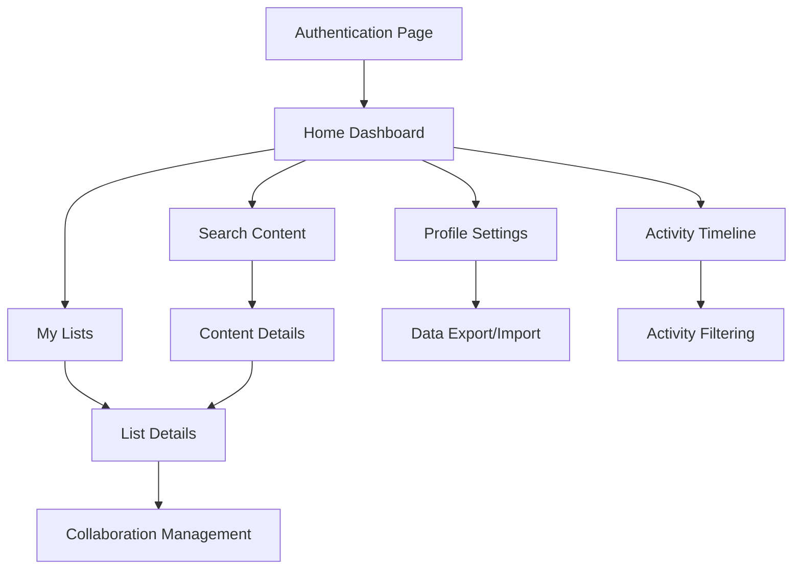

# WatchThis - Product Requirements Document

## 1. Product Overview

WatchThis is a collaborative movie and TV show tracking application that allows users to create, manage, and share watchlists with friends. The app provides seamless content discovery through TMDB integration and secure authentication via passkeys, eliminating the need for traditional passwords.

The product targets entertainment enthusiasts who want to organize their viewing preferences and collaborate with friends on shared watchlists, offering a modern, colorful, and engaging user experience exclusively in dark mode.

## 2. Core Features

### 2.1 User Roles

| Role | Registration Method             | Core Permissions                                                               |
| ---- | ------------------------------- | ------------------------------------------------------------------------------ |
| User | Username + Passkey registration | Can create lists, collaborate on shared lists, search content, manage own data |

### 2.2 Feature Module

Our WatchThis app consists of the following main pages:

1. **Authentication page**: passkey registration, passkey sign-in, username setup.
2. **Home page**: dashboard overview, quick access to lists, activity feed (replacing quick actions).
3. **Activity page**: comprehensive activity timeline with infinite scroll and filtering.
4. **My Lists page**: personal list management, list creation.
5. **Search page**: TMDB content discovery, advanced filtering, content details.
6. **List Details page**: list content management, collaboration controls, sharing options.
7. **Profile page**: user settings, data export/import, account management.

### 2.3 Page Details

| Page Name      | Module Name                | Feature description                                                                                |
| -------------- | -------------------------- | -------------------------------------------------------------------------------------------------- |
| Authentication | Passkey Registration       | Register with username and create passkey for secure authentication                                |
| Authentication | Passkey Sign-in            | Sign in using existing passkey across multiple devices                                             |
| Home           | Dashboard                  | Display overview of all lists, recent activity, and quick navigation                               |
| Home           | Activity Feed              | Display up to 10 recent activity entries replacing quick actions section entirely                  |
| Activity       | Activity Timeline          | Infinite scroll view of all activity entries with detailed information and timestamps              |
| My Lists       | Custom List Creation       | Create new lists with type selection and watch status sync option (TV only, Movies only, or Mixed) |
| My Lists       | List Overview              | View all personal and shared lists with quick access and sync indicators                           |
| Search         | Content Discovery          | Search TMDB database for movies and TV shows with real-time results                                |
| Search         | Advanced Filtering         | Filter content by genre, year, rating, type, and other criteria                                    |
| Search         | Content Details            | View detailed information about movies/shows before adding to lists                                |
| Search         | Watch Status Management    | Set and update watch status for content (Planning, Watching, Completed, etc.)                      |
| Search         | Episode Progress Tracking  | Track individual episode progress for TV shows with automatic status updates                       |
| List Details   | Content Management         | Add, remove, and organize content within lists                                                     |
| List Details   | Watch Status Display       | View watch status badges on content cards showing current progress                                 |
| List Details   | List Settings Modal        | Toggle watch status sync option in existing settings modal                                         |
| List Details   | Collaboration Controls     | Invite friends, manage permissions, block/remove collaborators                                     |
| List Details   | Sharing Options            | Generate shareable links and manage list visibility                                                |
| Profile        | Profile Picture Management | Set external profile picture URL with live preview and validation                                  |
| Profile        | Username Management        | Change username with availability validation and conflict resolution                               |
| Profile        | Passkey Device Viewer      | View all registered passkey devices with names, creation dates, and last used timestamps           |
| Profile        | Data Export/Import         | Export lists to CSV/JSON formats and import from external sources                                  |
| Profile        | Account Settings           | Manage privacy preferences and account information                                                 |
| Activity       | Activity Entry Display     | Show activity type, user info, content details, and sync indicators for collaborative actions      |
| Activity       | Activity Filtering         | Filter activity by type, date range, and collaboration status                                      |

## 3. Watch Status Tracking System

### 3.1 Status Types and Behaviors

**Movie Watch Statuses:**

* **Planning**: User intends to watch the movie

* **Completed**: User has finished watching the movie

**TV Show Watch Statuses:**

* **Planning**: User intends to watch the show

* **Watching**: User is currently watching the show (has watched at least one episode)

* **Paused**: User has temporarily stopped watching but intends to continue

* **Completed**: User has watched all available episodes

* **Dropped**: User has stopped watching and does not intend to continue

### 3.2 Episode Tracking for TV Shows

**Episode Progress Management:**

* Users can mark individual episodes as watched or unwatched

* Episode data is fetched from TMDB API including season and episode numbers

* Progress is displayed as "X of Y episodes watched" format

* Episode tracking is only available for TV shows, not movies

**Automatic Status Updates:**

* When a user marks their first episode as watched, show status automatically changes to "Watching"

* When all available episodes are marked as watched, show status automatically changes to "Completed"

* If new episodes are added to a "Completed" show, status reverts to "Watching"

* Manual status changes override automatic updates until next episode interaction

### 3.3 Status Display and Interaction

**Content Card Badges:**

* Watch status appears as a colored badge on content cards when set

* Badge colors: Planning (blue), Watching (yellow), Paused (orange), Completed (green), Dropped (red)

* Badges only appear when user has set a status (no badge for untracked content)

* Badge text shows status name and episode progress for TV shows

**Content Details Modal:**

* Status selector dropdown with appropriate options based on content type

* Episode list with checkboxes for TV shows showing season/episode structure, episode titles, and synopses from TMDB

* Progress indicator showing completion percentage

* Last updated timestamp for status changes

## 4. Watch Together Feature

### 4.1 Sync Configuration

**List Creation and Settings:**

* "Sync watch status with collaborators" toggle option available during list creation

* Option can be enabled/disabled by list owner at any time in list settings

* Clear indication when sync is enabled with visual indicators throughout the interface

* Sync setting applies to all content within the list, not individual items

### 4.2 Status Synchronization Behavior

**Automatic Sync Triggers:**

* Content status changes (Planning, Watching, Paused, Completed, Dropped)

* Episode watch status updates for TV shows

* Only applies when content exists in a list with sync enabled

* Sync occurs in real-time when collaborators are online

**Sync Logic:**

* When a user updates status for content in a sync-enabled list, the same status is applied to all collaborators

* Episode progress is synced individually - marking an episode as watched applies to all collaborators

* If collaborators have conflicting statuses, the most recent update takes precedence

* Sync only affects content that exists in the specific sync-enabled list

### 4.3 User Experience

**Visual Indicators:**

* Sync-enabled lists display a "sync" icon in list cards and headers only

* No additional sync indicators on content cards or other UI elements

**Privacy and Control:**

* Users can see which lists have sync enabled before joining as collaborators

* Sync setting is clearly communicated during collaboration invitations

* Users maintain individual control over content not in sync-enabled lists

* Option to leave sync-enabled lists if user prefers individual tracking

## 5. Activity Tracking System

### 5.1 Activity Types and Generation

**Watch Status Changes:**

* Changing watch status of any content (Planning, Watching, Paused, Completed, Dropped) generates an activity entry

* Activity includes content title, poster, old status, new status, and timestamp

* If content exists in shared lists, activity is visible to all list collaborators

* For sync-enabled lists, activity shows up to 2 additional usernames and profile pictures of other collaborators whose status was also updated

**Episode Progress Tracking:**

* Marking TV show episodes as watched/unwatched generates activity entries

* Activity includes show title, season/episode information, and progress update

* Same visibility rules as watch status changes apply

* Sync-enabled lists show collaborative progress updates with multiple user indicators

**List Content Management:**

* Adding content to any list generates an activity entry with content details

* Removing content from any list generates an activity entry

* If list is shared with collaborators, these activities are visible to all list members

* Activities include list name, content title, and action performed

**List Management Activities:**

* Creating new lists generates activity entries visible to the creator

* Updating list details (name, description, settings) generates activity entries

* Adding collaborators to lists generates activity entries visible to all list members

* Removing collaborators generates activity entries visible to remaining list members

* All list management activities include list name and specific action details

### 5.2 Activity Feed Display

**Dashboard Integration:**

* Activity feed completely replaces the existing "Quick actions" section on the home page

* Displays up to 10 most recent activity entries in chronological order (newest first)

* Each entry shows user avatar, username, action description, content/list information, and relative timestamp

* "View more" button provides access to comprehensive activity timeline

**Activity Timeline Page:**

* Dedicated page accessible via "View more" button from dashboard

* Infinite scroll implementation loading activities in batches

* Comprehensive view of all user and collaborative activities

* Advanced filtering options by activity type, date range, and collaboration status

### 5.3 Collaborative Activity Features

**Visibility Rules:**

* Personal activities (own actions) are always visible to the user

* Shared list activities are visible to all list collaborators

* Private list activities remain private to the list owner

* Activity visibility respects list sharing permissions

**Sync Indicators:**

* When sync is enabled and multiple users are affected by an action, activity entries show collaborative indicators

* Display primary actor (the user who performed the action) prominently

* Show up to 2 additional affected users with smaller avatars and usernames

* Clear visual distinction between individual and collaborative activities

## 6. Core Process

**User Registration and Authentication Flow:**
New users register by choosing a username and creating a passkey through their device's biometric or security key. Once registered, users can sign in on any device using their passkey without passwords.

**Content Discovery and List Management Flow:**
Users search for movies and TV shows through TMDB integration, view detailed information, and add content to their lists. They can create custom lists with specific content types and manage their default "For Me" list.

**Collaboration Flow:**
Users can invite friends to collaborate on custom lists (excluding "For Me" list), manage permissions, and control access by blocking or removing collaborators as needed.

**Watch Together Flow:**
Users can enable "Sync watch status with collaborators" when creating or editing a list. When enabled, any watch status updates (including episode progress) made by any collaborator will automatically sync to all other collaborators for content within that list. This creates a shared viewing experience where the group's progress is synchronized.

**Watch Status Tracking Flow:**
Users can set and update watch status for any content (movies or TV shows). For movies, available statuses are Planning and Completed. For TV shows, statuses include Planning, Watching, Paused, Completed, and Dropped. TV shows support episode-level tracking where marking episodes as watched automatically updates the show status to Watching, and completing all episodes sets status to Completed.

**Activity Tracking Flow:**
All user actions (watch status changes, episode progress, list management, content additions/removals) automatically generate activity entries. These activities are displayed on the home dashboard (up to 10 entries) and in the comprehensive activity timeline. Collaborative activities are shared with list collaborators based on list sharing settings, with sync-enabled lists showing multiple user indicators when actions affect multiple users simultaneously.

## 7. User Interface Design

### 7.1 Design Style

**Watch Status Color Scheme:**

* Planning: Blue (#3B82F6) with light blue background

* Watching: Yellow (#EAB308) with light yellow background

* Paused: Orange (#F97316) with light orange background

* Completed: Green (#22C55E) with light green background

* Dropped: Red (#EF4444) with light red background

**Activity Feed Color Scheme:**

* Watch status activities: Use corresponding status colors for action indicators

* Episode progress: Purple (#8B5CF6) for episode-related activities

* List management: Teal (#14B8A6) for list creation, updates, and collaboration

* Content management: Indigo (#6366F1) for adding/removing content

**Badge Design:**

* Rounded corners with subtle border and semi-transparent background

* Small text with icon indicators for status type

* Hover effects with slightly darker background

* Responsive sizing for different screen sizes

### 7.2 Page Design Overview

| Page Name      | Module Name           | UI Elements                                                                                           |
| -------------- | --------------------- | ----------------------------------------------------------------------------------------------------- |
| Authentication | Passkey Setup         | Centered card with gradient background, biometric icon animations                                     |
| Home           | Dashboard             | Grid layout with colorful cards, activity feed replacing quick actions, floating action buttons       |
| Home           | Activity Feed         | Linear timeline with user avatars, action descriptions, content thumbnails, and relative timestamps   |
| Activity       | Activity Timeline     | Infinite scroll layout with detailed activity cards, filtering controls, and search functionality     |
| Activity       | Activity Cards        | User avatar clusters for sync activities, content thumbnails, action type indicators, timestamps      |
| My Lists       | List Grid             | Masonry layout with vibrant list cards, quick action overlays, type indicators, sync status icons     |
| My Lists       | List Creation Form    | Toggle switch for "Sync watch status with collaborators" with clear labeling and description          |
| Search         | Content Browser       | Search bar with live suggestions, filter chips, movie/TV poster grid with hover effects               |
| List Details   | Content Management    | Collaboration avatars, watch status badges, colorful status indicators, sync indicators               |
| List Details   | List Settings Modal   | Sync toggle switch integrated into existing list settings modal                                       |
| Search         | Content Details Modal | Status dropdown selector, episode checklist, progress bars, timestamp displays, sync status indicator |
| Profile        | Profile Header        | Large circular profile picture with URL input field, username display with edit icon                  |
| Profile        | Settings Panel        | Toggle switches with custom styling, export buttons with progress indicators                          |
| Profile        | Device Management     | Card-based layout showing passkey devices with device icons and status indicators                     |

### 7.3 Watch Status UI Components

| Component Name     | UI Elements                                                          | Description                                                                                                              |
| ------------------ | -------------------------------------------------------------------- | ------------------------------------------------------------------------------------------------------------------------ |
| Status Badge       | Existing Badge component with status variants                        | Uses the existing Badge component with status-specific styling (watching, completed, planning, paused, dropped variants) |
| Status Selector    | Dropdown with status options                                         | Allows users to change watch status in modals                                                                            |
| Episode Tracker    | Checkbox list with episode titles, synopses, and season/episode info | Shows episode progress for TV shows including episode titles and synopses fetched from TMDB API                          |
| Progress Indicator | Circular or linear progress bar                                      | Visual representation of completion percentage                                                                           |

### 7.4 Activity Feed UI Components

| Component Name          | UI Elements                                                   | Description                                                                                            |
| ----------------------- | ------------------------------------------------------------- | ------------------------------------------------------------------------------------------------------ |
| Activity Entry          | User avatar, action description, content thumbnail, timestamp | Individual activity item showing user action with relevant content and timing information              |
| Collaborative Indicator | Primary user avatar with up to 2 smaller secondary avatars    | Shows when sync actions affect multiple users, with clear visual hierarchy                             |
| Activity Type Badge     | Colored icon badge indicating activity type                   | Visual indicator for different activity types (status change, episode progress, list management, etc.) |
| Content Thumbnail       | Small poster image with content title overlay                 | Compact content representation within activity entries                                                 |
| Activity Filter         | Dropdown and toggle controls for filtering                    | Allows filtering by activity type, date range, and collaboration status                                |
| Load More Button        | Infinite scroll trigger with loading animation                | Seamless loading of additional activity entries in the timeline view                                   |

### 7.5 Responsiveness

The application is mobile-first with adaptive design for tablet and desktop. Touch interactions are optimized for mobile devices with gesture support for list management and content browsing. The interface scales seamlessly across screen sizes while maintaining the vibrant, entertainment-focused aesthetic.
