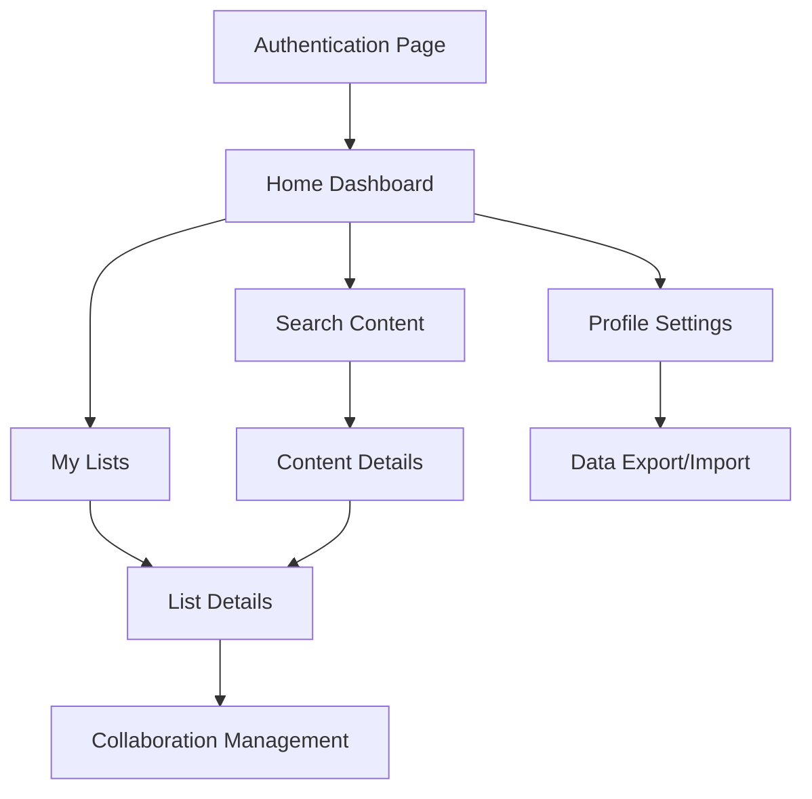

# WatchThis - Product Requirements Document

## 1. Product Overview

WatchThis is a collaborative movie and TV show tracking application that allows users to create, manage, and share watchlists with friends. The app provides seamless content discovery through TMDB integration and secure authentication via passkeys, eliminating the need for traditional passwords.

The product targets entertainment enthusiasts who want to organize their viewing preferences and collaborate with friends on shared watchlists, offering a modern, colorful, and engaging user experience exclusively in dark mode.

## 2. Core Features

### 2.1 User Roles

| Role | Registration Method             | Core Permissions                                                               |
| ---- | ------------------------------- | ------------------------------------------------------------------------------ |
| User | Username + Passkey registration | Can create lists, collaborate on shared lists, search content, manage own data |

### 2.2 Feature Module

Our WatchThis app consists of the following main pages:

1. **Authentication page**: passkey registration, passkey sign-in, username setup.
2. **Home page**: dashboard overview, quick access to lists, recent activity feed.
3. **My Lists page**: personal list management, list creation.
4. **Search page**: TMDB content discovery, advanced filtering, content details.
5. **List Details page**: list content management, collaboration controls, sharing options.
6. **Profile page**: user settings, data export/import, account management.

### 2.3 Page Details

| Page Name      | Module Name            | Feature description                                                   |
| -------------- | ---------------------- | --------------------------------------------------------------------- |
| Authentication | Passkey Registration   | Register with username and create passkey for secure authentication   |
| Authentication | Passkey Sign-in        | Sign in using existing passkey across multiple devices                |
| Home           | Dashboard              | Display overview of all lists, recent activity, and quick navigation  |
| Home           | Activity Feed          | Show recent additions, friend activities, and list updates            |
| My Lists       | Custom List Creation   | Create new lists with type selection (TV only, Movies only, or Mixed) |
| My Lists       | List Overview          | View all personal and shared lists with quick access                  |
| Search         | Content Discovery      | Search TMDB database for movies and TV shows with real-time results   |
| Search         | Advanced Filtering     | Filter content by genre, year, rating, type, and other criteria       |
| Search         | Content Details        | View detailed information about movies/shows before adding to lists   |
| List Details   | Content Management     | Add, remove, and organize content within lists                        |
| List Details   | Collaboration Controls | Invite friends, manage permissions, block/remove collaborators        |
| List Details   | Sharing Options        | Generate shareable links and manage list visibility                   |
| Profile        | Profile Picture Management | Set external profile picture URL with live preview and validation |
| Profile        | Username Management    | Change username with availability validation and conflict resolution   |
| Profile        | Passkey Device Viewer  | View all registered passkey devices with names, creation dates, and last used timestamps |
| Profile        | Data Export/Import     | Export lists to CSV/JSON formats and import from external sources     |
| Profile        | Account Settings       | Manage privacy preferences and account information                     |

## 3. Core Process

**User Registration and Authentication Flow:**
New users register by choosing a username and creating a passkey through their device's biometric or security key. Once registered, users can sign in on any device using their passkey without passwords.

**Content Discovery and List Management Flow:**
Users search for movies and TV shows through TMDB integration, view detailed information, and add content to their lists. They can create custom lists with specific content types and manage their default "For Me" list.

**Collaboration Flow:**
Users can invite friends to collaborate on custom lists (excluding "For Me" list), manage permissions, and control access by blocking or removing collaborators as needed.

## 4. User Interface Design

### 4.1 Page Design Overview

| Page Name      | Module Name        | UI Elements                                                                             |
| -------------- | ------------------ | --------------------------------------------------------------------------------------- |
| Authentication | Passkey Setup      | Centered card with gradient background, biometric icon animations                       |
| Home           | Dashboard          | Grid layout with colorful cards, activity timeline, floating action buttons             |
| My Lists       | List Grid          | Masonry layout with vibrant list cards, quick action overlays, type indicators          |
| Search         | Content Browser    | Search bar with live suggestions, filter chips, movie/TV poster grid with hover effects |
| List Details   | Content Management | Collaboration avatars, colorful status indicators                                       |
| Profile        | Profile Header     | Large circular profile picture with URL input field, username display with edit icon    |
| Profile        | Settings Panel     | Toggle switches with custom styling, export buttons with progress indicators            |
| Profile        | Device Management  | Card-based layout showing passkey devices with device icons and status indicators      |

### 4.3 Responsiveness

The application is mobile-first with adaptive design for tablet and desktop. Touch interactions are optimized for mobile devices with gesture support for list management and content browsing. The interface scales seamlessly across screen sizes while maintaining the vibrant, entertainment-focused aesthetic.
