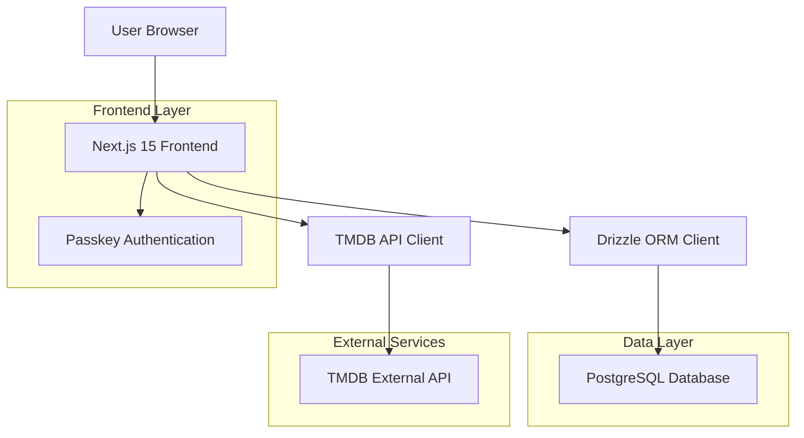

# WatchThis - Technical Architecture Document

## 1. Architecture Overview



## 2. Technology Stack

- **Frontend**: Next.js@15 + React@19 + TypeScript + Tailwind CSS@4 + React ARIA Components
- **Database**: PostgreSQL with Drizzle ORM
- **Authentication**: WebAuthn/Passkeys (no backend auth service)
- **External APIs**: TMDB API v3
- **Testing**: Vitest + React Testing Library
- **Deployment**: Vercel OR Docker

## 3. Core Architecture Patterns

### Server Components First

- All pages are server components by default
- Use "islands of reactivity" - wrap client components in Suspense
- Pattern: `page.tsx` (server) → `<Suspense>` → `ClientComponent.tsx`

### Middleware Authentication

- ALL authenticated API routes use `withAuth` from `/src/lib/auth/api-middleware.ts`
- Guaranteed user context in protected routes

### Shared Layouts

- Next.js layout system for common UI elements
- Route groups for different auth states: `(authenticated)` and `(public)`

## 4. Route Structure

| Route             | Purpose                  | Auth Required |
| ----------------- | ------------------------ | ------------- |
| `/`               | Home dashboard           | Yes           |
| `/auth`           | Authentication page      | No            |
| `/lists`          | My Lists page            | Yes           |
| `/lists/[id]`     | List details             | Yes           |
| `/search`         | Content discovery        | Yes           |
| `/profile`        | User profile             | Yes           |
| `/activity`       | Activity timeline        | Yes           |
| `/api/auth/*`     | Authentication endpoints | Mixed         |
| `/api/lists/*`    | List management          | Yes           |
| `/api/tmdb/*`     | TMDB proxy endpoints     | Yes           |
| `/api/status/*`   | Watch status management  | Yes           |
| `/api/activity/*` | Activity feed            | Yes           |
| `/api/profile/*`  | Profile management       | Yes           |

## 5. Database Schema Overview

### Core Tables

- **users**: User accounts and profile information
- **passkey_credentials**: WebAuthn credential storage
- **lists**: User-created watchlists
- **list_collaborators**: List sharing and permissions
- **list_items**: Content within lists
- **user_content_status**: Watch status tracking
- **episode_watch_status**: Episode-level progress
- **activity_feed**: User activity tracking

### Key Relationships

- Users own lists and can collaborate on others
- Lists contain items (TMDB content references)
- Users track watch status for content
- Activities are generated from user actions

## 6. External Integrations

### TMDB API

- Server-side proxy endpoints for content search and details
- Caching strategy for frequently accessed content
- Rate limiting and error handling

### WebAuthn/Passkeys

- Browser-native authentication
- Device-based credential storage
- Cross-platform compatibility

## 7. Performance Considerations

- **Server Components**: Initial data fetching on server
- **Minimal Client Components**: Only for interactivity
- **Suspense Boundaries**: Consistent loading states
- **Database Optimization**: Proper indexing and query optimization
- **API Caching**: TMDB response caching

## 8. Security Architecture

- **Passwordless Authentication**: WebAuthn passkeys only
- **API Middleware**: Consistent auth validation
- **Input Validation**: TypeScript + runtime validation
- **CORS Configuration**: Proper origin restrictions
- **Environment Variables**: Secure secret management

## 9. Development Standards

### File Organization

```
src/
├── app/
│   ├── (authenticated)/     # Protected routes
│   ├── (public)/           # Public routes
│   └── api/                # API routes
├── components/
│   ├── ui/                 # Base components
│   └── [feature]/          # Feature-specific
└── lib/
    ├── auth/               # Authentication
    ├── db/                 # Database
    └── utils.ts            # Utilities
```

### Naming Conventions

- **Pages**: `page.tsx`, `layout.tsx`
- **Client Components**: Suffix with "Client" (e.g., `DashboardClient.tsx`)
- **API Routes**: `route.ts`
- **Files**: PascalCase for components, camelCase for utilities

### Code Standards

- **TypeScript**: Strict configuration required
- **Styling**: Tailwind CSS exclusively
- **Error Handling**: Consistent error boundaries and API responses
- **Testing**: Component and integration tests

---

_For detailed feature implementations, API specifications, and database schemas, refer to individual feature documents in the `/features/` directory._
