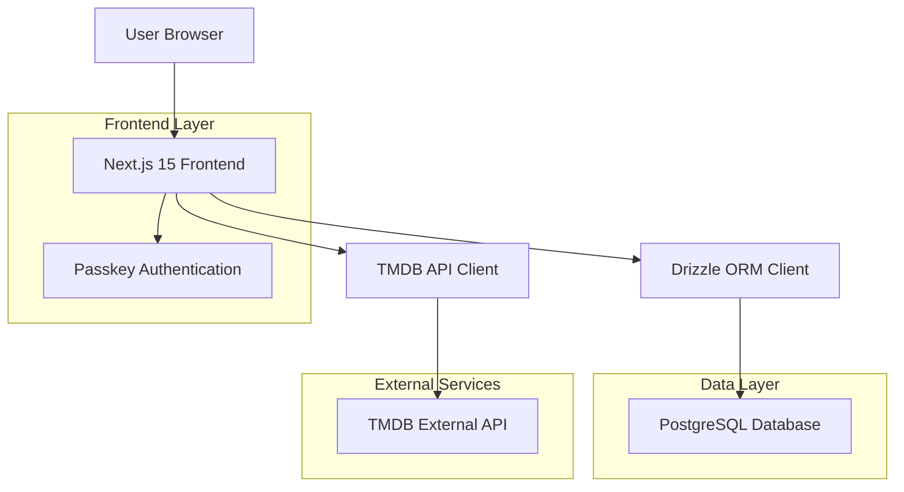
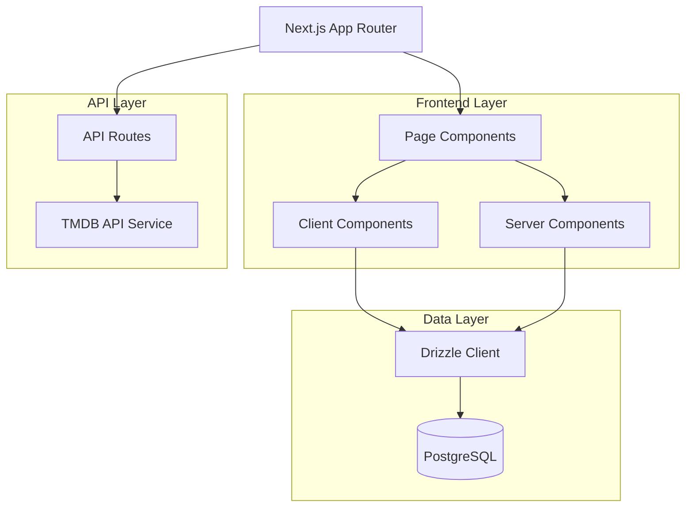
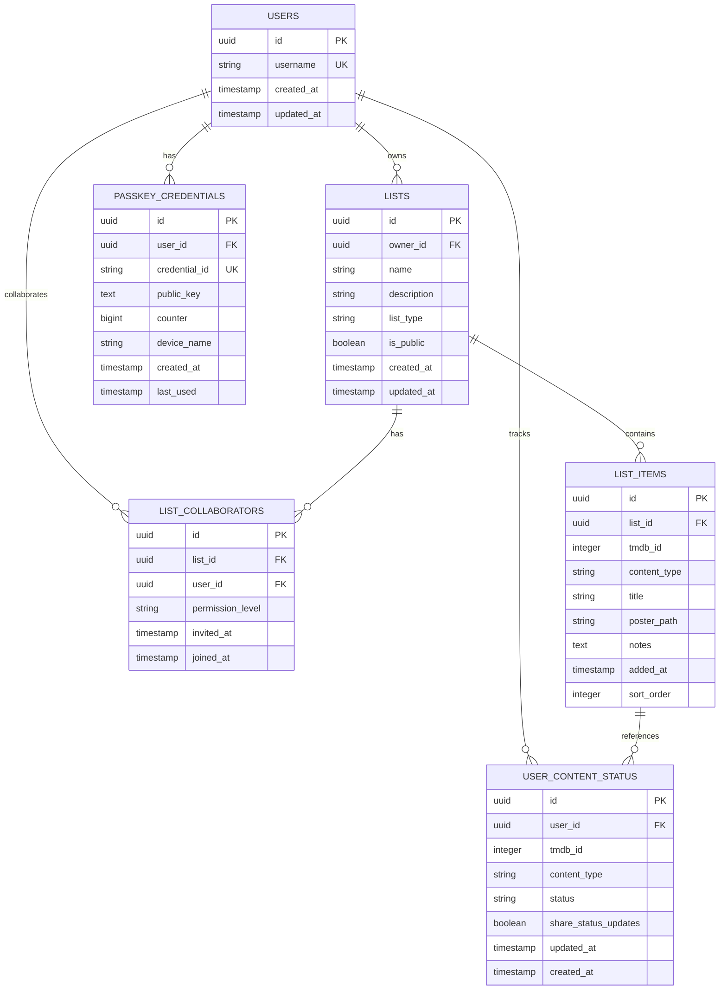

# WatchThis - Technical Architecture Document

## 1. Architecture Design



## 2. Technology Description

* Frontend: Next.js\@15 + React\@19 + TypeScript + Tailwind CSS\@4 + React ARIA Components

* Database: PostgreSQL with Drizzle ORM

* Authentication: WebAuthn/Passkeys (no backend auth service)

* External APIs: TMDB API v3

* Testing: Vitest + React Testing Library

* Deployment: Vercel OR Docker

## 3. Route Definitions

| Route                   | Purpose                                                           |
| ----------------------- | ----------------------------------------------------------------- |
| /                       | Home dashboard with lists overview and activity feed              |
| /auth                   | Authentication page for passkey registration and sign-in          |
| /lists                  | My Lists page showing all personal and shared lists               |
| /lists/\[id]            | Individual list details with content management and collaboration |
| /search                 | Content discovery page with TMDB search and filtering             |
| /profile                | User profile with settings and data export/import                 |
| /api/tmdb/search        | Server-side TMDB API proxy for content search                     |
| /api/tmdb/details/\[id] | Server-side TMDB API proxy for content details                    |

## 4. API Definitions

### 4.1 Core API

**TMDB Content Search**

```
GET /api/tmdb/search
```

Request:

| Param Name | Param Type | isRequired | Description                              |
| ---------- | ---------- | ---------- | ---------------------------------------- |
| query      | string     | true       | Search term for movies/TV shows          |
| type       | string     | false      | Content type filter (movie, tv, or both) |
| page       | number     | false      | Page number for pagination               |

Response:

| Param Name     | Param Type | Description                     |
| -------------- | ---------- | ------------------------------- |
| results        | array      | Array of movie/TV show objects  |
| total\_pages   | number     | Total number of pages available |
| total\_results | number     | Total number of results         |

**Content Details**

```
GET /api/tmdb/details/[id]
```

Request:

| Param Name | Param Type | isRequired | Description     |
| ---------- | ---------- | ---------- | --------------- |
| id         | string     | true       | TMDB content ID |

Response:

| Param Name    | Param Type | Description                 |
| ------------- | ---------- | --------------------------- |
| id            | number     | TMDB content ID             |
| title         | string     | Movie title or TV show name |
| overview      | string     | Content description         |
| poster\_path  | string     | Poster image path           |
| release\_date | string     | Release date                |
| genres        | array      | Array of genre objects      |

## 5. Server Architecture Diagram



## 6. Data Model

### 6.1 Data Model Definition



### 6.2 Data Definition Language

**Users Table**

```sql
-- Create users table
CREATE TABLE users (
    id UUID PRIMARY KEY DEFAULT gen_random_uuid(),
    username VARCHAR(50) UNIQUE NOT NULL,
    created_at TIMESTAMP WITH TIME ZONE DEFAULT NOW(),
    updated_at TIMESTAMP WITH TIME ZONE DEFAULT NOW()
);

-- Create index
CREATE INDEX idx_users_username ON users(username);
```

**Passkey Credentials Table**

```sql
-- Create passkey_credentials table
CREATE TABLE passkey_credentials (
    id UUID PRIMARY KEY DEFAULT gen_random_uuid(),
    user_id UUID NOT NULL REFERENCES users(id) ON DELETE CASCADE,
    credential_id VARCHAR(255) UNIQUE NOT NULL,
    public_key TEXT NOT NULL,
    counter BIGINT DEFAULT 0,
    device_name VARCHAR(100),
    created_at TIMESTAMP WITH TIME ZONE DEFAULT NOW(),
    last_used TIMESTAMP WITH TIME ZONE DEFAULT NOW()
);

-- Create indexes
CREATE INDEX idx_passkey_credentials_user_id ON passkey_credentials(user_id);
CREATE INDEX idx_passkey_credentials_credential_id ON passkey_credentials(credential_id);
```

**Lists Table**

```sql
-- Create lists table
CREATE TABLE lists (
    id UUID PRIMARY KEY DEFAULT gen_random_uuid(),
    owner_id UUID NOT NULL REFERENCES users(id) ON DELETE CASCADE,
    name VARCHAR(100) NOT NULL,
    description TEXT,
    list_type VARCHAR(20) DEFAULT 'mixed' CHECK (list_type IN ('movie', 'tv', 'mixed')),
    is_public BOOLEAN DEFAULT false,
    created_at TIMESTAMP WITH TIME ZONE DEFAULT NOW(),
    updated_at TIMESTAMP WITH TIME ZONE DEFAULT NOW()
);

-- Create indexes
CREATE INDEX idx_lists_owner_id ON lists(owner_id);
CREATE INDEX idx_lists_created_at ON lists(created_at DESC);
```

**List Collaborators Table**

```sql
-- Create list_collaborators table
CREATE TABLE list_collaborators (
    id UUID PRIMARY KEY DEFAULT gen_random_uuid(),
    list_id UUID NOT NULL REFERENCES lists(id) ON DELETE CASCADE,
    user_id UUID NOT NULL REFERENCES users(id) ON DELETE CASCADE,
    permission_level VARCHAR(20) DEFAULT 'collaborator' CHECK (permission_level IN ('collaborator', 'viewer')),
    invited_at TIMESTAMP WITH TIME ZONE DEFAULT NOW(),
    joined_at TIMESTAMP WITH TIME ZONE,
    UNIQUE(list_id, user_id)
);

-- Create indexes
CREATE INDEX idx_list_collaborators_list_id ON list_collaborators(list_id);
CREATE INDEX idx_list_collaborators_user_id ON list_collaborators(user_id);
```

**List Items Table**

```sql
-- Create list_items table
CREATE TABLE list_items (
    id UUID PRIMARY KEY DEFAULT gen_random_uuid(),
    list_id UUID NOT NULL REFERENCES lists(id) ON DELETE CASCADE,
    tmdb_id INTEGER NOT NULL,
    content_type VARCHAR(10) NOT NULL CHECK (content_type IN ('movie', 'tv')),
    title VARCHAR(255) NOT NULL,
    poster_path VARCHAR(255),
    notes TEXT,
    added_at TIMESTAMP WITH TIME ZONE DEFAULT NOW(),
    sort_order INTEGER DEFAULT 0,
    UNIQUE(list_id, tmdb_id, content_type)
);

-- Create indexes
CREATE INDEX idx_list_items_list_id ON list_items(list_id);
CREATE INDEX idx_list_items_tmdb_id ON list_items(tmdb_id);
CREATE INDEX idx_list_items_sort_order ON list_items(list_id, sort_order);
```

**User Content Status Table**

```sql
-- Create user_content_status table
CREATE TABLE user_content_status (
    id UUID PRIMARY KEY DEFAULT gen_random_uuid(),
    user_id UUID NOT NULL REFERENCES users(id) ON DELETE CASCADE,
    tmdb_id INTEGER NOT NULL,
    content_type VARCHAR(10) NOT NULL CHECK (content_type IN ('movie', 'tv')),
    status VARCHAR(20) DEFAULT 'to_watch' CHECK (status IN ('to_watch', 'watching', 'watched')),
    share_status_updates BOOLEAN DEFAULT true,
    updated_at TIMESTAMP WITH TIME ZONE DEFAULT NOW(),
    created_at TIMESTAMP WITH TIME ZONE DEFAULT NOW(),
    UNIQUE(user_id, tmdb_id, content_type)
);

-- Create indexes
CREATE INDEX idx_user_content_status_user_id ON user_content_status(user_id);
CREATE INDEX idx_user_content_status_tmdb_id ON user_content_status(tmdb_id);
CREATE INDEX idx_user_content_status_updated_at ON user_content_status(updated_at DESC);
```

**Status Management Architecture**

The `user_content_status` table enables sophisticated status tracking that addresses cross-list synchronization and collaborative sharing:

1. **Cross-List Status Sync**: When content appears in multiple lists, its status is maintained globally per user through the `user_content_status` table, ensuring consistency across all lists.

2. **Collaborative Status Sharing**: The `share_status_updates` boolean flag allows users to control whether their status changes propagate to collaborators on shared lists. When enabled (default), status updates are visible to all list collaborators.

3. **Status Resolution**: The application joins `list_items` with `user_content_status` to display the current status for each user-content combination, falling back to 'to_watch' if no status record exists.

**Initial Data**

```sql
-- Create default "For Me" list for each user (handled in application logic)
-- This will be created automatically when a user registers
-- Initial user_content_status records are created when users first interact with content
```

