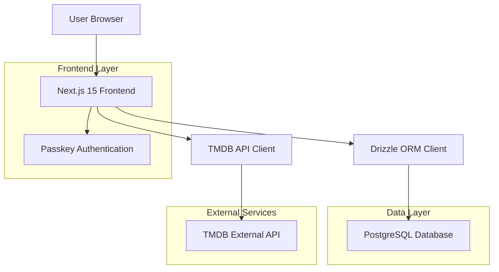
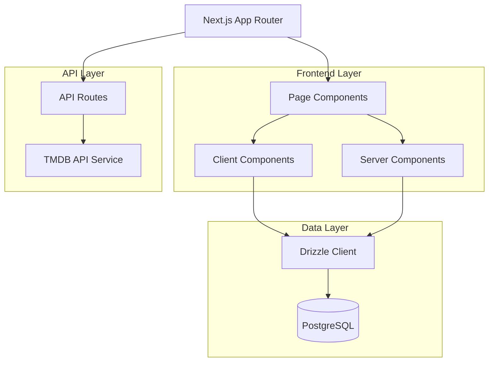
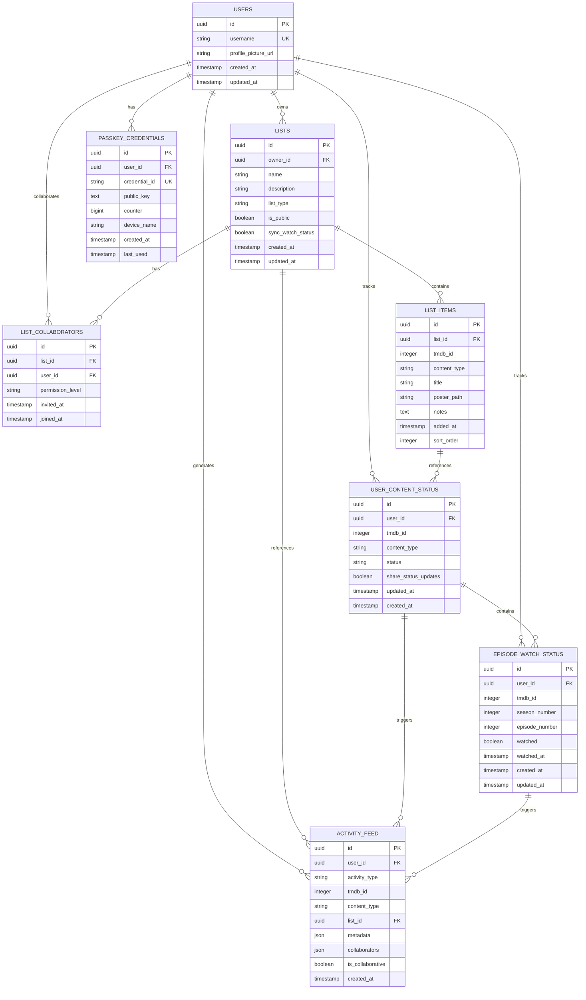

# WatchThis - Technical Architecture Document

## 1. Architecture Design



## 2. Technology Description

* Frontend: Next.js\@15 + React\@19 + TypeScript + Tailwind CSS\@4 + React ARIA Components

* Database: PostgreSQL with Drizzle ORM

* Authentication: WebAuthn/Passkeys (no backend auth service)

* External APIs: TMDB API v3

* Testing: Vitest + React Testing Library

* Deployment: Vercel OR Docker

## 3. Route Definitions

| Route                    | Purpose                                                              |
| ------------------------ | -------------------------------------------------------------------- |
| /                        | Home dashboard with lists overview and activity feed                 |
| /auth                    | Authentication page for passkey registration and sign-in             |
| /lists                   | My Lists page showing all personal and shared lists                  |
| /lists/\[id]             | Individual list details with content management and collaboration    |
| /search                  | Content discovery page with TMDB search and filtering                |
| /profile                 | User profile with settings and data export/import                    |
| /api/auth/session        | Enhanced session endpoint with profile management                    |
| /api/profile/devices     | Passkey device management and viewing                                |
| /api/profile/export      | Data export functionality (CSV/JSON)                                 |
| /api/profile/import      | Data import functionality (CSV/JSON)                                 |
| /api/tmdb/search         | Server-side TMDB API proxy for content search                        |
| /api/tmdb/details/\[id]  | Server-side TMDB API proxy for content details                       |
| /api/tmdb/episodes/\[id] | Server-side TMDB API proxy for TV show episode data                  |
| /api/status/content      | Content watch status management with sync support (GET, PUT, DELETE) |
| /api/status/episodes     | Episode watch status tracking with sync support (GET, PUT)           |
| /activity                | Activity timeline page with infinite scroll and filtering            |
| /api/activity            | Activity feed management (GET, POST)                                 |
| /api/activity/timeline   | Infinite scroll activity timeline with filtering (GET)               |

## 4. API Definitions

### 4.1 Core API

**TMDB Content Search**

```
GET /api/tmdb/search
```

Request:

| Param Name | Param Type | isRequired | Description                              |
| ---------- | ---------- | ---------- | ---------------------------------------- |
| query      | string     | true       | Search term for movies/TV shows          |
| type       | string     | false      | Content type filter (movie, tv, or both) |
| page       | number     | false      | Page number for pagination               |

Response:

| Param Name     | Param Type | Description                     |
| -------------- | ---------- | ------------------------------- |
| results        | array      | Array of movie/TV show objects  |
| total\_pages   | number     | Total number of pages available |
| total\_results | number     | Total number of results         |

**Content Details**

```
GET /api/tmdb/details/[id]
```

Request:

| Param Name | Param Type | isRequired | Description     |
| ---------- | ---------- | ---------- | --------------- |
| id         | string     | true       | TMDB content ID |

Response:

| Param Name    | Param Type | Description                 |
| ------------- | ---------- | --------------------------- |
| id            | number     | TMDB content ID             |
| title         | string     | Movie title or TV show name |
| overview      | string     | Content description         |
| poster\_path  | string     | Poster image path           |
| release\_date | string     | Release date                |
| genres        | array      | Array of genre objects      |

**Enhanced Session Management**

```
GET /api/auth/session
```

Response:

| Param Name                 | Param Type | Description                    |
| -------------------------- | ---------- | ------------------------------ |
| user                       | object     | User information object        |
| user.id                    | string     | User ID                        |
| user.username              | string     | Current username               |
| user.profile\_picture\_url | string     | Profile picture URL (nullable) |
| user.created\_at           | string     | Account creation timestamp     |

```
PUT /api/profile
```

Request:

| Param Name            | Param Type | isRequired | Description                  |
| --------------------- | ---------- | ---------- | ---------------------------- |
| username              | string     | false      | New username                 |
| profile\_picture\_url | string     | false      | External profile picture URL |

Response:

| Param Name | Param Type | Description         |
| ---------- | ---------- | ------------------- |
| success    | boolean    | Operation status    |
| user       | object     | Updated user object |

**Passkey Device Management**

```
GET /api/profile/devices
```

Response:

| Param Name | Param Type | Description                     |
| ---------- | ---------- | ------------------------------- |
| devices    | array      | Array of passkey device objects |

Device Object:

| Param Name   | Param Type | Description              |
| ------------ | ---------- | ------------------------ |
| id           | string     | Device credential ID     |
| device\_name | string     | User-defined device name |
| created\_at  | string     | Device registration date |
| last\_used   | string     | Last authentication date |

**Data Export**

```
GET /api/profile/export?format=csv|json
```

Request:

| Param Name | Param Type | isRequired | Description              |
| ---------- | ---------- | ---------- | ------------------------ |
| format     | string     | true       | Export format (csv/json) |

Response:

| Param Name | Param Type | Description                       |
| ---------- | ---------- | --------------------------------- |
| data       | string     | Exported data in requested format |
| filename   | string     | Suggested filename                |

**Data Import**

```
POST /api/profile/import
```

Request:

| Param Name | Param Type | isRequired | Description                |
| ---------- | ---------- | ---------- | -------------------------- |
| file       | File       | true       | CSV or JSON file to import |
| format     | string     | true       | File format (csv/json)     |

Response:

| Param Name      | Param Type | Description                    |
| --------------- | ---------- | ------------------------------ |
| success         | boolean    | Import operation status        |
| imported\_count | number     | Number of lists imported       |
| errors          | array      | Array of import error messages |

**Content Watch Status Management**

```
GET /api/status/content?tmdb_id={id}&content_type={type}
```

Request:

| Param Name    | Param Type | isRequired | Description                |
| ------------- | ---------- | ---------- | -------------------------- |
| tmdb\_id      | number     | true       | TMDB content ID            |
| content\_type | string     | true       | Content type (movie or tv) |

Response:

| Param Name  | Param Type | Description                           |
| ----------- | ---------- | ------------------------------------- |
| status      | string     | Current watch status (nullable)       |
| updated\_at | string     | Last status update timestamp          |
| progress    | object     | Episode progress data (TV shows only) |

```
PUT /api/status/content
```

Request:

| Param Name    | Param Type | isRequired | Description                                      |
| ------------- | ---------- | ---------- | ------------------------------------------------ |
| tmdb\_id      | number     | true       | TMDB content ID                                  |
| content\_type | string     | true       | Content type (movie or tv)                       |
| status        | string     | true       | New status (planning, watching, completed, etc.) |

Response:

| Param Name      | Param Type | Description                                    |
| --------------- | ---------- | ---------------------------------------------- |
| success         | boolean    | Operation status                               |
| status          | object     | Updated status object                          |
| synced\_to      | array      | List of collaborator IDs who received the sync |
| affected\_lists | array      | List IDs where sync was applied                |

**Episode Watch Status Tracking**

```
GET /api/status/episodes?tmdb_id={id}
```

Request:

| Param Name | Param Type | isRequired | Description     |
| ---------- | ---------- | ---------- | --------------- |
| tmdb\_id   | number     | true       | TMDB TV show ID |

Response:

| Param Name      | Param Type | Description                       |
| --------------- | ---------- | --------------------------------- |
| episodes        | array      | Array of episode watch status     |
| total\_episodes | number     | Total number of episodes          |
| watched\_count  | number     | Number of episodes marked watched |

```
PUT /api/status/episodes
```

Request:

| Param Name      | Param Type | isRequired | Description                |
| --------------- | ---------- | ---------- | -------------------------- |
| tmdb\_id        | number     | true       | TMDB TV show ID            |
| season\_number  | number     | true       | Season number              |
| episode\_number | number     | true       | Episode number             |
| watched         | boolean    | true       | Whether episode is watched |

Response:

| Param Name      | Param Type | Description                                    |
| --------------- | ---------- | ---------------------------------------------- |
| success         | boolean    | Operation status                               |
| show\_status    | string     | Updated show status (if changed)               |
| episode\_count  | object     | Updated episode count information              |
| synced\_to      | array      | List of collaborator IDs who received the sync |
| affected\_lists | array      | List IDs where sync was applied                |

**Activity Feed Management**

```
GET /api/activity?type={type}&date_from={date}&date_to={date}&limit={limit}&offset={offset}
```

Request:

| Param Name | Param Type | isRequired | Description                             |
| ---------- | ---------- | ---------- | --------------------------------------- |
| type       | string     | false      | Filter by activity type                 |
| date\_from | string     | false      | Start date filter (ISO string)          |
| date\_to   | string     | false      | End date filter (ISO string)            |
| limit      | number     | false      | Number of activities to return (max 50) |
| offset     | number     | false      | Offset for pagination                   |

Response:

| Param Name   | Param Type | Description                           |
| ------------ | ---------- | ------------------------------------- |
| activities   | array      | Array of activity objects             |
| total\_count | number     | Total number of activities            |
| has\_more    | boolean    | Whether more activities are available |

Activity Object:

| Param Name    | Param Type | Description                                                                        |
| ------------- | ---------- | ---------------------------------------------------------------------------------- |
| id            | string     | Activity ID                                                                        |
| type          | string     | Activity type (status\_change, episode\_progress, list\_content, list\_management) |
| user\_id      | string     | Primary user who performed the action                                              |
| content\_id   | number     | TMDB content ID (if applicable)                                                    |
| content\_type | string     | Content type (movie/tv, if applicable)                                             |
| list\_id      | string     | List ID (if applicable)                                                            |
| metadata      | object     | Activity-specific metadata                                                         |
| collaborators | array      | Array of affected collaborator user IDs                                            |
| created\_at   | string     | Activity timestamp                                                                 |

**List Management (Enhanced for Sync Settings)**

The existing list API endpoints in `/api/lists/[id]/route.ts` will be enhanced to handle sync settings:

```
GET /api/lists/[id]
```

Response includes:

| Param Name           | Param Type | Description                           |
| -------------------- | ---------- | ------------------------------------- |
| sync\_watch\_status  | boolean    | Whether sync is enabled for this list |
| ...other list fields | various    | Standard list properties              |

```
PUT /api/lists/[id]
```

Request can include:

| Param Name           | Param Type | isRequired | Description                     |
| -------------------- | ---------- | ---------- | ------------------------------- |
| sync\_watch\_status  | boolean    | false      | Enable or disable sync feature  |
| ...other list fields | various    | false      | Other list properties to update |

Response:

| Param Name | Param Type | Description                                  |
| ---------- | ---------- | -------------------------------------------- |
| success    | boolean    | Operation status                             |
| list       | object     | Updated list object with sync\_watch\_status |

## 5. Server Architecture Diagram



## 6. Data Model

### 6.1 Data Model Definition



### 6.2 Data Definition Language

**Users Table**

```sql
-- Create users table
CREATE TABLE users (
    id UUID PRIMARY KEY DEFAULT gen_random_uuid(),
    username VARCHAR(50) UNIQUE NOT NULL,
    profile_picture_url VARCHAR(500),
    created_at TIMESTAMP WITH TIME ZONE DEFAULT NOW(),
    updated_at TIMESTAMP WITH TIME ZONE DEFAULT NOW()
);

-- Add profile_picture_url column to existing users table (migration)
ALTER TABLE users ADD COLUMN profile_picture_url VARCHAR(500);

-- Create index
CREATE INDEX idx_users_username ON users(username);
```

**Passkey Credentials Table**

```sql
-- Create passkey_credentials table
CREATE TABLE passkey_credentials (
    id UUID PRIMARY KEY DEFAULT gen_random_uuid(),
    user_id UUID NOT NULL REFERENCES users(id) ON DELETE CASCADE,
    credential_id VARCHAR(255) UNIQUE NOT NULL,
    public_key TEXT NOT NULL,
    counter BIGINT DEFAULT 0,
    device_name VARCHAR(100),
    created_at TIMESTAMP WITH TIME ZONE DEFAULT NOW(),
    last_used TIMESTAMP WITH TIME ZONE DEFAULT NOW()
);

-- Create indexes
CREATE INDEX idx_passkey_credentials_user_id ON passkey_credentials(user_id);
CREATE INDEX idx_passkey_credentials_credential_id ON passkey_credentials(credential_id);
```

**Lists Table**

```sql
-- Create lists table
CREATE TABLE lists (
    id UUID PRIMARY KEY DEFAULT gen_random_uuid(),
    owner_id UUID NOT NULL REFERENCES users(id) ON DELETE CASCADE,
    name VARCHAR(100) NOT NULL,
    description TEXT,
    list_type VARCHAR(20) DEFAULT 'mixed' CHECK (list_type IN ('movie', 'tv', 'mixed')),
    is_public BOOLEAN DEFAULT false,
    sync_watch_status BOOLEAN DEFAULT false,
    created_at TIMESTAMP WITH TIME ZONE DEFAULT NOW(),
    updated_at TIMESTAMP WITH TIME ZONE DEFAULT NOW()
);

-- Create indexes
CREATE INDEX idx_lists_owner_id ON lists(owner_id);
CREATE INDEX idx_lists_created_at ON lists(created_at DESC);
```

**List Collaborators Table**

```sql
-- Create list_collaborators table
CREATE TABLE list_collaborators (
    id UUID PRIMARY KEY DEFAULT gen_random_uuid(),
    list_id UUID NOT NULL REFERENCES lists(id) ON DELETE CASCADE,
    user_id UUID NOT NULL REFERENCES users(id) ON DELETE CASCADE,
    permission_level VARCHAR(20) DEFAULT 'collaborator' CHECK (permission_level IN ('collaborator', 'viewer')),
    invited_at TIMESTAMP WITH TIME ZONE DEFAULT NOW(),
    joined_at TIMESTAMP WITH TIME ZONE,
    UNIQUE(list_id, user_id)
);

-- Create indexes
CREATE INDEX idx_list_collaborators_list_id ON list_collaborators(list_id);
CREATE INDEX idx_list_collaborators_user_id ON list_collaborators(user_id);
```

**List Items Table**

```sql
-- Create list_items table
CREATE TABLE list_items (
    id UUID PRIMARY KEY DEFAULT gen_random_uuid(),
    list_id UUID NOT NULL REFERENCES lists(id) ON DELETE CASCADE,
    tmdb_id INTEGER NOT NULL,
    content_type VARCHAR(10) NOT NULL CHECK (content_type IN ('movie', 'tv')),
    title VARCHAR(255) NOT NULL,
    poster_path VARCHAR(255),
    notes TEXT,
    added_at TIMESTAMP WITH TIME ZONE DEFAULT NOW(),
    sort_order INTEGER DEFAULT 0,
    UNIQUE(list_id, tmdb_id, content_type)
);

-- Create indexes
CREATE INDEX idx_list_items_list_id ON list_items(list_id);
CREATE INDEX idx_list_items_tmdb_id ON list_items(tmdb_id);
CREATE INDEX idx_list_items_sort_order ON list_items(list_id, sort_order);
```

**User Content Status Table**

```sql
-- Create user_content_status table
CREATE TABLE user_content_status (
    id UUID PRIMARY KEY DEFAULT gen_random_uuid(),
    user_id UUID NOT NULL REFERENCES users(id) ON DELETE CASCADE,
    tmdb_id INTEGER NOT NULL,
    content_type VARCHAR(10) NOT NULL CHECK (content_type IN ('movie', 'tv')),
    status VARCHAR(20) NOT NULL CHECK (status IN ('planning', 'watching', 'paused', 'completed', 'dropped')),
    next_episode_date TIMESTAMP WITH TIME ZONE,
    updated_at TIMESTAMP WITH TIME ZONE DEFAULT NOW(),
    created_at TIMESTAMP WITH TIME ZONE DEFAULT NOW(),
    UNIQUE(user_id, tmdb_id, content_type)
);

-- Create episode_watch_status table
CREATE TABLE episode_watch_status (
    id UUID PRIMARY KEY DEFAULT gen_random_uuid(),
    user_id UUID NOT NULL REFERENCES users(id) ON DELETE CASCADE,
    tmdb_id INTEGER NOT NULL,
    season_number INTEGER NOT NULL,
    episode_number INTEGER NOT NULL,
    watched BOOLEAN DEFAULT false,
    watched_at TIMESTAMP WITH TIME ZONE,
    created_at TIMESTAMP WITH TIME ZONE DEFAULT NOW(),
    updated_at TIMESTAMP WITH TIME ZONE DEFAULT NOW(),
    UNIQUE(user_id, tmdb_id, season_number, episode_number)
);

-- Create indexes for user_content_status
CREATE INDEX idx_user_content_status_user_id ON user_content_status(user_id);
CREATE INDEX idx_user_content_status_tmdb_id ON user_content_status(tmdb_id);
CREATE INDEX idx_user_content_status_updated_at ON user_content_status(updated_at DESC);

-- Create indexes for episode_watch_status
CREATE INDEX idx_episode_watch_status_user_id ON episode_watch_status(user_id);
CREATE INDEX idx_episode_watch_status_tmdb_id ON episode_watch_status(tmdb_id);
CREATE INDEX idx_episode_watch_status_season_episode ON episode_watch_status(tmdb_id, season_number, episode_number);
CREATE INDEX idx_episode_watch_status_watched_at ON episode_watch_status(watched_at DESC);
```

**Activity Feed Table**

```sql
-- Create activity_feed table
CREATE TABLE activity_feed (
    id UUID PRIMARY KEY DEFAULT gen_random_uuid(),
    user_id UUID NOT NULL REFERENCES users(id) ON DELETE CASCADE,
    activity_type VARCHAR(50) NOT NULL CHECK (activity_type IN ('status_change', 'episode_progress', 'list_content', 'list_management')),
    tmdb_id INTEGER,
    content_type VARCHAR(10) CHECK (content_type IN ('movie', 'tv')),
    list_id UUID REFERENCES lists(id) ON DELETE CASCADE,
    metadata JSONB DEFAULT '{}',
    collaborators UUID[],
    is_collaborative BOOLEAN DEFAULT false,
    created_at TIMESTAMP WITH TIME ZONE DEFAULT NOW()
);

-- Create indexes for activity_feed
CREATE INDEX idx_activity_feed_user_id ON activity_feed(user_id);
CREATE INDEX idx_activity_feed_created_at ON activity_feed(created_at DESC);
CREATE INDEX idx_activity_feed_activity_type ON activity_feed(activity_type);
CREATE INDEX idx_activity_feed_list_id ON activity_feed(list_id);
CREATE INDEX idx_activity_feed_collaborative ON activity_feed(is_collaborative, created_at DESC);
CREATE INDEX idx_activity_feed_tmdb_content ON activity_feed(tmdb_id, content_type);
```

**Enhanced Status Management Architecture**

The watch status system uses two complementary tables to provide comprehensive tracking:

1. **Content-Level Status (`user_content_status`)**: Tracks overall watch status for movies and TV shows with support for Planning, Watching, Paused, Completed, and Dropped statuses. This ensures cross-list synchronization where content status remains consistent across all user lists.

2. **Episode-Level Tracking (`episode_watch_status`)**: Provides granular episode tracking for TV shows, recording which specific episodes have been watched. This enables automatic status updates and progress calculation.

3. **Automatic Status Logic**:

   * First episode marked watched → Show status becomes "Watching"

   * All episodes marked watched → Show status becomes "Completed"

   * New episodes added to completed show → Status reverts to "Watching"

   * Manual status changes override automatic updates until next episode interaction

4. **Watch Together Sync Logic**: When a user updates content or episode status, the system:

   * Checks if the content exists in any lists with `sync_watch_status = true`

   * Identifies all collaborators in those sync-enabled lists

   * Applies the same status update to all collaborators' `user_content_status` and `episode_watch_status` records

   * Maintains audit trail of sync operations for transparency

   * Handles conflict resolution using "last update wins" strategy

5. **Collaborative Status Sharing**: The `share_status_updates` flag controls whether status changes are visible to collaborators on shared lists, maintaining privacy while enabling social features.

6. **Status Resolution**: The application joins `list_items` with `user_content_status` and aggregates `episode_watch_status` data to display comprehensive progress information, with appropriate fallbacks for untracked content.

7. **Activity Feed Generation**: The system automatically creates activity feed entries when:

   * Content watch status changes (status\_change activity type)

   * TV show episodes are marked as watched (episode\_progress activity type)

   * Content is added/removed from lists (list\_content activity type)

   * Lists are created/updated or collaborators are modified (list\_management activity type)

8. **Collaborative Activity Visibility**: Activity entries are visible to:

   * The user who performed the action (always visible)

   * Collaborators of shared lists when the activity involves content in those lists

   * Additional collaborators when sync is enabled and multiple users are affected

9. **Activity Metadata Structure**: Each activity entry contains:

   * `status_change`: `{"old_status": "planning", "new_status": "watching"}`

   * `episode_progress`: `{"season": 1, "episode": 5, "episode_title": "Episode Title"}`

   * `list_content`: `{"action": "added", "content_title": "Movie Title"}`

   * `list_management`: `{"action": "created", "list_name": "My List", "collaborators_added": ["user1", "user2"]}`

**Initial Data**

```sql
-- Create default "For Me" list for each user (handled in application logic)
-- This will be created automatically when a user registers
-- Initial user_content_status records are created when users first interact with content
```

## 7. Coding Standards

### 7.1 Component Architecture

**Server Components First**

* Use Server Components by default for all pages and components

* Only use Client Components when interactivity is required (forms, event handlers, state management)

* Create "islands of reactivity" using Client Components within Server Component trees

* Wrap Client Components with Suspense boundaries for better loading states

```tsx
// ✅ Good: Server Component with Client Component island
export default async function ListPage({ params }: { params: { id: string } }) {
  const list = await getList(params.id); // Server-side data fetching

  return (
    <div>
      <h1>{list.name}</h1>
      <Suspense fallback={<LoadingSpinner />}>
        <AddContentForm listId={list.id} /> {/* Client Component */}
      </Suspense>
    </div>
  );
}
```

### 7.2 Testing Requirements

**Comprehensive Test Coverage**

* Write unit tests for every utility function and library

* Write component tests for all UI components using React Testing Library

* Write integration tests for API routes and database operations

* Maintain minimum 80% code coverage

```tsx
// Example component test structure
describe("ListCard", () => {
  it("renders list information correctly", () => {
    render(<ListCard list={mockList} />);
    expect(screen.getByText(mockList.name)).toBeInTheDocument();
  });

  it("handles collaboration status display", () => {
    // Test collaborative features
  });
});
```

### 7.3 Layout and Authentication Patterns

**Shared Layouts**

* Extract common UI elements (headers, navigation, footers) into shared layout components

* Implement authentication checks at the layout level to avoid repetition

* Use layout.tsx files for route-level shared layouts

```tsx
// app/(authenticated)/layout.tsx
export default async function AuthenticatedLayout({
  children,
}: {
  children: React.ReactNode;
}) {
  const user = await getCurrentUser(); // Single auth check for all child routes

  if (!user) {
    redirect("/auth");
  }

  return (
    <div className="min-h-screen bg-gray-900">
      <Header user={user} />
      <main className="container mx-auto px-4 py-8">{children}</main>
    </div>
  );
}
```

### 7.4 API Route Authentication

**Middleware-First Authentication**

* Handle authentication in middleware whenever possible

* Pass user information from middleware to API routes via headers or request context

* Avoid re-checking authentication in API routes if middleware has already validated

```tsx
// middleware.ts
export async function middleware(request: NextRequest) {
  const user = await validateAuth(request);

  if (user) {
    // Add user info to request headers
    request.headers.set("x-user-id", user.id);
    request.headers.set("x-username", user.username);
  }

  return NextResponse.next({
    request: {
      headers: request.headers,
    },
  });
}

// API route using middleware auth
export async function GET(request: Request) {
  const userId = request.headers.get("x-user-id");

  if (!userId) {
    return NextResponse.json({ error: "Unauthorized" }, { status: 401 });
  }

  // No need to re-validate auth, middleware already did it
  const lists = await getUserLists(userId);
  return NextResponse.json(lists);
}
```

### 7.5 File Organization

**Consistent Structure**

* Group related components in feature-based directories

* Keep test files adjacent to source files with `.test.tsx` or `.spec.tsx` extensions

* Use barrel exports (index.ts) for clean imports

* Separate client and server utilities into appropriate directories

```
src/
├── app/
│   ├── (authenticated)/
│   │   ├── layout.tsx          # Auth layout
│   │   ├── dashboard/
│   │   └── lists/
│   └── (public)/
│       ├── layout.tsx          # Public layout
│       └── auth/
├── components/
│   ├── ui/                     # Reusable UI components
│   ├── forms/                  # Form components
│   └── layouts/                # Layout components
├── lib/
│   ├── auth/                   # Authentication utilities
│   ├── db/                     # Database utilities
│   └── utils.ts                # General utilities
└── __tests__/                  # Global test utilities
```

### 7.6 Watch Status Implementation Patterns

**Status Management Best Practices**

* Use optimistic updates for status changes with proper error handling and rollback

* Implement debounced episode tracking to avoid excessive database writes

* Cache episode data from TMDB API to reduce external API calls

* Use database transactions for automatic status updates to ensure consistency

```tsx
// Optimistic status update pattern
const updateContentStatus = async (tmdbId: number, newStatus: string) => {
  // Optimistic update
  setLocalStatus(newStatus);

  try {
    await fetch("/api/status/content", {
      method: "PUT",
      body: JSON.stringify({ tmdb_id: tmdbId, status: newStatus }),
    });
  } catch (error) {
    // Rollback on error
    setLocalStatus(previousStatus);
    showErrorToast("Failed to update status");
  }
};

// Debounced episode tracking
const debouncedEpisodeUpdate = useMemo(
  () =>
    debounce(
      async (
        tmdbId: number,
        season: number,
        episode: number,
        watched: boolean
      ) => {
        await updateEpisodeStatus(tmdbId, season, episode, watched);
      },
      500
    ),
  []
);
```

**Database Transaction Pattern for Automatic Updates**

```tsx
// Server-side automatic status update with transaction
export async function updateEpisodeWithStatusCheck(
  userId: string,
  tmdbId: number,
  season: number,
  episode: number,
  watched: boolean
) {
  return await db.transaction(async (tx) => {
    // Update episode status
    await tx
      .insert(episodeWatchStatus)
      .values({
        userId,
        tmdbId,
        seasonNumber: season,
        episodeNumber: episode,
        watched,
        watchedAt: watched ? new Date() : null,
      })
      .onConflictDoUpdate({
        target: [
          episodeWatchStatus.userId,
          episodeWatchStatus.tmdbId,
          episodeWatchStatus.seasonNumber,
          episodeWatchStatus.episodeNumber,
        ],
        set: { watched, watchedAt: watched ? new Date() : null },
      });

    // Check if show status needs automatic update
    const episodeStats = await getEpisodeStats(tx, userId, tmdbId);
    const newShowStatus = calculateAutoStatus(episodeStats);

    if (newShowStatus) {
      await tx
        .insert(userContentStatus)
        .values({
          userId,
          tmdbId,
          contentType: "tv",
          status: newShowStatus,
        })
        .onConflictDoUpdate({
          target: [userContentStatus.userId, userContentStatus.tmdbId],
          set: { status: newShowStatus, updatedAt: new Date() },
        });
    }
  });
}
```

### 7.7 Performance Guidelines

**Optimization Best Practices**

* Use dynamic imports for heavy Client Components

* Implement proper caching strategies for database queries

* Optimize images with Next.js Image component

* Use React.memo() for expensive Client Components that don't need frequent re-renders

```tsx
// Dynamic import for heavy components
const VideoPlayer = dynamic(() => import("./VideoPlayer"), {
  loading: () => <VideoPlayerSkeleton />,
  ssr: false,
});

// Cached database query
const getListsWithCache = cache(async (userId: string) => {
  return await db.select().from(lists).where(eq(lists.ownerId, userId));
});
```

### 7.8 Activity Feed Implementation Patterns

**Activity Generation Best Practices**

* Generate activity entries asynchronously to avoid blocking user interactions

* Use database transactions to ensure activity entries are created atomically with the triggering action

* Implement activity deduplication to prevent spam from rapid successive actions

* Cache collaborator lists for shared lists to optimize activity visibility calculations

```tsx
// Activity generation pattern with transaction
export async function updateContentStatusWithActivity(
  userId: string,
  tmdbId: number,
  contentType: string,
  newStatus: string
) {
  return await db.transaction(async (tx) => {
    // Get old status for activity metadata
    const oldStatus = await getCurrentStatus(tx, userId, tmdbId, contentType);
    
    // Update content status
    await tx.insert(userContentStatus).values({
      userId,
      tmdbId,
      contentType,
      status: newStatus,
    }).onConflictDoUpdate({
      target: [userContentStatus.userId, userContentStatus.tmdbId],
      set: { status: newStatus, updatedAt: new Date() },
    });
    
    // Generate activity entry
    await createActivityEntry(tx, {
      userId,
      activityType: 'status_change',
      tmdbId,
      contentType,
      metadata: { old_status: oldStatus, new_status: newStatus },
    });
    
    // Handle collaborative activities for shared lists
    await handleCollaborativeActivity(tx, userId, tmdbId, contentType);
  });
}
```

**Activity Feed UI Patterns**

* Use virtualized scrolling for infinite scroll performance with large activity lists

* Implement optimistic updates for activity interactions (likes, comments if added later)

* Group related activities (e.g., multiple episode watches) to reduce feed noise

* Use skeleton loading states while fetching activity data

```tsx
// Activity feed component with infinite scroll
function ActivityFeed() {
  const {
    data,
    fetchNextPage,
    hasNextPage,
    isFetchingNextPage,
  } = useInfiniteQuery({
    queryKey: ['activity-feed'],
    queryFn: ({ pageParam = 0 }) => fetchActivities({ offset: pageParam }),
    getNextPageParam: (lastPage) => 
      lastPage.has_more ? lastPage.activities.length : undefined,
  });
  
  return (
    <div className="activity-feed">
      {data?.pages.map((page) =>
        page.activities.map((activity) => (
          <ActivityEntry key={activity.id} activity={activity} />
        ))
      )}
      {hasNextPage && (
        <button onClick={() => fetchNextPage()} disabled={isFetchingNextPage}>
          {isFetchingNextPage ? 'Loading...' : 'Load More'}
        </button>
      )}
    </div>
  );
}
```

**Collaborative Activity Display**

* Show up to 2 additional user avatars for sync activities

* Use avatar clustering with overflow indicators for multiple collaborators

* Implement real-time updates for collaborative activities using WebSockets or polling

```tsx
// Collaborative activity indicator component
function CollaborativeIndicator({ activity }) {
  const { user, collaborators } = activity;
  const displayCollaborators = collaborators.slice(0, 2);
  const overflowCount = Math.max(0, collaborators.length - 2);
  
  return (
    <div className="flex items-center space-x-1">
      <UserAvatar user={user} size="md" />
      {activity.is_collaborative && (
        <>
          <span className="text-xs text-gray-400">with</span>
          {displayCollaborators.map((collaborator) => (
            <UserAvatar key={collaborator.id} user={collaborator} size="sm" />
          ))}
          {overflowCount > 0 && (
            <div className="w-6 h-6 rounded-full bg-gray-600 flex items-center justify-center text-xs">
              +{overflowCount}
            </div>
          )}
        </>
      )}
    </div>
  );
}
```

### 7.9 Watch Status UI Component Guidelines

**Status Badge Implementation**

* Use the existing Badge component with status-specific variants (watching, completed, planning, paused, dropped)

* Leverage existing Badge component styling and behavior rather than creating new components

* Ensure consistent status color scheme across the application

**Episode Tracker Component**

* Display episode titles and synopses fetched from TMDB API alongside checkboxes

* Implement efficient data fetching and caching for episode metadata

* Use debounced updates for episode status changes to optimize performance

```tsx
// Example: Using existing Badge component for status display
import { Badge } from "@/components/ui/Badge";

function ContentCard({ content, userStatus }) {
  return (
    <div className="content-card">
      {userStatus && (
        <Badge variant={userStatus.status}>{userStatus.status}</Badge>
      )}
      {/* Content details */}
    </div>
  );
}

// Example: Episode tracker with TMDB data
function EpisodeTracker({ tmdbId, episodes, userProgress }) {
  return (
    <div className="episode-list">
      {episodes.map((episode) => (
        <div key={episode.id} className="episode-item">
          <input
            type="checkbox"
            checked={userProgress[episode.id]?.watched || false}
            onChange={(e) => updateEpisodeStatus(episode.id, e.target.checked)}
          />
          <div className="episode-info">
            <h4>{episode.name}</h4>
            <p className="text-sm text-gray-400">{episode.overview}</p>
          </div>
        </div>
      ))}
    </div>
  );
}
```

