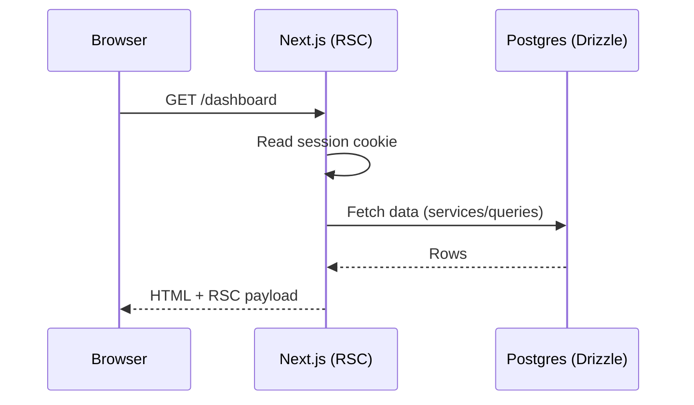
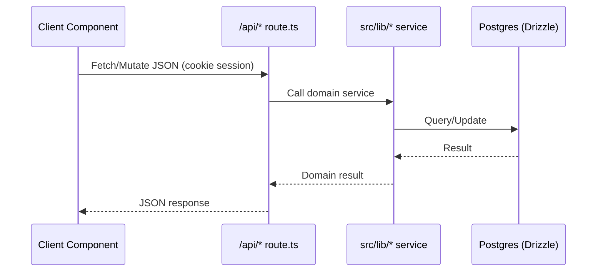

# Architecture Overview

WatchThis is a Next.js App Router application that combines server-rendered pages with small client-side “islands” for interactive experiences. Most domain logic lives in `src/lib/*` services, which are called by `src/app/api/**/route.ts` handlers and (in some cases) by server components.

## High-Level Components

- **App Router UI**: `src/app/**` pages and layouts define routes and compose UI.
- **Client Providers**: global client-side state and caching is provided via React Query and an auth context.
- **API Routes**: `src/app/api/**/route.ts` implements JSON endpoints, generally thin wrappers around service modules.
- **Domain Services**: `src/lib/*/service.ts` implements business logic and persistence.
- **Database Layer**: Drizzle schema + client in `src/lib/db`.
- **External Integrations**: TMDB + JustWatch wrappers live in `src/lib/tmdb` and API routes under `src/app/api/tmdb` and `src/app/api/watch`.

## Request Flows

### Server-Rendered Page

### Client Interaction (Island → API)

## Code Organization (What Goes Where)

- **Routing + composition**: `src/app/*`
- **Reusable UI**: `src/components/*`
- **Domain logic**: `src/lib/*`
- **Cross-cutting utilities**: `src/lib/utils.ts`
- **Schema + DB client**: `src/lib/db/schema.ts`, `src/lib/db/index.ts`
