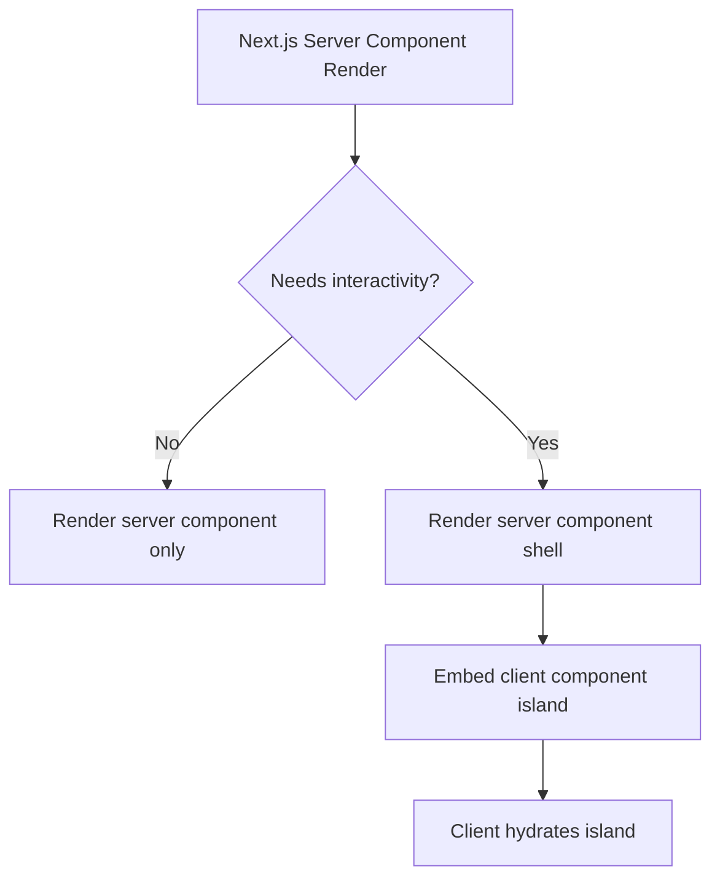

# Routing & Rendering

WatchThis uses the Next.js App Router with route groups to separate public and authenticated experiences.

## Route Groups

- **Public**: `src/app/(public)` contains public routes and layout.
- **Authenticated**: `src/app/(authenticated)` contains protected pages and a wrapper layout.

Route-group directory names (like `(authenticated)`) are not part of the URL path; they are only for organization. For example, `src/app/(authenticated)/dashboard/page.tsx` routes to `/dashboard`.

## Server Components First

Pages are written as server components by default, with client components used only where necessary (interactive UI, hooks, browser-only APIs).

Practical examples:

- A server page can read cookies and fetch data before render.
- A client component can manage forms, modals, infinite scroll, and use React Query.

## Authenticated Guarding Strategy

There are two distinct enforcement layers:

- **API protection** is enforced on the server using `withAuth` in `src/lib/auth/api-middleware.ts`.
- **Page protection** is primarily handled via the authenticated route-group layout.

Relevant code:

- Authenticated layout: [layout.tsx](../../src/app/%28authenticated%29/layout.tsx)
- API middleware: [api-middleware.ts](../../src/lib/auth/api-middleware.ts)

## Rendering Model (Mental Model)

## Suspense & Loading States

Interactive modules and data-heavy sections can be wrapped in Suspense at the page level. This keeps the initial server render fast while allowing client data fetching (React Query) to proceed independently.
