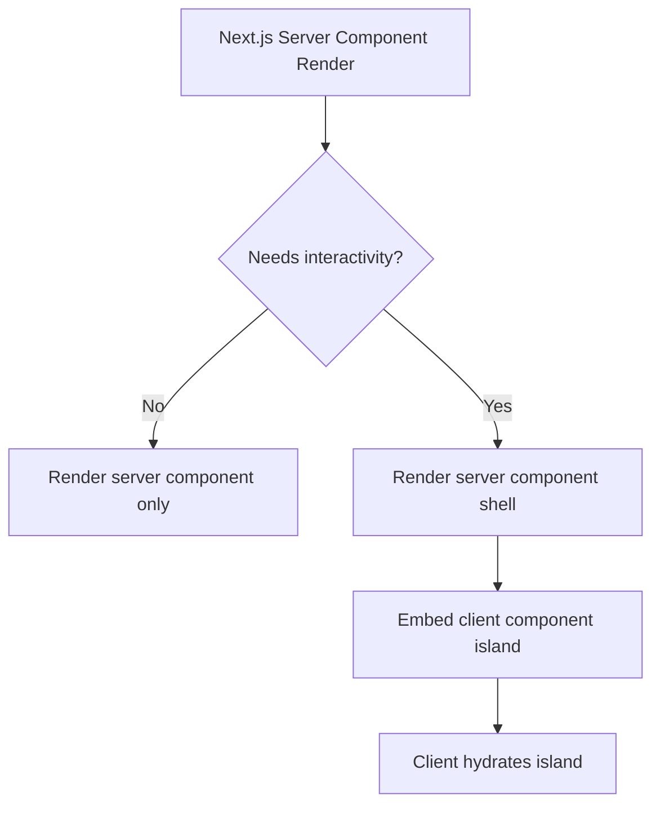

# Routing & Rendering

WatchThis uses the Next.js App Router with route groups to separate public and authenticated experiences.

## Route Groups

- **Public**: `src/app/(public)` contains public routes and layout.
- **Authenticated**: `src/app/(authenticated)` contains protected pages and a wrapper layout.

Route-group directory names (like `(authenticated)`) are not part of the URL path; they are only for organization. For example, `src/app/(authenticated)/dashboard/page.tsx` routes to `/dashboard`.

## Server Components First

Pages are written as server components by default, with client components used only where necessary (interactive UI, hooks, browser-only APIs).

Practical examples:

- A server page can read cookies and fetch data before render.
- A client component can manage forms, modals, infinite scroll, and use React Query.

## Authenticated Guarding Strategy

There are two distinct enforcement layers:

- **API protection** is enforced on the server using `withAuth` in `src/lib/auth/api-middleware.ts`.
- **Page protection** is primarily handled via the authenticated route-group layout.

Relevant code:

- Authenticated layout: [layout.tsx](../../src/app/%28authenticated%29/layout.tsx)
- API middleware: [api-middleware.ts](../../src/lib/auth/api-middleware.ts)

## Rendering Model (Mental Model)

```mermaid
flowchart TD
  A[Next.js Server Component Render] --> B{Needs interactivity?}
  B -- No --> C[Render server component only]
  B -- Yes --> D[Render server component shell]
  D --> E[Embed client component island]
  E --> F[Client hydrates island]
```

## Suspense & Loading States

Interactive modules and data-heavy sections can be wrapped in Suspense at the page level. This keeps the initial server render fast while allowing client data fetching (React Query) to proceed independently.

## Navigation Progress Bar

Because most pages are server components, a client-side navigation waits on a server render before the URL changes. A thin red-to-orange bar along the top of the viewport covers that wait.

- The bar is mounted once in the root layout: [NavigationProgress.tsx](../../src/components/ui/NavigationProgress.tsx).
- Link clicks start it automatically. A document-level click listener catches any same-origin `<a>` (including `next/link`), skipping modifier clicks, cancelled clicks, `target="_blank"`, downloads, and same-URL or hash-only links.
- Programmatic navigation uses `useProgressRouter` from [useProgressRouter.ts](../../src/hooks/useProgressRouter.ts) in place of `useRouter`; its `push` and `replace` start the bar, and everything else (`refresh`, `back`, …) passes through untouched. ESLint rejects importing `useRouter` from `next/navigation` outside that hook and tests.
- The bar finishes when the pathname or search params change. It only appears if the navigation takes longer than 120ms, so prefetched routes never flash it.
- Some navigations never change the URL, so the bar also finishes on back/forward (`popstate`), on a back/forward-cache restore (`pageshow` with `persisted`), on a navigation to the current URL, and after 15 seconds regardless ([navigation-progress.ts](../../src/lib/navigation-progress.ts)).
