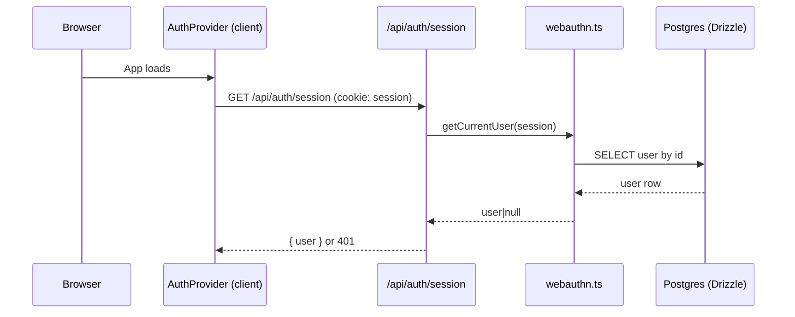
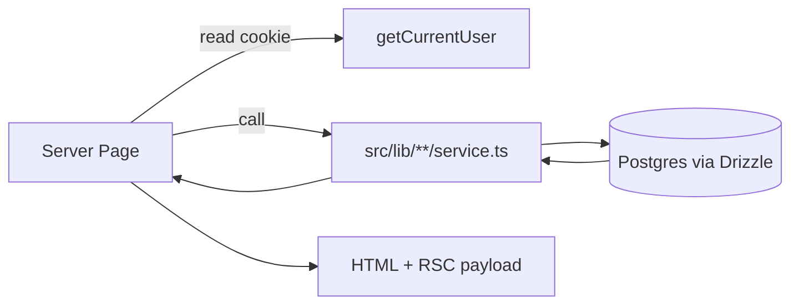

# State & Data Flow

WatchThis keeps most state server-side (Postgres via Drizzle) and uses client-side state primarily for UI concerns and caching. The high-level mental model is:

- Server components and API routes read/write the database as the source of truth.
- Client components fetch/mutate via `/api/**` and rely on React Query for caching and request lifecycle.
- Authentication state is derived from a `session` cookie (JWT) and exposed to client components via a small auth context.

Related docs: [overview.md](./overview.md), [routing-and-rendering.md](./routing-and-rendering.md)

## Principles (Why It’s Built This Way)

- **Server-side source of truth**: persisted domain state lives in Postgres; UI state is ephemeral.
- **Server components first**: pages render on the server by default; client components are “islands” for interactivity.
- **Thin API routes**: API handlers mostly validate inputs, call a service, and return JSON.
- **Explicit caching**: React Query caches client fetches; server-side caches exist where external APIs are expensive.

## Where State Lives

### Database (Source Of Truth)

Domain state is stored in Postgres and accessed via Drizzle:

- Drizzle client: [db/index.ts](../../src/lib/db/index.ts)
- Drizzle schema: [db/schema.ts](../../src/lib/db/schema.ts)
- Typical pattern: API route → service → Drizzle queries/updates

### Session Cookie (Authentication)

Authentication is cookie-based:

- A signed JWT is stored in the `session` cookie.
- The server verifies the token and resolves the user record when needed.

Relevant code:

- Session verification + current user: [webauthn.ts](../../src/lib/auth/webauthn.ts)
- API auth wrapper: [api-middleware.ts](../../src/lib/auth/api-middleware.ts)

### Client Cache (React Query)

Client components use React Query to cache API responses and manage request lifecycles:

- Provider: [ReactQueryProvider.tsx](../../src/components/providers/ReactQueryProvider.tsx)
- Root mount: [app/layout.tsx](../../src/app/layout.tsx)

Default query behavior is intentionally conservative (no refetch-on-focus, low retry count) to reduce surprise network traffic.

### Client Context (AuthProvider)

Auth state is held in a small React context for convenience (not as a general app-state store):

- Provider: [AuthProvider.tsx](../../src/components/providers/AuthProvider.tsx)
- Client helpers: [client.ts](../../src/lib/auth/client.ts)

In addition to `user/loading/error`, the provider also manages streaming preferences loaded from `/api/profile/streaming`.

### Local Component State (UI Only)

Short-lived UI state (modal open/closed, input values, tab selection) lives in component state and should not be persisted unless it’s meaningful domain state.

## Global Client Providers

The root layout wraps all routes with the global providers:

- [app/layout.tsx](../../src/app/layout.tsx)
- [ReactQueryProvider.tsx](../../src/components/providers/ReactQueryProvider.tsx)
- [AuthProvider.tsx](../../src/components/providers/AuthProvider.tsx)

This means any client component can:

- Use React Query (`useQuery`, `useMutation`, etc.)
- Consume auth state (`useAuth`, `useUser`, `useIsAuthenticated`)

## Auth & Session Flow

### Server-Side Enforcement (APIs)

Authenticated API routes should wrap handlers with `withAuth`, which:

- Reads the `session` cookie
- Verifies it and loads the user
- Injects `request.user` for downstream logic
- Returns `401` and clears the cookie if invalid

Relevant code:

- [withAuth](../../src/lib/auth/api-middleware.ts)
- Example authenticated route: [status/content/route.ts](../../src/app/api/status/content/route.ts)

### Client-Side Guarding (Pages)

Protected UI routes are grouped under `src/app/(authenticated)` and gated by a client layout that redirects unauthenticated users:

Route-group directory names (like `(authenticated)`) are not part of the URL path; they are only for organization.

- Authenticated layout: [src/app/(authenticated)/layout.tsx](../../src/app/%28authenticated%29/layout.tsx)

Some server pages also read cookies and resolve the current user to prefetch initial data during the server render:

- Example: [lists/page.tsx](../../src/app/%28authenticated%29/lists/page.tsx)

### Session Read Path



## Typical Data Interaction

### Client “Island” → API → Service → DB

```mermaid
flowchart LR
  UI[Client Component] -->|fetch JSON| API[/src/app/api/**/route.ts]
  API -->|call| Svc[src/lib/**/service.ts]
  Svc -->|query/update| DB[(Postgres via Drizzle)]
  DB --> Svc
  Svc --> API
  API --> UI
  UI -->|cache| RQ[(React Query Cache)]
```

### Server Component → Service → DB (No API Hop)

Server pages can fetch directly from services when rendering user-specific pages:



This is typically used to pre-render an initial view (e.g. lists) and then hydrate a client component with `initial*` props.

## React Query Conventions (In Practice)

React Query keys are simple array “namespaces” rather than a centralized key factory. Common patterns include:

- `["tmdb", ...]` for TMDB-backed data
- `["lists", listId, ...]` for list resources
- `["episodes", tvShowId]` for episode tracking

Mutations usually keep caches coherent by invalidating affected keys via `queryClient.invalidateQueries({ queryKey })`. Some components patch cached data directly with `setQueryData` after a successful mutation, but there is no broad “optimistic update with rollback” convention.

## Server-Side Caching (External Integrations)

Some expensive external calls are cached server-side in Postgres:

- **TMDB content cache**: `tmdbCache` stores enriched content details and is refreshed on a time threshold.
  - Cache helpers: [tmdb/cache-utils.ts](../../src/lib/tmdb/cache-utils.ts)
  - Schema: [tmdbCache table](../../src/lib/db/schema.ts)
- **List recommendations cache**: per-list recommendation keys are cached and refreshed when stale or when list items change.
  - Implementation: [lists/recommendations.ts](../../src/lib/lists/recommendations.ts)

These server-side caches reduce rate-limit pressure and keep API responses consistent.

## Error Handling & API Response Conventions

API routes generally return JSON with appropriate HTTP status codes:

- **Success**: arbitrary JSON payload (`200`, `201`, etc.)
- **Failure**: `{ error: string }` with a non-2xx status code

Shared helper:

- [handleApiError](../../src/lib/auth/api-middleware.ts)

Common patterns:

- **Validation errors**: `400` with `{ error: "..." }`
- **Not found**: `404` with `{ error: "..." }` (or service returns `"notFound"` and the route maps it)
- **Auth**: `401` with `{ error: "Authentication required" }` and (when needed) cookie clearing
- **Upstream issues**: `503` when TMDB is unavailable, `429` when rate-limited (via `handleApiError`)

## Practical Guidelines

- **Prefer services for domain logic**: keep API routes thin; avoid duplicating DB logic in route handlers.
- **Use React Query for client-driven data**: when a feature is interactive (search, modals, incremental updates), React Query should own the request lifecycle and cache.
- **Use server fetching for initial render**: if a page needs data to render above-the-fold, fetch it in a server component and pass initial props to a client island.
- **Keep auth state minimal**: treat `AuthProvider` as a session convenience layer, not an app-wide store for domain data.
