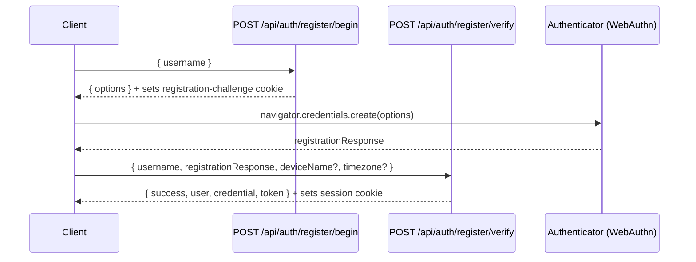
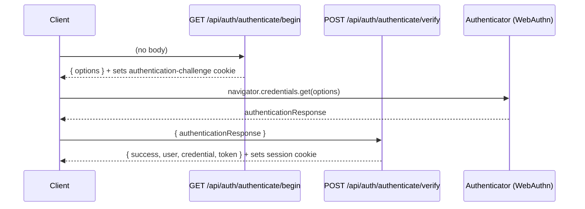
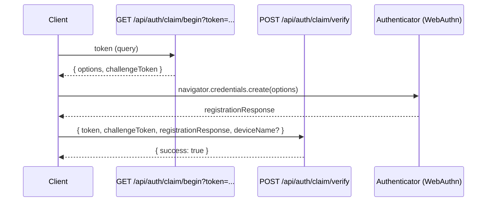

# WebAuthn Flows

This document describes the WebAuthn flows as implemented by WatchThis, including the API endpoints and the challenge/session mechanics.

Relevant routes:

- Register: [register/begin](../../src/app/api/auth/register/begin/route.ts), [register/verify](../../src/app/api/auth/register/verify/route.ts)
- Authenticate: [authenticate/begin](../../src/app/api/auth/authenticate/begin/route.ts), [authenticate/verify](../../src/app/api/auth/authenticate/verify/route.ts)
- Claim additional device: [claim/begin](../../src/app/api/auth/claim/begin/route.ts), [claim/verify](../../src/app/api/auth/claim/verify/route.ts)
- Sign out: [signout](../../src/app/api/auth/signout/route.ts)

## Registration (Create Account + First Passkey)

Notes:

- The server stores the challenge in an HTTP-only cookie (`registration-challenge`) scoped to `/api/auth/register`.
- Verification clears the challenge cookie and sets the `session` cookie.

## Authentication (Sign In)

Notes:

- The authentication challenge is stored in an HTTP-only cookie (`authentication-challenge`) scoped to `/api/auth/authenticate`.
- Verification clears the challenge cookie and updates credential usage metadata server-side.

## Claim (Add Another Passkey Device)

The claim flow allows adding an additional passkey (device) to an existing account using a short-lived claim token. The claim token is provided as a query parameter and verified by the server.

Notes:

- Unlike registration/authentication, the claim begin route returns a `challengeToken` in JSON rather than setting a cookie.
- Claims are validated against the database (active/expired/consumed).
