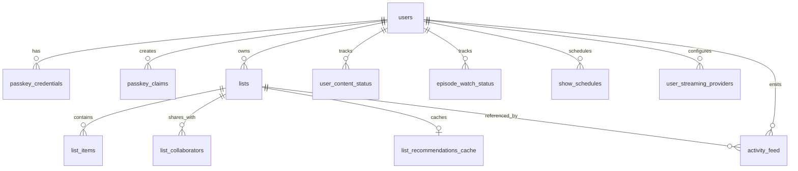

# Database Schema Tour

WatchThis uses PostgreSQL with Drizzle ORM. The schema is defined in TypeScript, and schema changes are tracked via SQL migrations generated by drizzle-kit.

Primary references:

- Drizzle schema: [src/lib/db/schema.ts](../../src/lib/db/schema.ts)
- DB client: [src/lib/db/index.ts](../../src/lib/db/index.ts)
- Drizzle config: [drizzle.config.ts](../../drizzle.config.ts)
- Migration files: [drizzle/](../../drizzle/)
- Migration workflow: [migrations.md](./migrations.md)

## Conventions

- IDs: Almost every table uses a UUID primary key with a default value.
- Timestamps: Most tables have `created_at` and/or `updated_at` as `timestamptz` (`withTimezone: true`).
- Deletes: Most foreign keys use `ON DELETE CASCADE`, so deleting a user or list generally deletes dependent rows.
- Uniqueness: Many “natural key” constraints are enforced via multi-column `UNIQUE` constraints (which also create indexes).
- App-level enums: Several columns are `varchar` that are constrained in application code (not by Postgres enums).

## Entity Overview

## Table Reference

### users

Primary user identity and profile preferences.

- Columns:
  - `id` (uuid, PK)
  - `username` (varchar(50), required, unique)
  - `profile_picture_url` (varchar(500), optional)
  - `timezone` (varchar(100), required, defaults to `UTC`)
  - `country` (varchar(2), optional)
  - `created_at`, `updated_at` (timestamptz, required)
- Notes:
  - `timezone` is stored as a string (typically an IANA name like `America/New_York`).

### passkey_credentials

WebAuthn credentials (passkeys) bound to a user.

- Columns:
  - `user_id` (uuid, required, FK → users.id, cascade delete)
  - `credential_id` (varchar(255), required, unique)
  - `public_key` (text, required)
  - `counter` (bigint, required, defaults to `0`)
  - `device_name` (varchar(100), optional)
  - `deleted_at` (timestamptz, optional)
  - `created_at` (timestamptz, required)
  - `last_used` (timestamptz, required)
- Notes:
  - `deleted_at` enables “soft deletion” for device removal while keeping history/audit potential.

### passkey_claims

Supports the “claim” flow to add additional devices to an account.

- Columns:
  - `user_id` (uuid, required, FK → users.id, cascade delete)
  - `claim_code` (varchar(64), required, unique)
  - `status` (varchar(20), required, defaults to `active`)
  - `initiator` (varchar(10), required, defaults to `user`)
  - `expires_at` (timestamptz, required)
  - `created_at` (timestamptz, required)
  - `consumed_at` (timestamptz, optional)

### lists

The core “watchlist” container. Lists are owned by a user, optionally public, and can be shared via collaborators.

- Columns:
  - `owner_id` (uuid, required, FK → users.id, cascade delete)
  - `name` (varchar(100), required)
  - `description` (text, optional)
  - `list_type` (varchar(20), required, defaults to `mixed`)
  - `is_public` (boolean, required, defaults to `false`)
  - `is_archived` (boolean, required, defaults to `false`)
  - `sync_watch_status` (boolean, required, defaults to `false`)
  - `created_at`, `updated_at` (timestamptz, required)
- Notes:
  - `sync_watch_status` is intended to coordinate list membership with per-user watch status.

### list_collaborators

Users who have access to a list owned by someone else.

- Columns:
  - `list_id` (uuid, required, FK → lists.id, cascade delete)
  - `user_id` (uuid, required, FK → users.id, cascade delete)
  - `permission_level` (varchar(20), required, defaults to `collaborator`)
  - `created_at` (timestamptz, required)
- Constraints:
  - Unique: (`list_id`, `user_id`)

### list_items

Items in a list, identified by a `(tmdb_id, content_type)` pair.

- Columns:
  - `list_id` (uuid, required, FK → lists.id, cascade delete)
  - `tmdb_id` (int, required)
  - `content_type` (varchar(10), required)
  - `created_at` (timestamptz, required)
- Constraints:
  - Unique: (`list_id`, `tmdb_id`, `content_type`)

### list_recommendations_cache

Cached recommendations for a list, stored as JSON.

- Columns:
  - `list_id` (uuid, required, FK → lists.id, cascade delete)
  - `recommendations` (jsonb, required; array of `{ tmdbId, contentType }`)
  - `items_updated_at` (timestamptz, required)
  - `created_at`, `updated_at` (timestamptz, required)
- Constraints:
  - Unique: (`list_id`)
- Notes:
  - `items_updated_at` allows invalidation when list membership changes.

### user_content_status

Per-user watch status for a piece of content.

- Columns:
  - `user_id` (uuid, required, FK → users.id, cascade delete)
  - `tmdb_id` (int, required)
  - `content_type` (varchar(10), required)
  - `status` (varchar(20), required, defaults to `planning`)
  - `next_episode_date` (timestamptz, optional)
  - `updated_at`, `created_at` (timestamptz, required)
- Constraints:
  - Unique: (`user_id`, `tmdb_id`, `content_type`)

### episode_watch_status

Per-episode watched state for a user and a TV show identified by `tmdb_id`.

- Columns:
  - `user_id` (uuid, required, FK → users.id, cascade delete)
  - `tmdb_id` (int, required)
  - `season_number` (int, required)
  - `episode_number` (int, required)
  - `watched` (boolean, required, defaults to `false`)
  - `watched_at` (timestamptz, optional)
  - `created_at`, `updated_at` (timestamptz, required)
- Constraints:
  - Unique: (`user_id`, `tmdb_id`, `season_number`, `episode_number`)

### show_schedules

Per-user schedule settings for TV content, keyed by day-of-week.

- Columns:
  - `user_id` (uuid, required, FK → users.id, cascade delete)
  - `tmdb_id` (int, required)
  - `day_of_week` (int, required)
  - `created_at`, `updated_at` (timestamptz, required)
- Constraints:
  - Unique: (`user_id`, `tmdb_id`, `day_of_week`)
- Notes:
  - `day_of_week` uses `0 = Sunday` through `6 = Saturday`.

### user_streaming_providers

Per-user configuration of streaming providers by region.

- Columns:
  - `user_id` (uuid, required, FK → users.id, cascade delete)
  - `provider_id` (int, required)
  - `provider_name` (varchar(100), optional)
  - `logo_path` (varchar(255), optional)
  - `region` (varchar(2), required)
  - `created_at` (timestamptz, required)
- Constraints:
  - Unique: (`user_id`, `provider_id`, `region`)

### activity_feed

Append-only event log for user-visible activity and collaboration events. Metadata is stored as JSON.

- Columns:
  - `user_id` (uuid, required, FK → users.id, cascade delete)
  - `activity_type` (varchar(50), required)
  - `tmdb_id` (int, optional)
  - `content_type` (varchar(10), optional)
  - `list_id` (uuid, optional, FK → lists.id, cascade delete)
  - `metadata` (jsonb, optional)
  - `collaborators` (uuid[], optional)
  - `is_collaborative` (boolean, required, defaults to `false`)
  - `created_at` (timestamptz, required)
- Notes:
  - `collaborators` is a UUID array used for collaboration-related fanout/visibility.

### tmdb_cache

Local cache of selected TMDB content fields, used to reduce API usage and speed up list/search views.

- Columns:
  - `tmdb_id` (int, required)
  - `content_type` (varchar(10), required)
  - `title` (varchar(255), required)
  - `overview` (text, required)
  - `poster_path`, `backdrop_path` (varchar(255), optional)
  - `release_date` (timestamptz, required)
  - `vote_average` (numeric(3,1), required)
  - `vote_count` (int, required)
  - `popularity` (numeric(6,2), required)
  - `genre_ids` (int[], required, defaults to `[]`)
  - `cast_ids` (int[], required, defaults to `[]`)
  - `keyword_ids` (int[], required, defaults to `[]`)
  - `adult` (boolean, optional)
  - `created_at`, `updated_at` (timestamptz, required)
- Constraints:
  - Unique: (`tmdb_id`, `content_type`)

## App-Level Enum Values

These values are defined in TypeScript for type safety and are stored in the database as `varchar` columns.

- List type (`lists.list_type`): `movies`, `tv`, `mixed`
- Content type (`list_items.content_type`, `user_content_status.content_type`, `activity_feed.content_type`, `tmdb_cache.content_type`): `movie`, `tv`
- Watch status (`user_content_status.status`): `planning`, `watching`, `paused`, `completed`, `dropped`
- Collaborator permission (`list_collaborators.permission_level`): `collaborator`, `viewer`
- Activity type (`activity_feed.activity_type`): `status_changed`, `episode_progress`, `list_item_added`, `list_item_removed`, `list_created`, `list_updated`, `list_deleted`, `collaborator_added`, `collaborator_removed`, `profile_import`, `claim_generated`, `claim_consumed`, `passkey_deleted`

## How Schema Changes Ship

- The authoritative schema is in [src/lib/db/schema.ts](../../src/lib/db/schema.ts).
- Migrations are stored in [drizzle/](../../drizzle/) and configured by [drizzle.config.ts](../../drizzle.config.ts).
- For the recommended development vs migration-based workflows, see [migrations.md](./migrations.md).
