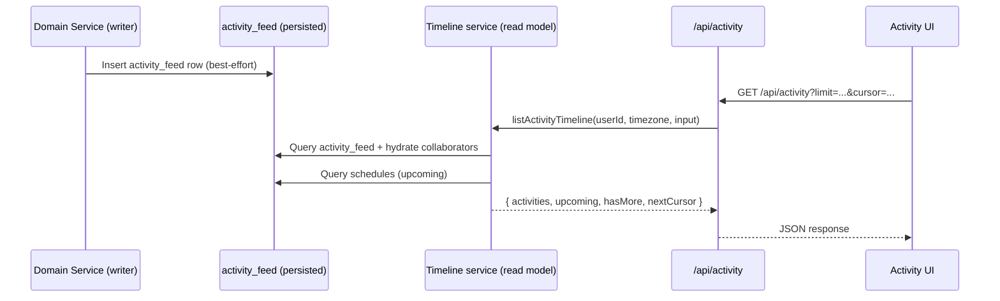

# Activity Domain

The activity domain provides a user-visible timeline of notable events (status changes, episode progress, list collaboration/actions, profile import, and passkey lifecycle events).

It consists of two related concepts returned together:

- **Activities**: persisted rows in the `activity_feed` table (write-once in normal operation; rows can still be removed via cascading deletes when a user or list is deleted).
- **Upcoming**: computed “what should you watch today?” entries derived from schedules, returned alongside activities for UI convenience.

Primary references:

- Timeline service (read model): [service.ts](../../src/lib/activity/service.ts)
- Timeline response types: [types.ts](../../src/lib/activity/types.ts)
- API route: [route.ts](../../src/app/api/activity/route.ts)
- DB schema: [schema.ts](../../src/lib/db/schema.ts)
- UI (rendering): [ActivityEntry.tsx](../../src/components/activity/ActivityEntry.tsx)
- UI (dashboard widget): [ActivityFeed.tsx](../../src/components/activity/ActivityFeed.tsx)
- UI (timeline page): [ActivityTimelineClient.tsx](../../src/components/activity/ActivityTimelineClient.tsx)

## Data Model

### `activity_feed` table

The activity feed is stored in Postgres as `activity_feed`:

- `id` (uuid)
- `userId` (uuid): the actor (who performed the action)
- `activityType` (string): discriminator for how to interpret `metadata` and render the entry
- optional entity pointers:
  - `tmdbId` (int): media identifier for movie/TV-related activity
  - `contentType` (string): `"movie"` or `"tv"` when applicable
  - `listId` (uuid): list identifier for list-related activity
- `metadata` (jsonb): event-specific payload used for UI text and small details (names, titles, etc.)
- collaboration context:
  - `collaborators` (uuid[]): user IDs who were affected / synced / included in the entry
  - `isCollaborative` (boolean): set when the entry is intended to render as a multi-user event
- `createdAt` (timestamptz): sorting key for the timeline

See the table definition in [schema.ts](../../src/lib/db/schema.ts) (search for `activityFeed`).

### `ActivityType`

Activity types are centralized in [schema.ts](../../src/lib/db/schema.ts) as `ActivityType`:

- `status_changed`
- `episode_progress`
- `list_item_added`, `list_item_removed`
- `list_created`, `list_updated`, `list_deleted`
- `collaborator_added`, `collaborator_removed`
- `profile_import`
- `claim_generated`, `claim_consumed`, `passkey_deleted`

Although the DB stores `activityType` as a string, UI rendering is keyed off these constants (see [ActivityEntry.tsx](../../src/components/activity/ActivityEntry.tsx)).

### Metadata shapes (by type)

`metadata` is intentionally schemaless at the DB level. In practice the UI expects specific keys for common types:

- `status_changed`:
  - `{ status, title, posterPath }`
- `episode_progress`:
  - `{ seasonNumber, episodeNumber, watched, title, posterPath, episodeName? }`
- `list_item_added`:
  - `{ title, listName, posterPath }`
- `list_item_removed`:
  - `{ title, posterPath }`
- `list_created` / `list_updated`:
  - `{ listName, listType, isPublic }`
- `list_deleted`:
  - `{ listName, listType }`
- `collaborator_added`:
  - `{ listName, collaboratorUsername, collaboratorUserId, permissionLevel }`
- `collaborator_removed`:
  - `{ listName, collaboratorUsername, collaboratorUserId }`
- `profile_import`:
  - `{ lists, listItems, contentStatus, episodeStatus, tvShowSchedules, errors }`
- `claim_generated`:
  - `{ initiator }`
- `claim_consumed`:
  - `{ claimId }`
- `passkey_deleted`:
  - `{ credentialId }`

## Read Model: Timeline Response

The timeline endpoint returns a combined response:

- `activities`: persisted activity feed items
- `upcoming`: computed schedule-based items for “today”
- `hasMore` / `nextCursor`: cursor pagination for activities

See [types.ts](../../src/lib/activity/types.ts).

## Visibility and Collaboration Semantics

The timeline is intentionally “collaboration aware”:

- An activity is visible if you are the actor (`activity_feed.user_id == userId`).
- An activity is also visible if your user ID appears in the `collaborators` array for that row.
- Additionally, list-scoped collaborative entries are included when:
  - `activity_feed.list_id` belongs to any list you own or collaborate on, and
  - `activity_feed.is_collaborative == true`

This lets list collaboration create “shared context” entries without requiring every viewer to be explicitly listed in `collaborators`.

## Writers: Where Entries Are Created

Activity entries are written from domain services at the moment the user-visible change happens. Common patterns:

- Inserts are usually best-effort (wrapped in `try/catch`) so the primary feature (e.g., status updates) does not fail if the activity write fails.
- `createdAt` is sometimes explicitly set by the writer for determinism; otherwise the DB default is used.

Key writer locations:

- Content watch status changes: [content-status/service.ts](../../src/lib/content-status/service.ts) (writes `status_changed`)
- Episode progress: [episodeUtils.ts](../../src/lib/episodes/episodeUtils.ts) (writes `episode_progress`)
- List and collaborator events: [lists/service.ts](../../src/lib/lists/service.ts)
- Profile import: [profile/data/service.ts](../../src/lib/profile/data/service.ts) (writes `profile_import`)
- Passkey claim + passkey deletion: [profile/devices/service.ts](../../src/lib/profile/devices/service.ts)
- Claim consumption (verify flow): [claim verify route](../../src/app/api/auth/claim/verify/route.ts)

Collaboration syncing helper (used by status/episode flows): [activityUtils.ts](../../src/lib/activity/activityUtils.ts).

## API Surface

### `GET /api/activity`

Implemented in [route.ts](../../src/app/api/activity/route.ts).

- Authentication: enforced via `withAuth` (cookie session)
- Query params:
  - `limit` (number, default `10`): page size
  - `cursor` (string, optional): ISO timestamp; fetches items with `createdAt < cursor`
  - `type` (string, optional): filters by `activityType` (one of `ActivityType.*`)
- Errors:
  - `400` when `cursor` cannot be parsed as a Date

## Timeline Query and Pagination

The timeline query lives in [listActivityTimeline](../../src/lib/activity/service.ts) and uses keyset pagination:

- Results are ordered by `createdAt DESC`.
- The service fetches `limit + 1` rows to compute `hasMore`.
- `nextCursor` is the last returned item’s `createdAt` (as `toISOString()`).

Collaborator user profiles are hydrated by a secondary query for `users` matching the collected `collaborators` IDs.

## Upcoming (Schedule-Derived) Items

The `upcoming` field is not stored in `activity_feed`. It is computed during timeline reads in [service.ts](../../src/lib/activity/service.ts):

- Determines “today” using the requesting user’s timezone.
- Loads rows from `show_schedules` for that day.
- Excludes shows that already had an episode watched “today” (timezone-aware date comparison).
- Hydrates content details using cached TMDB data.

This keeps schedules lightweight while making “what’s up next” available anywhere the activity feed is shown.

## UI Integration

The activity UI is split into:

- Dashboard widget: [ActivityFeed.tsx](../../src/components/activity/ActivityFeed.tsx) (fetches `/api/activity` with `limit=5` on small screens and `limit=10` on `md+`)
- Full timeline page: [activity/page.tsx](../../src/app/%28authenticated%29/activity/page.tsx) + [ActivityTimelineClient.tsx](../../src/components/activity/ActivityTimelineClient.tsx) (infinite pagination using `nextCursor`)
- Entry rendering: [ActivityEntry.tsx](../../src/components/activity/ActivityEntry.tsx)
  - Converts `activityType + metadata` into human-readable text
  - Renders multi-user entries when `isCollaborative` and `collaborators` are present

## Adding a New Activity Type

When introducing a new activity entry:

1. Add a constant to `ActivityType` in [schema.ts](../../src/lib/db/schema.ts).
2. Write an insert into `activityFeed` at the correct domain boundary (where the user-visible change occurs).
3. Update [ActivityEntry.tsx](../../src/components/activity/ActivityEntry.tsx) to render a useful description from `metadata`.
4. Ensure visibility semantics are correct (`collaborators`, `isCollaborative`, and/or `listId`).

## Typical Flow

