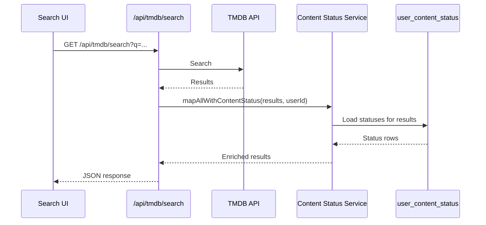
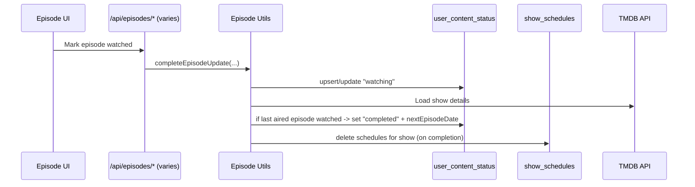

# Content Status Domain

Content status tracks a user’s relationship to a movie or TV show (planning, watching, completed, etc). It powers:

- UI context (badges, filtering, quick status changes)
- Server-side enrichment for TMDB responses (search/trending/discover)
- List views (status shown on list cards/items)
- Scheduling + episode workflows (status affects schedules; episode progress can update status)

## Primary References

- DB schema (source of truth): [schema.ts](../../src/lib/db/schema.ts)
- Domain service: [service.ts](../../src/lib/content-status/service.ts)
- Domain types: [types.ts](../../src/lib/content-status/types.ts)
- API routes: [route.ts](../../src/app/api/status/content/route.ts)

Related references:

- Episode workflows: [episodeUtils.ts](../../src/lib/episodes/episodeUtils.ts)
- Collaborator sync helper: [activityUtils.ts](../../src/lib/activity/activityUtils.ts)
- Scheduling service: [schedules/service.ts](../../src/lib/schedules/service.ts)
- Cached content + list enrichment: [cache-utils.ts](../../src/lib/tmdb/cache-utils.ts), [lists/service.ts](../../src/lib/lists/service.ts)
- TMDB API routes (enrichment): [search/route.ts](../../src/app/api/tmdb/search/route.ts), [trending/route.ts](../../src/app/api/tmdb/trending/route.ts), [discover/route.ts](../../src/app/api/tmdb/discover/route.ts)
- UI consumers: [StatusBadge.tsx](../../src/components/content/StatusBadge.tsx), [StatusSegmentedSelector.tsx](../../src/components/content/StatusSegmentedSelector.tsx), [ContentDetailsModal.tsx](../../src/components/content/ContentDetailsModal.tsx)

## Concepts

- **Status row**: persisted per `(userId, tmdbId, contentType)` in `user_content_status`.
- **Content type**: `movie` or `tv` (matches TMDB media types).
- **Enrichment**: attach status info to content returned from TMDB-facing routes and cached list content.
- **Collaboration sync**: if a list has `lists.syncWatchStatus = true`, status changes can propagate to list collaborators.
- **Scheduling interaction (TV only)**: schedules are removed when a show becomes `completed` or `dropped`; schedule creation is blocked for those statuses.

## Data Model

### `user_content_status`

The main table is `user_content_status` ([schema.ts](../../src/lib/db/schema.ts)).

- **Uniqueness**: `(userId, tmdbId, contentType)` is unique.
- **Default**: `status` defaults to `"planning"`.
- **Fields (high level)**:
  - `userId` (FK to `users`)
  - `tmdbId` (TMDB numeric ID)
  - `contentType` (`"movie"` | `"tv"`)
  - `status` (watch status string)
  - `nextEpisodeDate` (timestamp, TV-oriented; see below)
  - `createdAt`, `updatedAt`

`nextEpisodeDate` is used as a hint when a show is marked `completed` via episode progress: it stores the next known episode air date (if any), `null` if the show ended, or a placeholder date if TMDB indicates the show is continuing but does not provide a next air date.

### `episode_watch_status` (TV only)

Episode progress is persisted in `episode_watch_status` and can update the show-level status. See [episodeUtils.ts](../../src/lib/episodes/episodeUtils.ts) for the workflow.

## Status Model

Status strings are defined as enums in [schema.ts](../../src/lib/db/schema.ts):

- `ContentType`: `movie | tv`
- `WatchStatus` (union used by enrichment/UI): `planning | watching | paused | completed | dropped`
- `MovieWatchStatus`: `planning | completed`
- `TVWatchStatus`: `planning | watching | paused | completed | dropped`

Important invariant: movies should only use the movie-specific status subset. The API route enforces this at the boundary, while the DB column is a generic varchar.

## Service Responsibilities

The content status service ([service.ts](../../src/lib/content-status/service.ts)) is the domain layer for:

- CRUD for `user_content_status`
- Enriching content items (`TMDBMovie` / `TMDBTVShow` / `TMDBSearchItem`) with status info
- Handling side-effects when a status changes (TV schedule cleanup, collaborator sync, activity feed)

### CRUD operations

- `getContentStatus(userId, tmdbId, contentType)` loads a single status row and returns `{ status: ContentStatusItem | null }`.
- `createOrUpdateContentStatus(userId, input)` upserts a row and returns `{ status: ContentStatusItem }` or `"notFound"`.
  - Validates that the TMDB content exists by fetching details.
  - Best-effort side effects:
    - If TV + status becomes `completed` or `dropped`: delete `show_schedules` rows for that show/user.
    - Sync watch status to collaborators (see below).
    - Insert an `activity_feed` entry (`activityType = "status_changed"`).
- `updateContentStatus(userId, input)` updates an existing row and returns `{ status: ContentStatusItem }` or `"notFound"`.
- `deleteContentStatus(userId, tmdbId, contentType)` deletes an existing row or returns `"notFound"`.

### Enrichment operations

Enrichment attaches watch status to content in the `TMDBContent` domain model ([types.ts](../../src/lib/content-status/types.ts)):

- `mapWithContentStatus(content, userId)` / `mapAllWithContentStatus(contents, userId)`:
  - Map TMDB API result shapes into the domain `TMDBContent`
  - Bulk-load statuses for the result set to avoid N+1 queries
- `enrichWithContentStatus(content, userId)` / `enrichAllWithContentStatus(contents, userId)`:
  - Attach status onto already-mapped `TMDBContent` items (used by cache/list flows)

#### TV “completed → watching” regression when new episodes appear

For TV content only, enrichment includes a guard against stale “completed” states:

- If a show is `completed` and `nextEpisodeDate` is set but is now in the past:
  - Fetch show details from TMDB and check the latest aired episode.
  - If that episode is not marked watched in `episode_watch_status`, update `user_content_status` back to `watching` and clear `nextEpisodeDate`.

This prevents “completed” from sticking when a new episode has aired since the user finished the previous last episode.

## API: `/api/status/content`

All endpoints are authenticated (wrapped with `withAuth` in [route.ts](../../src/app/api/status/content/route.ts)).

- `GET /api/status/content?tmdbId=123&contentType=tv`
  - Response: `{ status: ContentStatusItem | null }`
- `POST /api/status/content`
  - Body: `{ tmdbId, contentType, status }`
  - Creates or updates. Validates status is in `MovieWatchStatus` or `TVWatchStatus` depending on `contentType`.
  - Returns `201` with `{ status: ContentStatusItem }` or `404` if TMDB content does not exist.
- `PUT /api/status/content`
  - Body: `{ tmdbId, contentType, status? }`
  - Updates only (requires an existing row). Returns `404` if the row does not exist.
- `DELETE /api/status/content?tmdbId=123&contentType=tv`
  - Deletes only (requires an existing row). Returns `404` if the row does not exist.

## Collaboration Sync

Status changes can propagate to collaborators for lists where `lists.syncWatchStatus = true` ([activityUtils.ts](../../src/lib/activity/activityUtils.ts)):

- A status update by a user is applied to all collaborators + list owner (excluding the initiator) for any sync-enabled list that contains the content.
- For TV content, when syncing a status that is `completed` or `dropped`, collaborator schedules for that show are removed as well.

The collaborator IDs that were updated are returned and may be stored on the activity feed entry.

## Scheduling Interaction (TV)

Scheduling uses `show_schedules` and integrates with content status ([schedules/service.ts](../../src/lib/schedules/service.ts)):

- When a TV show becomes `completed` or `dropped`, schedules for that show are removed (best-effort) during status updates and during episode-driven completion.
- When creating a schedule:
  - The service requires an existing `user_content_status` row for that show (`contentType="tv"`). If the show is not in the user’s library, schedule creation fails.
  - It blocks schedule creation if the current status is `completed` or `dropped`.
  - It can also sync schedule creates/deletes to collaborators for sync-enabled lists.

## List + Cache Enrichment

List pages typically render content from the TMDB cache layer. That flow enriches cached `TMDBContent` with watch status so the UI can show badges without additional round trips:

- `getAllCachedContent(...)` enriches results via `enrichAllWithContentStatus(contents, userId)` ([cache-utils.ts](../../src/lib/tmdb/cache-utils.ts)).
- List item APIs/services ultimately depend on cached content fetches, so list UIs receive `watchStatus`/`statusUpdatedAt` populated ([lists/service.ts](../../src/lib/lists/service.ts)).

## UI Integration

Common UI entry points for content status:

- `StatusBadge` renders a compact display of `watchStatus` on cards and list items ([StatusBadge.tsx](../../src/components/content/StatusBadge.tsx)).
- `StatusSegmentedSelector` constrains available statuses by content type and is used for editing/filtering ([StatusSegmentedSelector.tsx](../../src/components/content/StatusSegmentedSelector.tsx)).
- `ContentDetailsModal` posts status changes to `/api/status/content` when a user updates status from the details view ([ContentDetailsModal.tsx](../../src/components/content/ContentDetailsModal.tsx)).

## Enrichment Flow (Search Example)

## Episode → Status Flow (TV)

Marking episodes watched can update the show-level status ([episodeUtils.ts](../../src/lib/episodes/episodeUtils.ts)).

