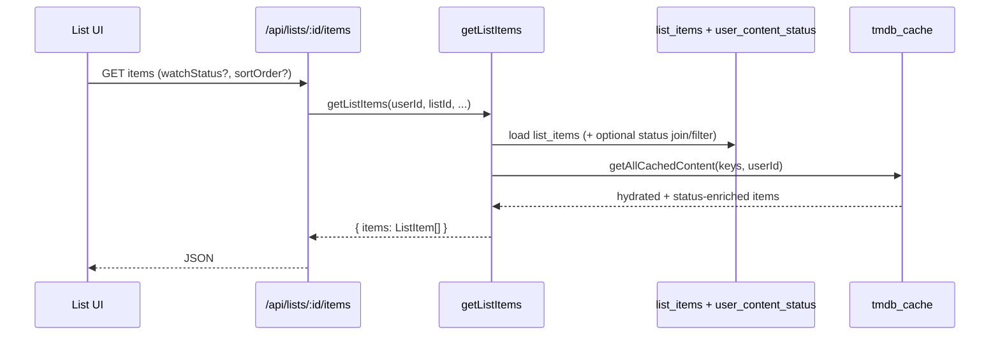
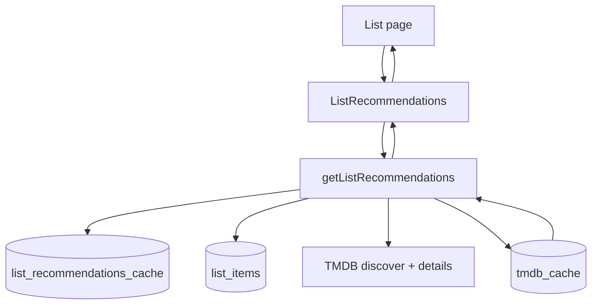
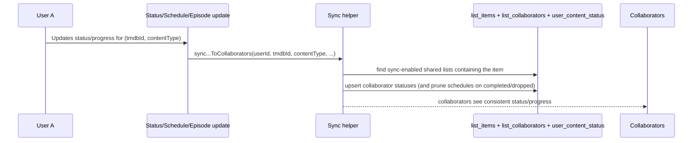

# Lists Domain

Lists are the core collaborative feature: users create lists of movies/TV items, optionally share them with collaborators, and can enable cross-user syncing of watch status and TV progress.

Primary references:

- Service: [lists/service.ts](../../src/lib/lists/service.ts)
- Types: [lists/types.ts](../../src/lib/lists/types.ts)
- API routes: [app/api/lists](../../src/app/api/lists)
- Recommendations engine: [lists/recommendations.ts](../../src/lib/lists/recommendations.ts)
- Recommendations UI: [ListRecommendations](../../src/components/lists/ListRecommendations.tsx)
- Sync helpers (status): [syncStatusToCollaborators](../../src/lib/activity/activityUtils.ts)
- Sync helpers (schedules): [schedules/service.ts](../../src/lib/schedules/service.ts)
- Sync helpers (episodes): [syncEpisodeStatusToCollaborators](../../src/lib/episodes/episodeUtils.ts)

Related domains:

- Content status: [content-status.md](./content-status.md)
- Schedules: [schedules.md](./schedules.md)
- Episodes: [episodes.md](./episodes.md)

## Concepts

- **List**: a named container owned by a single user. Lists can be archived, made public, and configured to sync watch status.
- **List type**: constrains what items can be added: `movies`, `tv`, or `mixed`.
- **List item**: membership row `(listId, tmdbId, contentType)` plus a timestamp for ordering.
- **Collaborator**: a user with access to a list. Collaborators are tracked with a `permissionLevel` (`collaborator` / `viewer`). `viewer` is read-only for list content.
- **Sync watch status**: if enabled, a user’s status/schedule/episode updates can propagate to other members of the shared list (see [Sync Watch Status](#sync-watch-status)).

## Data Model

Tables live in [schema.ts](../../src/lib/db/schema.ts).

- `lists`
  - Owner: `owner_id` (FK → `users.id`, cascade on delete)
  - Settings: `list_type`, `is_public`, `is_archived`, `sync_watch_status`
  - Timestamps: `created_at`, `updated_at`
- `list_items`
  - FK: `list_id` (cascade on delete)
  - Identity: unique `(list_id, tmdb_id, content_type)`
  - Timestamp: `created_at` (used for sorting)
- `list_collaborators`
  - FK: `list_id` + `user_id` (both cascade on delete)
  - Identity: unique `(list_id, user_id)`
  - `permission_level` string (default `collaborator`)
- `list_recommendations_cache`
  - FK: `list_id` (cascade on delete), unique `(list_id)`
  - `recommendations`: JSON array of `{ tmdbId, contentType }` keys
  - `items_updated_at`: latest list item timestamp at time of generation
  - `updated_at`: cache freshness timestamp (used for time-based invalidation)

List UI and API responses are hydrated from the TMDB cache (`tmdb_cache`) and enriched with user status via the content-status domain.

## Access Control

Lists have two distinct concerns:

1. **API auth**: all `/api/lists/*` routes are protected by `withAuth`, so requests require an authenticated session.
2. **List authorization**: within services, reads and writes are constrained by list membership.

Authorization rules (as implemented today):

- **Read list metadata / items**: allowed if user is list owner, collaborator, or the list is `isPublic=true` ([getList](../../src/lib/lists/service.ts), [getListItems](../../src/lib/lists/service.ts)).
- **Mutate list metadata**: owner-only ([createList](../../src/lib/lists/service.ts), [updateList](../../src/lib/lists/service.ts), [deleteList](../../src/lib/lists/service.ts)).
- **Mutate list items**: owner or collaborator with `permissionLevel=collaborator` ([createListItem](../../src/lib/lists/service.ts), [deleteListItem](../../src/lib/lists/service.ts)).
- **Manage collaborators**: owner-only ([listListCollaborators](../../src/lib/lists/service.ts), [createListCollaborator](../../src/lib/lists/service.ts), [updateListCollaborator](../../src/lib/lists/service.ts), [deleteListCollaborator](../../src/lib/lists/service.ts)).

## Settings & Invariants

- **List type enforcement**: adding an item is rejected if the list is not compatible with the item’s `contentType` (`movies` ↔ `movie`, `tv` ↔ `tv`) ([createListItem](../../src/lib/lists/service.ts)).
- **Archiving behavior**: when a list is archived via `updateList`, `syncWatchStatus` is forcibly disabled ([updateList](../../src/lib/lists/service.ts)).
- **No duplicate membership**: `(listId, tmdbId, contentType)` is unique, and the service also checks for conflicts to return a clean 409 ([createListItem](../../src/lib/lists/service.ts)).

## API Surface

All endpoints below require authentication (`withAuth`).

| Endpoint                               | Method   | Purpose                                      |
| -------------------------------------- | -------- | -------------------------------------------- |
| `/api/lists`                           | `GET`    | List non-archived lists for the current user |
| `/api/lists`                           | `POST`   | Create a new list                            |
| `/api/lists/archived`                  | `GET`    | List archived lists for the current user     |
| `/api/lists/:id`                       | `GET`    | Get list metadata                            |
| `/api/lists/:id`                       | `PUT`    | Update list metadata (owner-only)            |
| `/api/lists/:id`                       | `DELETE` | Delete list (owner-only)                     |
| `/api/lists/:id/items`                 | `GET`    | Get list items (hydrated + status-enriched)  |
| `/api/lists/:id/items`                 | `POST`   | Add an item (owner/collaborator)             |
| `/api/lists/:id/items/:itemId`         | `DELETE` | Remove an item (owner/collaborator)          |
| `/api/lists/:id/collaborators`         | `GET`    | List collaborators (owner-only)              |
| `/api/lists/:id/collaborators`         | `POST`   | Add collaborator by username (owner-only)    |
| `/api/lists/:id/collaborators/:userId` | `PUT`    | Update collaborator permission (owner-only)  |
| `/api/lists/:id/collaborators/:userId` | `DELETE` | Remove collaborator (owner-only)             |

### List Items Filtering

`GET /api/lists/:id/items` supports:

- `watchStatus` (repeatable): `planning`, `watching`, `paused`, `completed`, `dropped`, `none`
  - `none` means there is no `user_content_status` row for the current user
  - combining `none` with other statuses returns `(status IN ...) OR (status IS NULL)`
- `sortOrder`: `ascending` (default) or `descending` (sorts by list item `created_at`)

## Flows

### List Collection (With Poster Previews)

List “cards” include a preview collage of up to 4 posters.

```mermaid
flowchart LR
  UI[Lists UI] --> API[/api/lists]
  API --> Svc[listLists]
  Svc --> DB[(lists + list_items)]
  Svc --> Cache[tmdb_cache hydration]
  Cache --> Svc --> API --> UI
```

Implementation notes:

- List counts are computed per list via subqueries in one query ([fetchLists](../../src/lib/lists/service.ts)).
- Posters come from the 6 most recently added items; up to 4 non-null `posterPath` values are returned ([fetchLists](../../src/lib/lists/service.ts)).

### List Items (Hydration + Status Enrichment)

List items are stored as keys and hydrated from `tmdb_cache`; the response is enriched with the current user’s watch status via the content-status domain.



### Activity Feed Events

Lists emit activity items to `activity_feed` for core user-visible actions:

- `LIST_CREATED`, `LIST_UPDATED`, `LIST_DELETED`
- `LIST_ITEM_ADDED`, `LIST_ITEM_REMOVED`
- `COLLABORATOR_ADDED`, `COLLABORATOR_REMOVED`

See: [lists/service.ts](../../src/lib/lists/service.ts) and the activity domain: [activity.md](./activity.md).

### Recommendations (Cached Per List)

Recommendations are computed server-side (not via a dedicated API route) and cached per list.



Cache rules (current):

- Cache is considered fresh for 14 days.
- Cache is also invalidated when list items change (tracked by `items_updated_at` vs latest list item `created_at`).

See: [getListRecommendations](../../src/lib/lists/recommendations.ts).

## Sync Watch Status

If `lists.sync_watch_status` is enabled for a shared list, updates to content status and TV progress can be propagated to other members of the list. This includes syncing TV schedules (`show_schedules`) created/removed by one member to the other members of the shared list (subject to some guardrails, like not creating schedules for users who have already completed/dropped the show).



Current implementation entry point for content status sync:

- [syncStatusToCollaborators](../../src/lib/activity/activityUtils.ts)

Related sync entry points for collaborative lists:

- Schedules: [schedules/service.ts](../../src/lib/schedules/service.ts)
- Episode progress: [syncEpisodeStatusToCollaborators](../../src/lib/episodes/episodeUtils.ts)

Important note: adding/removing list items does not directly write `user_content_status`; sync is triggered by status/progress updates, gated by list membership and the `sync_watch_status` flag.
