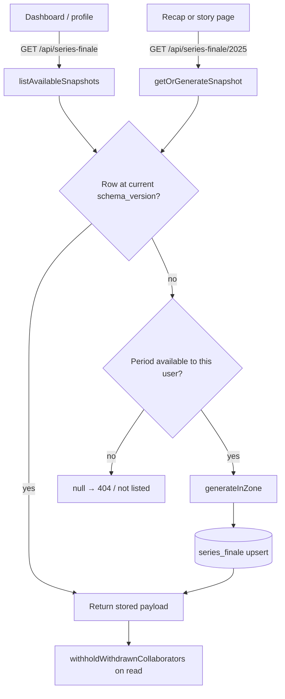

# Series Finale Domain

Series Finale is WatchThis's year-in-review. Each user gets one recap per completed calendar year. It renders in three ways:

- a 14-card **story** (the default on a phone);
- a denser **recap page** (the default on a desktop);
- a 1080×1350 **share image**.

All three render one frozen object, the **payload**. It is computed once per user per period, stored in `series_finale`, and kept indefinitely.

The design spec is [2026-08-31-series-finale-design.md](../superpowers/specs/2026-08-31-series-finale-design.md). It records why each decision was made. This page describes how the shipped code works.

Primary references:

- Payload contract and constants: [types.ts](../../src/lib/series-finale/types.ts)
- Aggregation engine (pure, no I/O): [aggregate.ts](../../src/lib/series-finale/aggregate.ts)
- Archetype classifier: [archetype.ts](../../src/lib/series-finale/archetype.ts)
- Periods and timezone localisation: [periods.ts](../../src/lib/series-finale/periods.ts)
- Batch-write filter: [solo-ticks.ts](../../src/lib/series-finale/solo-ticks.ts)
- Loading, generation, crew, cohort and listing: [service.ts](../../src/lib/series-finale/service.ts)
- Runtime cache (TMDB per-episode runtimes): [runtime.ts](../../src/lib/series-finale/runtime.ts), [runtime-math.ts](../../src/lib/series-finale/runtime-math.ts)
- Share image: [share.ts](../../src/lib/series-finale/share.ts), [share-card.tsx](../../src/lib/series-finale/share-card.tsx), [card/route.tsx](../../src/app/api/series-finale/[period]/card/route.tsx)
- API routes: [src/app/api/series-finale/](../../src/app/api/series-finale/)
- Pages: [series-finale/[period]/page.tsx](../../src/app/%28authenticated%29/series-finale/[period]/page.tsx) (recap), [story/page.tsx](../../src/app/%28authenticated%29/series-finale/[period]/story/page.tsx) (story)
- UI components: [src/components/series-finale/](../../src/components/series-finale/)
- Client data hooks: [useSeriesFinale.ts](../../src/hooks/useSeriesFinale.ts)
- Shared timezone helpers: [time.ts](../../src/lib/time.ts)
- Runtime backfill tool: [tools/backfill-runtimes.ts](../../tools/backfill-runtimes.ts) (see [tools/README.md](../../tools/README.md))
- End-to-end suite: [e2e/series-finale/](../../e2e/series-finale/README.md)

## How a Recap Comes to Exist

Generation is **lazy**. There is no scheduler. A snapshot is computed the first time something asks for it, and two things ask:

1. **`GET /api/series-finale`.** The dashboard banner and the profile archive read this. It calls `listAvailableSnapshots`, which works out every year the user can have a recap of and generates any that are missing or stale. This is the feature's real entry point: without it, no user would ever see a recap.
2. **`GET /api/series-finale/{period}`** (and the card route). Opening a recap or story URL directly calls `getOrGenerateSnapshot`.

### Which years are available

A year is available when **both** of these hold:

- **It has ended in the user's own timezone.** `completedYearsBetween` localises each candidate year and keeps it only once its local end has passed. A user in Auckland gets their 2025 recap about 13 hours before a user in UTC does.
- **It is not before the user's recap start.** The recap start is the later of:
  - their first recorded activity (first watched episode or first status row);
  - their account's `created_at`.

  The account floor exists because imports (the SeriesGuide converter especially) stamp history with episode *air dates*. Without the floor, an importer could get thirty years of fake recaps. The cost is that genuine pre-signup history gets no recap.

`MIN_YEAR` (1900) and `MAX_YEAR` (2999) bound what a URL segment can request. `parsePeriodLabel` rejects anything that is not a four-digit year in range. The routes answer such requests with `400`, and the pages with `notFound()`.

`loadRecapStart` is the single source of availability for both the listing and the payload route, so the two can never disagree.

### Generation

`generateInZone` (deliberately not exported, because it does no availability check):

1. Localises the canonical period to the user's zone (`localisePeriod`).
2. Loads the user's rows (`loadUserRows`):
   - watched episodes **inside** the localised window;
   - **all** status rows, all-time, because some cards need history before the period;
   - `tmdb_cache` metadata for every referenced title;
   - TMDB genre names, memoised per process.
3. Resolves episode runtimes from `tmdb_episode_runtime`. Only seasons the cache has **never** recorded are fetched live (`ensureSeasonsCached`). A cached season is never refetched during a user request, because keeping the cache fresh is the backfill's job.
4. Resolves film runtimes from `tmdb_cache.runtime`.
5. Loads crew and compare data (`loadCollaboratorSlices`). See [Crew and Compare](#crew-and-compare).
6. Loads list-shared title keys for the group-watcher archetype.
7. Loads the percentile cohort (`loadCohortMinutes`).
8. Runs the pure engine (`buildPayload`).
9. Fills the cross-user fields the pure engine cannot know: `headline.percentile`, `topShow.alsoTopFor` and `compare`.
10. Upserts on `(user_id, period_start, period_end)`. Regenerating replaces the row.

The row is keyed by the **canonical** UTC calendar year, which is also the URL label and the cohort identity. The payload's `period.start` and `period.end` record the **localised** bounds that the data was actually selected with.

### Listing budget

`listAvailableSnapshots` generates newest-first and sequentially. It always generates the newest missing year. Older ones are generated only while the request has spent less than `LIST_GENERATION_BUDGET_MS` (5 s). A long-history user's archive therefore fills over a few dashboard visits rather than one very slow one.

Concurrent calls for the same user in one process share a single run (`inFlightListings`). Across processes, duplicate work is possible but harmless, because the upsert makes the last write win.

### Frozen, except for privacy

A stored payload is never recomputed on read. TMDB popularity drifts and users keep editing statuses, so a live recompute would make an archived year disagree with a share image someone already posted.

The single read-time transformation is `withholdWithdrawnCollaborators`. It:

- removes any collaborator who has since turned off crew comparisons or deleted their account;
- relabels the remaining collaborators with their **current** usernames.

It only ever removes or relabels other people's data. The viewer's own figures are returned exactly as frozen.

### Schema versioning

`SERIES_FINALE_SCHEMA_VERSION` (currently **4**) is stored on each row. A row below the current version is regenerated on its next read, or by the next listing. Bump it whenever a stored payload would read differently if generated today. The version history is in the comment above the constant in [types.ts](../../src/lib/series-finale/types.ts).

A regeneration replaces `payload`, `schema_version` and `generated_at`. It leaves `dismissed_at` and `story_completed_at` alone, so a user does not see the banner again or have to replay the story because the payload shape changed.

## Timezones

Every date bucket (day, weekday, hour, month, streak) is computed in the user's `users.timezone`. The zone is resolved once through `resolveTimeZone`, which falls back to `UTC` for a missing, stale or renamed IANA name. The resolved zone is recorded as `payload.period.timezone`.

Renderers that place instants on a clock must use `period.timezone`, **not the browser's zone**. `BigDayTimeline` does this, so a recap viewed abroad still shows the hours the episodes were actually watched at.

`buildMonths` derives the period's year from the **midpoint** of the period. It uses neither edge: reading an edge in UTC breaks zones east of UTC, and reading it in-zone breaks zones west of UTC. The comment on `buildMonths` explains this in detail.

## Solo Ticks

Batch writes (for example, marking a whole season watched) stamp every episode with one `new Date()`. `partitionSoloTicks` calls an episode a **solo tick** when no other episode in the period shares its `watched_at` to the millisecond.

| Uses only solo ticks | Uses every episode |
| --- | --- |
| `bigDay.timeline`, `rhythm.lateShare`, `rhythm.hourCounts`, the nightly-ritualist rule | Totals, months, weekdays, streaks, the big day's date and count |

Below `SOLO_TICK_FLOOR` (50 solo ticks in the period), every solo-tick field is `null` and the nightly-ritualist rule is skipped. The Biggest day card then shows its date and count without the hour axis. Note that the floor applies to the **period**, not the day, so a non-null timeline can still hold very few points.

Three fields share a similar name but count different things:

- `payload.soloTickTotal` counts the whole period.
- `bigDay.soloTickCount` counts one day.
- `ArchetypeInput.soloTickCount` is the period total.

## The Payload

The full contract, with field-level commentary, is `SeriesFinalePayload` in [types.ts](../../src/lib/series-finale/types.ts). In summary:

| Field | What it holds | Notes |
| --- | --- | --- |
| `period` | `start`, `end` (localised ISO), `label`, `timezone` | |
| `headline` | `hours`, `minutes`, `episodes`, `titlesCompleted`, `titlesDropped`, `unknownRuntimeEpisodes`, `percentile` | Hours are episodes and completed films with a known runtime. |
| `episodes` | `total`, `perDay` | |
| `finished` | `films`, `shows`, `total` | Dated by `user_content_status.updated_at`. |
| `topShow` | Most-watched show, its minutes, last-watched date, `alsoTopFor` | `null` (no fallback to second place) if the top show has no cached metadata. Ties go to the lower `tmdbId`. |
| `niche` | Least popular completed film against the median of the others | Uses the *current* TMDB popularity. |
| `genres` | Top five genres plus "Everything else" | A share of genre **tags**, not of titles; percents need not sum to 100. |
| `months` | 12 buckets | Episodes by `watched_at`, plus completed films by `updated_at`. |
| `soloTickTotal` | Solo ticks across the period | |
| `bigDay` | Busiest day, its episodes and minutes, labelled `timeline`, longest `streak` | Ties go to the earlier date. |
| `rhythm` | `archetype`, `weekdayCounts` (Monday-first), `topWeekday`, `lateShare`, `hourCounts`, `sharedListShare`, `topGenreName`, `topGenreShare` | The last four are exactly what the archetype was classified on. |
| `shame` | `dropped` shows with the last episode reached; films `stillPlanning` with days waited | `stillPlanning` includes films added before the period **ended**, however long ago. |
| `crew` | Up to 8 collaborators: `userId`, `username`, `episodes` | Never hours, and never their top show. |
| `compare` | One row per crew member: set split plus two named titles | Ordered by titles in common. |
| `thin` | `episodes < 10 && titlesCompleted < 5` | |

Weekdays are **Monday-first, 0–6** everywhere in Series Finale. `show_schedules.day_of_week` is Sunday-first, so never compare the two without converting.

### Thin years

A thin year still gets a row; the profile archive lists it. Its recap and story render `ThinYearCard` instead of the cards, and:

- the dashboard banner never promotes it;
- the card route answers `404`;
- the percentile cohort excludes it.

## Archetypes

`classifyArchetype` assigns at most one "watching type". The rules are evaluated in order and the first match wins. A thin year gets `null`, and so does a year that matches no rule (in which case the "Your type" card is simply omitted).

| # | Archetype | Rule |
| --- | --- | --- |
| 1 | `serial-abandoner` | At least 5 dropped, and dropped / (dropped + completed) ≥ 0.35 |
| 2 | `completionist` | At least 15 titles in completed + dropped + paused, and completed share ≥ 0.9 |
| 3 | `weekday-marathoner` | Some weekday holds at least 22% of episodes **and** a median of 4 or more episodes on the days it was active |
| 4 | `feast-or-famine` | The coefficient of variation of monthly counts is at least 0.75 |
| 5 | `nightly-ritualist` | At least 50 solo ticks on 5 or more distinct weekdays, with 60% or more inside one 3-hour window (wrapping past midnight) |
| 6 | `one-genre-only` | At least 40% of completed **titles** carry one genre (a share of titles, not of tags) |
| 7 | `deep-cut-hunter` | Median popularity of completed titles is 25 or less |
| 8 | `group-watcher` | At least 50% of completed titles are on a list shared with someone else |

The display name and per-type copy live in [format.ts](../../src/components/series-finale/format.ts) and [ARCHETYPE_LABELS.ts](../../src/components/series-finale/ARCHETYPE_LABELS.ts). The weekday marathoner's name includes the day ("The Sunday Marathoner"). Each type has its own visual in [ArchetypeVisual.tsx](../../src/components/series-finale/ArchetypeVisual.tsx). Each visual reads the same payload field the rule was classified on, so the picture always matches the decision. `busiestWindow` and `RITUAL_WINDOW_HOURS` are shared by the classifier and the ritualist's clock for this reason.

> The user guide deliberately does **not** list the archetypes, so users discover them in their own recap. Keep it that way when editing [content/help/series-finale](../../content/help/series-finale/).

## Crew and Compare

### Consent

`users.share_stats_with_collaborators` (default `true`) is a **withdrawal** switch. It is set from the profile's "Include me in crew comparisons" toggle, which calls `PUT /api/auth/session` with `{ shareStatsWithCollaborators }`. The consent filter is applied:

- in the SQL that resolves collaborator ids (`loadCollaboratorIds`);
- again where names and counts are read (`loadCollaboratorSlices`);
- again on every read of a stored payload (`withholdWithdrawnCollaborators`).

### Who is in the crew

A collaborator is anyone who shares a list with the user, either as the list's owner or as another collaborator on it. The crew is the `CREW_LIMIT` (8) **most active** consenting collaborators. Activity is the number of episodes they watched in the viewer's localised window, with ties broken by username and then id, comparing code units. This is decided by a single grouped query, so fan-out stays bounded however many collaborators exist.

Collaborator hours come only from the runtime cache. Generation never fetches TMDB on someone else's behalf.

### What is stored about a collaborator

Only what a card renders:

- `crew[]`: `userId`, `username`, period `episodes`.
- `compare[]`:
  - `onlyYou`, `both` and `onlyThem`, counted over titles completed in the period on each side;
  - `theyFinishedYouDropped`, the title of a show they completed that the viewer dropped;
  - `bothPlanningNeitherStarted`, the title of something on both planning lists. Planning is not scoped to the period.
- `topShow.alsoTopFor`: the usernames of crew members whose most-watched show was the viewer's top show. Each collaborator's own top show is compared and then discarded; it is never stored.

The payload reaches the viewer's browser in full, so anything stored here is disclosed. That is why collaborator hours and top shows are left out.

### Share image allowlist

`stripCrossUserData` builds the share card's input field by field from an **allowlist**:

- the period label;
- four headline numbers;
- the archetype and top weekday;
- the top show's title and poster;
- the niche film's title.

Crew, compare and `alsoTopFor` cannot reach the image. A field added to the payload later stays out of the image until someone deliberately adds it here.

## The Percentile

"Top N% of everyone on WatchThis" ranks the viewer's `headline.minutes` against every stored snapshot that:

- is at the current schema version;
- is not thin;
- has a comparable period length (within 10%);
- is not the viewer's own snapshot of this same period.

It is reported only once the cohort holds at least `PERCENTILE_COHORT_MINIMUM` (10) snapshots, and it is clamped to "top 1%" at best. Like everything else in the payload it is frozen at generation. Early recaps therefore rank against a small cohort, and the figure is not comparable between recaps generated at different times.

## UI Surfaces

| Surface | Component | Behaviour |
| --- | --- | --- |
| Dashboard banner | `SeriesFinaleBanner` | Promotes only the newest period, and never a thin one. "Not now" sets `dismissed_at`, updating the list cache optimistically. |
| Profile → Data Management | `ProfileFinaleRows`, `CrewComparisonToggle` | The permanent archive, thin years included, newest highlighted. The consent toggle sits under it. |
| Recap page | `RecapClient` | Desktop default: hero, stat row, then bands of panels. Panels with nothing to say are omitted, and a lone panel takes the full width. The header has "Play as story" and "Share". |
| Story | `StoryReel`, `story-cards/*` | `REEL_ORDER` holds 14 cards; cards with no content are removed (`hasContent`). Tap the right two-thirds or press ArrowRight to advance; tap the left third or press ArrowLeft to go back. Escape or × closes. |
| Share | `ShareButton` | Prefetches the PNG on mount, then shares it with `navigator.share({ files })`, falling back to a download. |

### Phone vs desktop

`usePhoneViewport` treats a viewport below `md` (`max-width: 767px`) as a phone.

- **Desktop:** `/series-finale/{year}` always renders the recap.
- **Phone:**
  - The recap route hands over to `/story` (with `router.replace`) until `story_completed_at` is set for that period.
  - Reaching the story's final summary card calls `POST …/story-complete`. The update is optimistic and the server uses `COALESCE` so the first timestamp wins. From then on the recap opens on that account on every device.
  - Closing the story before finishing it goes to the dashboard rather than bouncing back into the story.
  - Thin years and failed loads are never gated.
- Once a page has shown the year, it stays shown, even if the completion is later rolled back or the window is resized past the breakpoint.

### Copy and formatting

All user-facing strings derived from the payload (hero sentence, streak label, percentile line, archetype copy and so on) live in [format.ts](../../src/components/series-finale/format.ts), so the story, recap and share card cannot word the same fact differently.

## API

All routes require a session (`withAuth`). Every response, including 401s and errors, carries `Cache-Control: private, no-store`, because each URL is shared by every user while the body is per-user.

| Method and path | Purpose | Responses |
| --- | --- | --- |
| `GET /api/series-finale` | List available periods, generating missing or stale ones within the budget | `200 { periods: [{ label, generatedAt, dismissedAt, storyCompletedAt, headline }] }`, newest first |
| `GET /api/series-finale/{period}` | The frozen payload, generated if absent | `200 { payload, storyCompletedAt }`; `400` for a bad label; `404` if not available |
| `POST /api/series-finale/{period}/dismiss` | Hide the dashboard banner for this period | `200 { success: true }`; `400` |
| `POST /api/series-finale/{period}/story-complete` | Record that the story was finished (idempotent) | `200 { success: true }`; `400`; `404` if no row |
| `GET /api/series-finale/{period}/card` | 1080×1350 PNG share image (Node runtime) | `200 image/png`; `404` if not available **or thin** |

Each one is described in [openapi.yaml](../api/openapi.yaml) under the `SeriesFinale` tag.

The card route fetches the top show's poster itself: `w342`, a 3 s timeout, JPEG or PNG only, at most 2 MB, and no redirects. A failed or undecodable poster costs only the poster, not the card. The QR code always points at the marketing home page, never at user data, and there is no public recap route.

## Data Model

See [schema.md](../database/schema.md) for column-level detail.

| Table or column | Migration | Purpose |
| --- | --- | --- |
| `tmdb_episode_runtime` | 0011 | Per-episode runtimes, global across users. A null runtime means "asked, and TMDB does not know". |
| `tmdb_season_fetch` | 0011 | Which seasons have been fetched, which distinguishes "no runtimes" from "never asked". |
| `tmdb_cache.runtime` | 0011 | Film runtimes. TV rows leave this null. |
| `series_finale` | 0012 | One frozen payload per user per period. |
| `users.share_stats_with_collaborators` | 0012 | Crew consent (withdrawal switch). |
| `series_finale.story_completed_at` | 0013 | Phone recap gate. |

## Known Imprecision

These are accepted approximations. The spec gives the full reasoning.

- **Films are dated by `user_content_status.updated_at`.** Re-marking a film moves it to the later year.
- **`watched_at` is a logging time.** Ticking last night's episode this morning makes it a morning watch.
- **Niche popularity is today's TMDB value,** not the value at watch time.
- **Only first watches count;** there is no rewatch tracking.
- **The percentile reflects the cohort at generation time.**
- **`shame.dropped[].lastEpisode` only sees the period's episodes.** A show dropped this year but last watched in an earlier year shows no episode code.

## Testing

- **Unit and component tests** sit beside each module (`*.test.ts(x)` in `src/lib/series-finale/`, `src/components/series-finale/` and the API routes). The engine is pure, so `aggregate.test.ts` and `archetype.test.ts` need no database.
- **End-to-end:** [e2e/series-finale/README.md](../../e2e/series-finale/README.md). This is a Playwright suite against a production build and a throwaway podman Postgres. It seeds a multi-account cast (shared lists, a thin year, a batch ticker, a films-only user, a percentile cohort) and checks every figure against an independent SQL oracle. See [testing/overview.md](../testing/overview.md#end-to-end-series-finale).

## Launch

The steps for enabling the feature in a real environment are in the [Series Finale launch runbook](../runbooks/series-finale-launch.md).
