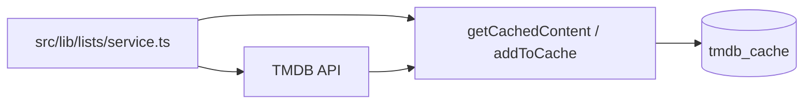

# TMDB Integration

WatchThis uses The Movie Database (TMDB) API for search, discovery, details, cast/credits, genres, and recommendations. A local cache is used to reduce repeated lookups.

Primary references:

- TMDB client wrapper: [tmdb/client.ts](../../src/lib/tmdb/client.ts)
- Cache helpers: [tmdb/cache-utils.ts](../../src/lib/tmdb/cache-utils.ts)
- Cache table: [tmdbCache](../../src/lib/db/schema.ts#L256-L283)
- API routes: [src/app/api/tmdb](../../src/app/api/tmdb)

## Configuration

- `TMDB_API_KEY` is required (see [.env.example](../../.env.example) and [README.md](../../README.md)).

## Pattern: Thin API Route → Client → Optional Enrichment

Many TMDB-backed endpoints:

- validate query parameters
- call `tmdbClient.*`
- optionally enrich results with user watch status
- normalize failures via `handleApiError`

Example: [tmdb/search/route.ts](../../src/app/api/tmdb/search/route.ts)

## Caching

WatchThis stores selected TMDB fields in Postgres to speed up list views and reduce API calls. Cache access is encapsulated in `cache-utils.ts` and used by domain services (notably lists).

## Error Handling

Integration endpoints typically use the shared helper that maps TMDB failures into stable HTTP responses.

Reference: [handleApiError](../../src/lib/auth/api-middleware.ts#L66-L86)
